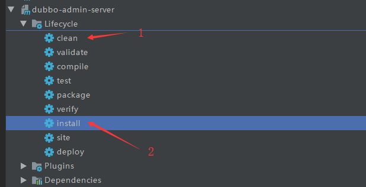
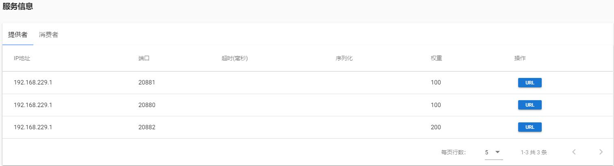

# Dubbo
## 使用dubbo来实现分布式

### 使用zookeeper作为注册中心

### 1. 这里是用docker来安装zookeeper

* [docker Hub](https://hub.docker.com/)这个docker仓库可以找自己需要的容器
* 使用docker下载zookeeper
    >````docker pull zookeeper````<br>
    上面默认使用最新版本，如果想要指定版本可以使用下面的方法，**tag**是版本号<br>
    ```docker pull zookeeper:tag```
* 下载完后运行zookeeper注册中心<br>
    在本机创建4个目录，用来关联docker中zookeeper的一些文件，这里我是用的linux，
    
    ````
    mkdir zookeeper
    cd zookeeper
    mkdir conf
    mkdir data
    mkdir datalog
    ````
    用docker运行zookeeper
    ````
    docker run -d -p 2181:2181
           --name myzookeeper 
           -v $PWD/conf:/conf 
           -v $PWD/data:/data 
           -v $PWD/datalog:/datalog 
           zookeeper
    ````
    上面的参数说明：
    ````
    -d:后台运行
    -p 2181:2181 : 把docker容器中zookeeper的2181端口号映射到本机的2181端口号
    -v $PWD/conf:/conf : $PWD是当前目录，把zookeeper的配置文件挂载到本机的/conf文件
    -v $PWD/data:/data : 把data文件挂载本机的/data文件
    -v $PWD/datalog:/datalog : 把datalog文件挂载到本机的/datalog文件
    ````
    运行成功后可以使用`docker ps`命令来查看运行中的容器<br>

### 2.使用dubbo-admin来监控dubbo

Apache的github:[dubbo-admin](https://github.com/apache/dubbo-admin)<br>
clone这个项目下来，然后使用IDE打开这个工程，`dubbo-admin-server`是服务端(springboot工程)，`dubbo-admin-ui`是客户端(vue工程)。
然后打开`dubbo-admin-server`的配置文件`application.properties`,把里面的注册中心地址换成自己的zookeeper地址

```
admin.registry.address=zookeeper://127.0.0.1:2181
admin.config-center=zookeeper://127.0.0.1:2181
admin.metadata-report.address=zookeeper://127.0.0.1:2181
```
如果不在配置文件中自定义`server.port`的话则默认使用8080端口号启动这个项目。<br>
改完配置文件后把server工程打包成jar包，这样以后就不用打开IDE才能运行这个项目了,在Idea右边的Maven中<br>
<br>
打包完成后会多了`target`文件夹<br>
<br>
然后打开这个jar包所在路径，在所在路径打开cmd，输入`java -jar jar包名`运行这个项目，需要配置好java环境才可以在cmd中使用java的命令<br>
运行了服务端后，然后去到`dubbo-admin-ui`项目的`index.js`配置文件<br>
<br>
找到两处端口号，修改成自己想要的端口号，如果使用默认则**server:8080**，**ui:8081**<br>
```
    assetsSubDirectory: 'static',
    assetsPublicPath: '/',
    proxyTable: {
      '/': {
        target: 'http://localhost:8080/',  //这个是刚才打开server的端口号
        changeOrigin:true,
        pathRewrite: {
          '^/': '/'
        }
      }
    },
    // Various Dev Server settings
    host: 'localhost', // can be overwritten by process.env.HOST
    port: 8081, // 这个是ui端使用的端口号
    autoOpenBrowser: false,
    errorOverlay: true,
    notifyOnErrors: true,
    poll: false, // https://webpack.js.org/configuration/dev-server/#devserver-watchoptions-
```
然后去到`dubbo-admin-ui`项目所在目录，在所在目录打开cmd，输入`npm install`来下载vue项目所需要的`node_modules`,如果嫌慢可以使用`cnpm install`，不过要先安装`cnpm`。
运行完毕后该项目会多出`node_modules`文件。继续在cmd中输入`npm run dev`运行这个项目,然后浏览器输入`localhost:port`就可以打开dubbo-admin监控页面。
### 3.建父工程和子工程

<br>
* 父工程<br>
    `01_dubbo`父工程的pom文件：
    ```
    <?xml version="1.0" encoding="UTF-8"?>
    <project xmlns="http://maven.apache.org/POM/4.0.0" xmlns:xsi="http://www.w3.org/2001/XMLSchema-instance"
             xsi:schemaLocation="http://maven.apache.org/POM/4.0.0 http://maven.apache.org/xsd/maven-4.0.0.xsd">
        <modelVersion>4.0.0</modelVersion>
        <parent>
            <groupId>org.springframework.boot</groupId>
            <artifactId>spring-boot-starter-parent</artifactId>
            <version>2.1.7.RELEASE</version>
            <relativePath/> <!-- lookup parent from repository -->
        </parent>
        <groupId>com.hat</groupId>
        <artifactId>01_dubbo</artifactId>
        <version>0.0.1-SNAPSHOT</version>
        <name>01_dubbo</name>
        <description>Dubbo Parent Module</description>
    
        <!--子模块-->
        <modules>
            <module>dubbo-interface</module>
            <module>dubbo-provider</module>
            <module>dubbo-consumer</module>
        </modules>
        <properties>
            <java.version>1.8</java.version>
        </properties>
    
        <dependencies>
            <dependency>
                <groupId>org.springframework.boot</groupId>
                <artifactId>spring-boot-starter</artifactId>
            </dependency>
    
            <dependency>
                <groupId>org.springframework.boot</groupId>
                <artifactId>spring-boot-starter-test</artifactId>
                <scope>test</scope>
            </dependency>
            <!--给父工程添加dubbo依赖，那么子工程不用再添加-->
            <!--<dependency>
                <groupId>com.alibaba.spring.boot</groupId>
                <artifactId>dubbo-spring-boot-starter</artifactId>
                <version>2.0.0</version>
            </dependency>
            <!--依赖zookeeper注册中心-->
            <dependency>
                <groupId>org.apache.zookeeper</groupId>
                <artifactId>zookeeper</artifactId>
                <version>3.5.5</version>
                <exclusions>
                    <!--把[slf4j-log4j12]和[log4j]除外-->
                    <exclusion>
                        <groupId>org.slf4j</groupId>
                        <artifactId>slf4j-log4j12</artifactId>
                    </exclusion>
                    <exclusion>
                        <groupId>log4j</groupId>
                        <artifactId>log4j</artifactId>
                    </exclusion>
                </exclusions>
            </dependency>
            <!--依赖zookeeper客户端-->
            <dependency>
                <groupId>com.101tec</groupId>
                <artifactId>zkclient</artifactId>
                <version>0.10<  /version>
            </dependency>-->
        </dependencies>
    
        <build>
            <plugins>
                <plugin>
                    <groupId>org.springframework.boot</groupId>
                    <artifactId>spring-boot-maven-plugin</artifactId>
                </plugin>
            </plugins>
        </build>
    
    </project>
    ```
* dubbo-interface工程<br>
    `dubbo-interface`工程用来提供公用的服务接口和javabean。<br>
    <br>
    `User`类如下:
    ```
    package com.hat.dubbointerface.bean;
    
    //实现属性的set、get方法
    public class User {
        private String name;
        private int age;
        private String phone;
    }
    ```
    `UserService`类如下：
    ```
    package com.hat.dubbointerface.service;
    
    //只提供接口
    public interface UserService {
        String getUser();
    }
    ```
    `dubbo-interface`工程的`pom`文件:
    ```
    <?xml version="1.0" encoding="UTF-8"?>
    <project xmlns="http://maven.apache.org/POM/4.0.0" xmlns:xsi="http://www.w3.org/2001/XMLSchema-instance"
             xsi:schemaLocation="http://maven.apache.org/POM/4.0.0 http://maven.apache.org/xsd/maven-4.0.0.xsd">
        <modelVersion>4.0.0</modelVersion>
        <!--父工程-->
        <parent>
            <groupId>com.hat</groupId>
            <artifactId>01_dubbo</artifactId>
            <version>0.0.1-SNAPSHOT</version>
        </parent>
        <groupId>com.hat</groupId>
        <artifactId>dubbo-interface</artifactId>
        <version>0.0.1-SNAPSHOT</version>
        <name>dubbo-interface</name>
        <description>Dubbo Api Module</description>
    
        <properties>
            <java.version>1.8</java.version>
        </properties>
    </project>
    ```
* dubbo-provier生产者工程<br>
    `dubbo-provider`是服务的提供者，用来把服务注册到注册中心供消费者使用。<br>
    目录结构：<br>
    <br>
    `pom`文件如下：
    ```
    <?xml version="1.0" encoding="UTF-8"?>
    <project xmlns="http://maven.apache.org/POM/4.0.0" xmlns:xsi="http://www.w3.org/2001/XMLSchema-instance"
             xsi:schemaLocation="http://maven.apache.org/POM/4.0.0 http://maven.apache.org/xsd/maven-4.0.0.xsd">
        <modelVersion>4.0.0</modelVersion>
        <!--父工程，添加父工程后就可以使用父工程中已经存在的依赖项-->
        <parent>
            <groupId>com.hat</groupId>
            <artifactId>01_dubbo</artifactId>
            <version>0.0.1-SNAPSHOT</version>
        </parent>
        <groupId>com.hat</groupId>
        <artifactId>dubbo-provider</artifactId>
        <version>0.0.1-SNAPSHOT</version>
        <name>dubbo-provider</name>
        <description>Dubbo Provider Module</description>
    
        <properties>
            <java.version>1.8</java.version>
        </properties>
    
        <dependencies>
            <dependency>
                <groupId>org.springframework.boot</groupId>
                <artifactId>spring-boot-starter</artifactId>
            </dependency>
            <dependency>
                <groupId>org.springframework.boot</groupId>
                <artifactId>spring-boot-starter-web</artifactId>
            </dependency>
            <dependency>
                <groupId>org.springframework.boot</groupId>
                <artifactId>spring-boot-starter-test</artifactId>
                <scope>test</scope>
            </dependency>
            <!--依赖dubbo-interface工程，以至于使用它里面的接口-->
            <dependency>
                <groupId>com.hat</groupId>
                <artifactId>dubbo-interface</artifactId>
                <version>0.0.1-SNAPSHOT</version>
            </dependency>
            
            <!--依赖dubbo-->
            <dependency>
                <groupId>org.apache.dubbo</groupId>
                <artifactId>dubbo-spring-boot-starter</artifactId>
                <version>2.7.3</version>
            </dependency>
            <dependency>
                <groupId>org.apache.dubbo</groupId>
                <artifactId>dubbo-dependencies-zookeeper</artifactId>
                <version>2.7.3</version>
                <exclusions>
                    <exclusion>
                        <groupId>org.slf4j</groupId>
                        <artifactId>slf4j-log4j12</artifactId>
                    </exclusion>
                    <exclusion>
                        <groupId>log4j</groupId>
                        <artifactId>log4j</artifactId>
                    </exclusion>
                </exclusions>
            </dependency>
    
        </dependencies>
    
        <build>
            <plugins>
                <plugin>
                    <groupId>org.springframework.boot</groupId>
                    <artifactId>spring-boot-maven-plugin</artifactId>
                </plugin>
            </plugins>
        </build>
    
    </project>
    ```
    `application.yml`配置文件：
    ```
    dubbo:
      application:
        name: provider     #必填，服务提供者的名称，默认值是${spring.application.name}
      registry:
        address: zookeeper://localhost:2181  #注册中心的地址,多个注册中心则用逗号隔开。
      config-center:
        address: zookeeper://localhost:2181  #控制中心地址
      metadata-report: 
        address: zookeeper://localhost:2181  #元数据报告，设置后可以查看元数据，dubbo需2.7以上
      protocal:
        name: dubbo #使用dubbo协议
        port: 20880 #协议端口号
    server:
      port: 9000  #服务的端口号
    ```
    `UserServiceImpl`类如下：
    ```
    package com.hat.provider.service.impl;
    
    import com.apache.dubbo.config.annotation.Service;
    import com.hat.dubbointerface.bean.User;
    import com.hat.dubbointerface.service.UserService;
    import org.springframework.beans.factory.annotation.Value;
    import org.springframework.stereotype.Component;
    
    @Component   //把当前类交给spring管理
    @Service(version = "1.0.0")   //这里是dubbo的Service，不是spring的Service，把该服务放到注册中心
    public class UserServiceImpl implements UserService{
    
        @Value("${server.port}")
        private String port;
    
        @Override
        public String getUser() {
            User user = new User();
            user.setName("张三");
            user.setAge(20);
            user.setPhone("12345678912");
            return "this is provider ["+port+"],message:"+user.toString();
        }
    }
    ```
    注意上面的\@***Service注解***是dubbo的注解。<br>
    <br>
    `DubboProviderApplication`启动类:<br>
    添加@**EnableDubboConfiguration**注解
    ```
    package com.hat.provider;
    
    import com.apache.dubbo.spring.boot.annotation.EnableDubboConfiguration;
    import org.springframework.boot.SpringApplication;
    import org.springframework.boot.autoconfigure.SpringBootApplication;
    
    @SpringBootApplication
    @EnableDubbo   //启动Dubbo
    public class DubboProviderApplication {
    
        public static void main(String[] args) {
            SpringApplication.run(DubboProviderApplication.class, args);
        }
    
    }
    ```
* dubbo-consumer消费者工程：<br>
    `dubbo-consumer`消费者用来使用已经注册的服务,
    目录结构：<br>
    <br>
    `pom`文件：
    ```
    <?xml version="1.0" encoding="UTF-8"?>
    <project xmlns="http://maven.apache.org/POM/4.0.0" xmlns:xsi="http://www.w3.org/2001/XMLSchema-instance"
             xsi:schemaLocation="http://maven.apache.org/POM/4.0.0 http://maven.apache.org/xsd/maven-4.0.0.xsd">
        <modelVersion>4.0.0</modelVersion>
        <!--父工程-->
        <parent>
            <groupId>com.hat</groupId>
            <artifactId>01_dubbo</artifactId>
            <version>0.0.1-SNAPSHOT</version>
        </parent>
        <groupId>com.hat</groupId>
        <artifactId>dubbo-consumer</artifactId>
        <version>0.0.1-SNAPSHOT</version>
        <name>dubbo-consumer</name>
        <description>Dubbo Consumer Module</description>
    
        <properties>
            <java.version>1.8</java.version>
        </properties>
    
        <dependencies>
            <dependency>
                <groupId>org.springframework.boot</groupId>
                <artifactId>spring-boot-starter</artifactId>
            </dependency>
            <dependency>
                <groupId>org.springframework.boot</groupId>
                <artifactId>spring-boot-starter-web</artifactId>
            </dependency>
            <dependency>
                <groupId>org.springframework.boot</groupId>
                <artifactId>spring-boot-starter-test</artifactId>
                <scope>test</scope>
            </dependency>
    
            <!--依赖dubbo-interface工程，以至于使用它里面的接口-->
            <dependency>
                <groupId>com.hat</groupId>
                <artifactId>dubbo-interface</artifactId>
                <version>0.0.1-SNAPSHOT</version>
            </dependency>
            
            <!--依赖dubbo-->
            <dependency>
                <groupId>org.apache.dubbo</groupId>
                <artifactId>dubbo-spring-boot-starter</artifactId>
                <version>2.7.3</version>
            </dependency>
            <dependency>
                <groupId>org.apache.dubbo</groupId>
                <artifactId>dubbo-dependencies-zookeeper</artifactId>
                <version>2.7.3</version>
                <exclusions>
                    <exclusion>
                        <groupId>org.slf4j</groupId>
                        <artifactId>slf4j-log4j12</artifactId>
                    </exclusion>
                    <exclusion>
                        <groupId>log4j</groupId>
                        <artifactId>log4j</artifactId>
                    </exclusion>
                </exclusions>
            </dependency>
        </dependencies>
    
        <build>
            <plugins>
                <plugin>
                    <groupId>org.springframework.boot</groupId>
                    <artifactId>spring-boot-maven-plugin</artifactId>
                </plugin>
            </plugins>
        </build>
    
    </project>
    ```
    `application.yml`配置文件：
    ```
    spring:
      dubbo:
        application:
          name: consumer  #消费者名称
        registry:
          address: zookeeper://localhost:2181 #注册中心地址
        protocal:
          name: dubbo  #使用的协议
    
    server:
      port: 9100   #消费者端口号
    ```
    `UserController`类：
    
    ```
    package com.hat.consumer.controller;
    
    import com.apache.dubbo.config.annotation.Reference;
    import com.hat.dubbointerface.service.UserService;
    import org.springframework.beans.factory.annotation.Value;
    import org.springframework.web.bind.annotation.GetMapping;
    import org.springframework.web.bind.annotation.RestController;
    
    @RestController
    public class UserController {
    
        @Value("${server.port}")
        private String port;
        @Reference(version = "1.0.0")  //引入已经注册的服务，指定版本号，与@Service版本号对应
        UserService userService;
    
        @GetMapping("/getuser")
        public String getUserApi(){
            return "consumer["+port+"],use:"+userService.getUser();
        }
    }
    ```
    `DubboConsumerApplication`启动类也加启动Dubbo注解.
    
    ```
    package com.hat.consumer;
    
    
    import com.apache.dubbo.spring.boot.annotation.EnableDubboConfiguration;
    import org.springframework.boot.SpringApplication;
    import org.springframework.boot.autoconfigure.SpringBootApplication;
    
    @SpringBootApplication
    @EnableDubbo //启动Dubbo服务
    public class DubboConsumerApplication {
    
        public static void main(String[] args) {
            SpringApplication.run(DubboConsumerApplication.class, args);
        }
    
    }
    ```
### 4. 启动工程

先启动provider工程再启动consumer工程。然后打开`dubbo-admin`监控，就可以查看到已经注册的服务和消费者<br>


### 5. 集群容错

*   设置集群容错策略：在`dubbo-consumer`中的`UserController`中的@***Reference()*** 中设置参数`cluster`<br>
    `cluster = "failover"`,
    * Failover<br>
    (默认)**失败重试**，即调用服务失败时重试其他服务，默认重试2次，可以在@***Reference()*** 中添加参数`retries=2`来修改重试次数
    * Failfast<br>
    **快速失败**，只发起一次调用，失败立即报错,通常用于非幂等性的写操作，比如新增记录
    * Failsafe<br>
    **失败安全**，出现异常时直接忽略，通常用于写入审计日志等操作
    * Failback <br>
    **失败自动恢复**，后台记录失败请求，定时重发，通常用于消息通知
    * Forking<br>
    **并行调用多个服务器**，只要有一个成功就返回，通常用于实时性要求较高的**读**操作，
    但会消耗更多的服务器资源，可通过`forks=2`来设置最大并行数
    * Broadcast <br>
    **广播调用所有服务提供者**，逐个调用，任意一台报错则报错，通常用于通知所有提供者更新缓存或日志等本地资源信息。
    

### 6. 负载均衡

*   **Random LoadBalance(随机)**<br>
    官方解释：
    
    >随机，按权重设置随机概率。<br>
     在一个截面上碰撞的概率高，但调用量越大分布越均匀，而且按概率使用权重后也比较均匀，有利于动态调整提供者权重。
    
    运行多个服务提供者，服务提供者完全一样<br>
    <br>
    <br>
    修改完配置后直接再次运行`dubbo-provider`项目,这里我运行了3个一样的服务提供者<br>
    <br>
    权重可以在`dubbo-provider`的`UserServiceImpl`类中的@**Service()注解**中添加参数**weight = 200**,如：
    `@Service(version = "1.0.0",weight = 200)`<br>
    dubbo默认使用的负载均衡是`Random LoadBalance`,即按权重随机负载均衡。
    比如我上图3个一样的服务，权重不一样，那么一个消费者调用到这个服务时，
    有1/2几率调用20882端口的服务，有1/4几率调用到20881和1/4几率调用到20880端口号的服务。
    模拟调用5次的结果:<br>
    <br>
    图中可以看出，权重为200的服务调用的次数最多，且5次顺序完全无规律，即权重越大被调用到的几率就越大
    
*   **RoundRobin LoadBalance(轮询)**<br>
    官网的解释如下：<br>
    
    >轮询，按公约后的权重设置轮询比率。<br>
     存在慢的提供者累积请求的问题，
     比如：第二台机器很慢，但没挂，当请求调到第二台时就卡在那，久而久之，所有请求都卡在调到第二台上。<br>
    
     修改`dubbo-consumer`中的`UserController`类中的@**Refrence()**，加上`loadbalance`参数，这里使用`roundrobin`,
     `@Reference(version = "1.0.0",loadbalance = "roundrobin")`<br>
     然后把启动的3个服务权重都设置成100，即3个服务的权重是一样的。
     测试调用结果如下：<br>
     <br>
     可以看到图上的端口号是*9000*、*9001*、*9002*这样按顺序调用的。<br>
     >**不过要注意**：当权重都相等时，消费者调用时的第一个服务未必是*9000*，
     也有可能是从*9001*或者*9002*开始，不过唯一不变的是调用到的服务都是平均且轮着的，当顺序定了后就会按着这个顺序调用服务<br>
    
     下面把权重修改下，9000、9001、9002端口的服务分别把权重设置成100、100、200，再次测试调用结果如下：<br>
     <br>
     <br>
     从两张图中可以看出，权重最大的服务一定是先调用，如果权重相同则随机调用，顺序定了后就会按着这个顺序调用服务。
    
*   **LeastActive LoadBalance(最少活跃调用数)**<br>
    官方解释：
    
    >最少活跃调用数，相同活跃数的随机，活跃数指调用前后计数差。<br>
     使慢的提供者收到更少请求，因为越慢的提供者的调用前后计数差会越大。<br>
    
     修改`dubbo-consumer`中的`UserController`中的@**Reference()** 中的`loadbalance`参数,
     `@Reference(version = "1.0.0",loadbalance = "leastactive")`<br>
     当3个服务权重都是100时，测试调用了50次的结果如下：<br>
     ***9000-->16次***、***9001-->17次***、***9002-->17次***。<br>
     所以当使用了**leastactive**负载均衡时，每个服务被调用的次数都会趋向平衡。<br>
     当3个服务权重分别为100、100、200时，测试50次的结果如下：<br>
     ***9000-->13次***、***9001-->12次***、***9002-->25次***。<br>
     可以看出权重200的服务被调用的次数都会在一半左右，然后两个权重100的服务被调用的总和会在一半左右。
    
 *  **ConsistentHash LoadBalance(一致性Hash)**<br>
    官网介绍:<br>
    
    >一致性 Hash，相同参数的请求总是发到同一提供者。<br>
     当某一台提供者挂时，原本发往该提供者的请求，基于虚拟节点，平摊到其它提供者，不会引起剧烈变动。<br>
     算法参见：[http://en.wikipedia.org/wiki/Consistent_hashing](http://en.wikipedia.org/wiki/Consistent_hashing)<br>
     缺省只对第一个参数 Hash，如果要修改，请配置 <dubbo:parameter key="hash.arguments" value="0,1" /><br>
     缺省用 160 份虚拟节点，如果要修改，请配置 <dubbo:parameter key="hash.nodes" value="320" /><br>
    
     修改`dubbo-consumer`中的`UserController`类中的@***Reference()***注解，修改`loadbalance`参数为：
     `@Reference(version = "1.0.0",loadbalance = "consistenthash ")`。
     测试结果为：<br>
     <br>
     开始时是调用9001端口的服务，当9001服务断了之后，就调用下一个服务，
     只有当这个服务断了后才会去调用其他的服务。

### 7.dubbo配置

````
dubbo:
  #应用级别配置
  application:
    name: consumer        #[服务治理] *必填，服务提供者或者消费者的名称
    version: 1.0.0        #[服务治理] 服务的版本号,消费者根据版本号调用对应的服务
    owner: who            #[服务治理] 服务的所有者，写这个服务的人
    organization: BU      #[服务治理] 服务的组织，写这个服务的部门或小组
    architecture:         #[服务治理] 服务的架构
    environment: dev      #[服务治理] 服务的环境，如：dev、test、production
    compiler: javassist   #[性能优化] 服务的java编译器，如jdk、javassist
    logger: slf4j         #[性能优化] 日志的输入方式，如slf4j、jlc、log4j、jdk
    dump-directory:       #保存线程垃圾的目录
    qos-enable: false     #是否启用qos治理
    qos-port:             #监听qos的端口号
    qos-accept-foreign-ip: false  #是否允许外部ip访问qos治理
  #注册中心配置
  registry:
    address: 127.0.0.1    #[服务发现] *必填 注册中心地址，【可以与protocol、port合并成 zookeeper://127.0.0.1:2181】
    protocol: zookeeper   #[服务发现] *必填 使用的注册中心，如：zookeeper、multicast、redis、simple。默认zookeeper
    port: 2181            #[服务发现] 注册中心的端口号，默认2181
    client: zkclient      #[服务发现] 注册中心使用的客户端，如curator、zkclient。默认zkclient
    username:             #[服务治理] 登录注册中心的帐号，如有设置要填
    password:             #[服务治理] 登录注册中心的密码，如有设置要填
    transporter:          #[性能调优] 网络传输类型，如mina、netty。默认netty
    server:               #[性能调优] 服务端实现类型，如mina、netty。默认netty
    cluster:              #[性能调优] 集群
    group:                #[服务治理] 注册中心的组
    version:              #[服务治理] 注册中心版本
    timeout:              #[性能调优] 向注册中心发送请求超时时间，单位毫秒
    session:              #[性能调优] 会话的超时时间，单位毫秒
    file: filename.log    #[服务治理] 保存注册中心的地址和服务，多个注册中心不能共用一个file
    check: false          #[服务治理] 是否在注册中心启动时检测注册中心是否可用
    dynamic: true         #[服务治理] 是否动态启动注册中心
    register: true        #[服务治理] 是否将服务注册到注册中心
    subscribe: true       #[服务治理] 是否订阅注册中心中的服务
  #协议配置
  protocol:
    name: dubbo           #[性能调优] *必填 使用的协议，如dubbo、rmi、hessian、http。默认dubbo
    port: 20880           #[服务治理] 使用协议的端口号。默认：dubbo--20880、rim--1099、hessian--80、http--80
    host:                 #[服务治理] 协议的地址，默认查找本机ip
    contextpath:          #[服务治理] 上下文路径
    threadpool: fixed     #[性能调优] 线程池类型，如：fixed、cached。默认fixed
    corethreads:          #[性能调优] 核心线程大小
    threads:              #[性能调优] 线程池大小(固定)
    iothreads:            #[性能调优] io线程池大小(固定)
    queues:               #[性能调优] 线程池队列长度
    accepts:              #[性能调优] 服务提供者最大接受连接数
    codec: dubbo          #[性能调优] 协议编码方式
    serialization: hessian2 #[性能调优] 序列化方式，如：dubbo--hessian2、rmi--java、http--json
    charset: UTF-8        #[性能调优] 序列化编码
    payload: 88388608     #[性能调优] 请求及响应数据包大小，88388608=8M，单位字节
    buffer: 8192          #[性能调优] 网络读写缓存大小，单位字节
    heartbeat:            #[性能调优] 心跳间隔，心跳：用来检测连接是否断开，每x毫秒发一次心跳来检查，单位毫秒
    accesslog:            #[服务治理] 访问日志
    transporter:          #[性能调优] 协议的服务端和客户端实现类型
    exchanger:            #[性能调优] 信息交换方式
    dispatcher:           #[性能调优] 协议的信息派发模式，用于指定线程模式，如：all，direct, message, execution, connection
    telnet:               #[服务治理] 支持telnet命令，多个命令用逗号隔开
    status:               #[服务治理] 状态检查
    register: true        #[服务治理] 是否注册到注册中心
  #服务提供者常用的配置
  provider:
    version: 1.0.0        #[服务治理] 服务的版本号
    group:                #[服务治理] 服务分组，同一个服务不同实现时使用
    delay: 0              #[性能调优] 延迟服务注册的时间，单位毫秒
    retries: 2            #[性能调优] 调用服务失败时重试的次数，默认2次
    weight: 100           #[性能调优] 服务的权重
    accepts:              #[性能调优] 服务允许最大连接数
    actives:              #[性能调优] 服务允许最大并发调用
    cluster: failover     #[性能调优] 集群方式
    connections: 0        #[性能调优] 服务连接限制，0表示分享连接，否者定义连接委托给当前服务
    loadbalance: random   #[性能调优] 负载均衡方式
    threadpool: fixed     #[性能调优] 线程池类型
    threads:              #[性能调优] 线程大小(固定)
    timeout: 1000         #[性能调优] 调用服务时连接超时时间，单位毫秒
    filter:               #[性能调优] 调用服务时，使用的拦截器名称，多个用逗号隔开
  #消费者常用的配置
  consumer:
    version: 1.0.0        #[服务治理] 调用服务时要与服务版本号一样
    timeout: 1000         #[性能调优] 调用服务时超时时间，单位毫秒
    cluster: failover     #[性能调优] 集群类型
    threadpool: fixed     #[性能调优] 线程池类型
    threads:              #[性能调优] 线程大小
    cache:                #[服务治理] 已调用参数为key，缓存返回结果，可选：lru, threadlocal, jcache
    async: false          #[性能调优] 是否使用异步，不可靠异步，只忽略返回值，不造成阻塞
    check: true           #[服务治理] 调用服务时检查连接是否可用
    connections: 0        #[性能调优] 服务连接限制，0表示分享连接，否者定义连接委托给当前服务
    cluter: failover      #[性能调优] 集群方式
    forks:                #[性能调优] 当集群方式为forking时可以设置forks的大小
    generic: false        #[服务治理] 是否使用通用接口
    loadbalance: radom    #[性能调优] 负载均衡方式
    listener:             #[服务治理] 消费者引用监听器的名称，多个用逗号分隔
    lazy: true            #[服务治理] 懒创建连接
    meta-data:            #[性能调优] 元数据
    owner:                #[服务治理] 写消费者的人
    retries: 2            #[性能调优] 调用服务失败后重试的次数，默认2次
  #扫描包
  scan:
    base-packages:        #扫描服务提供者的service包和消费者的包，多个用逗号分隔
````

