# RabbitMQ消息队列

## 一、RabbitMQ简介

### 1.什么是RabbitMQ

**AMQP(Advanced Message Queuing Protocol)**,即高级消息队列协议，是一个提供统一消息服务的应用层标准高级消息队列协议，是应用层的一个开放标准，为面向消息的中间件设计。基于此协议的客户端与消息中间件可传递消息。**RabbitMQ**则是**AMQP**的一种实现，它还支持**STOMP**和**MQTT**协议。

### 2.RabbitMQ的用处

* 解耦
* 异步处理
* 流量削峰
* 消息分发

### 3.与其他类似框架比较

| 特性                     | ActiveMQ                              | RabbitMQ                                           | RocketMQ                                                     | Kafka                                                        |
| ------------------------ | ------------------------------------- | -------------------------------------------------- | ------------------------------------------------------------ | ------------------------------------------------------------ |
| 单机吞吐量               | 万级，比 RocketMQ、Kafka 低一个数量级 | 同 ActiveMQ                                        | 10 万级，支撑高吞吐                                          | 10 万级，高吞吐，一般配合大数据类的系统来进行实时数据计算、日志采集等场景 |
| topic 数量对吞吐量的影响 |                                       |                                                    | topic 可以达到几百/几千的级别，吞吐量会有较小幅度的下降，这是 RocketMQ 的一大优势，在同等机器下，可以支撑大量的 topic | topic 从几十到几百个时候，吞吐量会大幅度下降，在同等机器下，Kafka 尽量保证 topic 数量不要过多，如果要支撑大规模的 topic，需要增加更多的机器资源 |
| 时效性                   | ms 级                                 | 微秒级，这是 RabbitMQ 的一大特点，延迟最低         | ms 级                                                        | 延迟在 ms 级以内                                             |
| 可用性                   | 高，基于主从架构实现高可用            | 同 ActiveMQ                                        | 非常高，分布式架构                                           | 非常高，分布式，一个数据多个副本，少数机器宕机，不会丢失数据，不会导致不可用 |
| 消息可靠性               | 有较低的概率丢失数据                  | 基本不丢                                           | 经过参数优化配置，可以做到 0 丢失                            | 同 RocketMQ                                                  |
| 功能支持                 | MQ 领域的功能极其完备                 | 基于 erlang 开发，并发能力很强，性能极好，延时很低 | MQ 功能较为完善，还是分布式的，扩展性好                      | 功能较为简单，主要支持简单的 MQ 功能，在大数据领域的实时计算以及日志采集被大规模使用 |


## 二、安装RabbitMQ

### 1.使用docker安装RabbitMQ

* 下载带有监控管理的**rabbitmq**：***rabbitmq-management***

  `docker pull rabbitmq:management`

* 部署**rabbitmq**容器

  ```
  docker run 
  -d                //后台运行
  -p 15672:15672    //把rabbitmq的15672端口映射到本机的15672端口，这个端口是登录管理页面用的
  -p 5672:5672      //把rabbitmq的5672端口映射到本机的5672端口，这个端口号是连接rabbitmq服务用的
  --hostname rabbitmq  //rabbitmq的主机名称
  --name myrabbitmq    //容器的名称
  -e RABBITMQ_ERLANG_COOKIE='rabbitmqCookie' 
  -v $PWD/myrabbitmq/:/var/lib/rabbitmq/ //把本机的$PWD/myrabbitmq/路径挂载到rabbitmq的/var/lib/rabbitmq/路径
  rabbitmq:management   //要启动的容器， 容器名:版本号
  ```

  

* **集群**部署**rabbitmq**容器

  再启动两个rabbitmq容器，**注意：**映射到本机的地址需要改变，不然会与部署的第一个rabbitmq容器端口号冲突。

  

  RabbitMQ的集群是依附于erlang的集群来工作的，所以必须先构建起erlang的集群镜像。erlang的集群通信的验证机制是通过**erlang.cookie**进行确认的，所以必须使RabbitMQ中的**erlang.cookie**保持一致，否者无法进行通信。RabbitMQ中的**erlang.cookie**存放在**/var/lib/rabbitmq/.erlang.cookie**中。
  
  

  **rabbitmq**：添加一个**RABBITMQ_ERLANG_COOKIE='rabbitmqCookie'**参数，这个参数的值可以随便填，只要保证要集群的其他rabbitmq容器有相同的参数值

  ```
  docker 
  run 
  -d 
  -p 15672:15672 
  -p 5672:5672 
  --hostname rabbitmq 
  --name myrabbitmq 
  -e RABBITMQ_ERLANG_COOKIE='rabbitmqCookie' 
  -v $PWD/myrabbitmq/:/var/lib/rabbitmq/ 
  rabbitmq:management
  ```
  

 **rabbitmq02**：

  ```
  docker 
  run 
  -d 
  -p 15673:15672 
  -p 5673:5672 
  --hostname rabbitmq02 
  --name myrabbitmq02 
  --link myrabbitmq:rabbitmq 
  -e RABBITMQ_ERLANG_COOKIE='rabbitmqCookie' 
  -v $PWD/myrabbitmq02/:/var/lib/rabbitmq/ 
  rabbitmq:management
  ```

  **rabbitmq03**:

  ```
  docker 
  run 
  -d 
  -p 15674:15672 
  -p 5674:5672 
  --hostname rabbitmq03 
  --name myrabbitmq03 
  --link myrabbitmq:rabbitmq 
  --link myrabbitmq02:rabbitmq02 
  -e RABBITMQ_ERLANG_COOKIE='rabbitmqCookie' 
  -v $PWD/myrabbitmq03/:/var/lib/rabbitmq/ 
  rabbitmq:management
  ```

   **--link**参数是连接两个或多个容器来进行通信。

   `--link <name or id>:alias`

  >**解释：**
  >
  >**name**或**id**：是源容器的**名称**或**id**，如第一个容器中设置的**--name**参数的名称。
  >
  >alias： 是源容器在link下的别名 

  

  然后把容器加入集群。

  首先进入第一个容器节点**myrabbitmq**，输入下面5条命令

  ```
  docker exec -it myrabbitmq bash    //进入myrabbitmq容器
  rabbitmqctl stop_app               //停止
  rabbitmqctl reset                  //重置
  rabbitmqctl start_app              //开启
  exit                               //退出容器返回到本机
  
  //结果如下：
  hat@ubuntu:~/docker/rabbitmq$ docker exec -it myrabbitmq bash
  root@rabbitmq:/# rabbitmqctl stop_app
  Stopping rabbit application on node rabbit@rabbitmq ...
  root@rabbitmq:/# rabbitmqctl reset
  Resetting node rabbit@rabbitmq ...
  root@rabbitmq:/# rabbitmqctl start_app
  Starting node rabbit@rabbitmq ...
  completed with 3 plugins.
  root@rabbitmq:/# exit
  exit  
  ```

  然后进入第二个容器节点**myrabbitmq02**，输入下面6条命令

  ```
  docker exec -it myrabbitmq02 bash   //进入myrabbitmq02容器
  rabbitmqctl stop_app                //停止
  rabbitmqctl reset				     //重置
  rabbitmqctl join_cluster --ram rabbit@rabbitmq  //把myrabbitmq02加入到rabbitmq(第一个容器的主机名)集群，--ram是设置成内存节点，不设置则默认为磁盘节点，如myrabbitmq容器就是磁盘节点
  rabbitmqctl start_app               //开启
  exit                                //退出容器返回本机
  
  结果如下：
  hat@ubuntu:~/docker/rabbitmq$ docker exec -it myrabbitmq02 bash
  root@rabbitmq02:/# rabbitmqctl stop_app
  Stopping rabbit application on node rabbit@rabbitmq02 ...
  root@rabbitmq02:/# rabbitmqctl reset
  Resetting node rabbit@rabbitmq02 ...
  root@rabbitmq02:/# rabbitmqctl join_cluster --ram rabbit@rabbitmq
  Clustering node rabbit@rabbitmq02 with rabbit@rabbitmq
  root@rabbitmq02:/# rabbitmqctl start_app
  Starting node rabbit@rabbitmq02 ...
  completed with 3 plugins.
  root@rabbitmq02:/# exit
  exit
  ```

  最后进入第三个容器节点**myrabbitmq03**，输入下面6条命令

  ```
  docker exec -it myrabbitmq02 bash   //进入myrabbitmq03容器
  rabbitmqctl stop_app                //停止
  rabbitmqctl reset				   //重置
  rabbitmqctl join_cluster --ram rabbit@rabbitmq  //把myrabbitmq03加入到rabbitmq(第一个容器的主机名)集群
  rabbitmqctl start_app               //开启
  exit                                //退出容器返回本机
  
  结果如下：
  hat@ubuntu:~/docker/rabbitmq$ docker exec -it myrabbitmq03 bash
  root@rabbitmq03:~# rabbitmqctl stop_app
  Stopping rabbit application on node rabbit@rabbitmq03 ...
  root@rabbitmq03:~# rabbitmqctl reset
  Resetting node rabbit@rabbitmq03 ...
  root@rabbitmq03:~# rabbitmqctl join_cluster --ram rabbit@rabbitmq
  Clustering node rabbit@rabbitmq03 with rabbit@rabbitmq
  root@rabbitmq03:~# rabbitmqctl start_app
  Starting node rabbit@rabbitmq03 ...
  e completed with 3 plugins.
  root@rabbitmq03:~# exit
  exit
  ```

  完成后在浏览器输入`localhost:15672`登录rabbitmq的管理页面,帐号密码都是*guest*，可以看到结果如下

  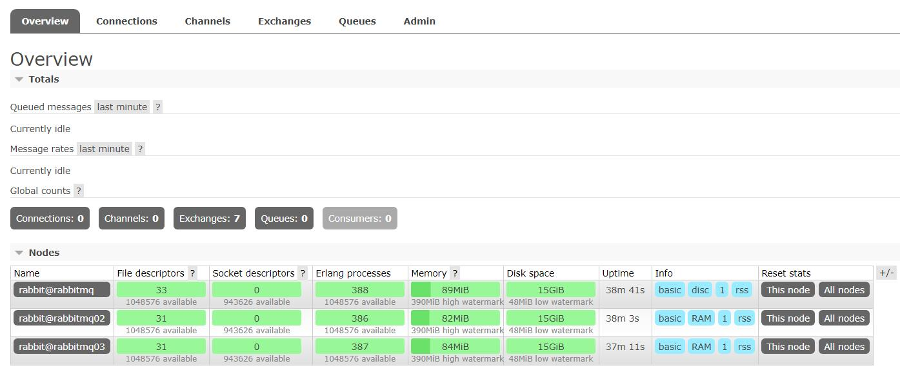

## 三、使用RabbitMQ

### 1.使用注解方式

#### 1.1 创建springboot工程，添加rabbitmq的依赖

```xml
<dependency>
    <groupId>org.springframework.boot</groupId>
    <artifactId>spring-boot-starter-amqp</artifactId>
</dependency>
```

#### 1.2 添加application.yml配置属性

这里我是用**yml**文件来进行配置。

```yaml
spring:
  rabbitmq:
    host: 192.168.229.130    #rabbitmq服务器的地址
    username: guest          #登录帐号，默认是guest
    password: guest          #登录密码，默认是guest
    port: 5672               #rabbitmq服务器占用的端口号，默认5672
```

#### 1.3 rabbitmq的实现

##### -  **无交换机消息队列**

> **解释**：这种消息队列一条消息只能被一个消费者消费，假如只有一个生产者生产一条消息发布到队列，而两个消费从队列中拿这个消息，则第一个消费者能拿到消息，第二个消费者不能拿到消息，当生产者再生产一条消息发布到队列，则第二个消费者可以拿到消息，消费者是按照***[轮询机制]***在队列中取消息的。


**模型图：**


**项目结构如下：**


- 创建**rabbitmqConfiguration**类，该类用来创建消息队列、交换器、绑定队列交换器等,这里先定义了一个无交换器的队列。注意要把该类定义为配置类，添加**@Configuration**注解，且要给创建队列的方法加上**@bean**注解注册到spring容器中

```java
package com.hat.rabbitmq.config;

import org.slf4j.Logger;
import org.slf4j.LoggerFactory;
import org.springframework.amqp.core.Queue;
import org.springframework.context.annotation.Bean;
import org.springframework.context.annotation.Configuration;

@Configuration //把该类定义为配置类
public class rabbitmqConfiguration {
    private static final Logger log = LoggerFactory.getLogger(rabbitmqConfiguration.class);

    /**
     * 无交换器的消息队列
     * 参数：
     *     name：队列名称，如果使用无交换器的消息队列则同时充当路由键(routing key)
     *     durable：queue持久化，即使消息代理崩溃，队列也不会消失，默认true
     *     exclusive：排他性，如果为true，那么除了当前连接可以使用该队列外，其他连接都不能使用该队列，默认false
     *     autoDelete：自动删除，在最后一个连接断开时，queue会自动删除，默认false
     * @return
   */
    @Bean //注册到spring容器
  public Queue queue(){
        //参数是队列名称，不使用交换器时队列名称相当于路由键，
      //接收者需要根据队列名称来接收消息
        return new Queue("defaultQueue",true,false,false);
    }
}

```


- 创建**MqSenderNoExchange**类，该类用来给队列发送消息

```java
package com.hat.rabbitmq.mqsender;

import org.slf4j.Logger;
import org.slf4j.LoggerFactory;
import org.springframework.amqp.core.AmqpTemplate;
import org.springframework.beans.factory.annotation.Autowired;
import org.springframework.stereotype.Component;

@Component //把该类交给spring容器管理
public class MqSender {
    private final static Logger log = LoggerFactory.getLogger(MqSender.class);

    //使用AmqpTemplate模版来发送消息
    @Autowired
    private AmqpTemplate rabbitTemplate;

    /**
     * 不使用交换器的消息队列发送者
     */
    public void defaultQueueSender(){
      long begin = System.currentTimeMillis();
        log.info("【消息开始发送。。。。】");
      //使用convertAndSend来发送消息，
        //参数： routingKey:路由键，接收器根据此路由键接收队列的消息，
        //       message：消息内容，内容可以是对象
        rabbitTemplate.convertAndSend("defaultQueue","[defaultQueue]发送的消息");
        log.info("【消息发送成功。。。。用时（"+(System.currentTimeMillis()-begin)+"ms）】");
    }
}
```

- 创建**MqReceiverNoExchange**类，该类用来接收消息

```java
package com.hat.rabbitmq.mqreceiver;

import org.slf4j.Logger;
import org.slf4j.LoggerFactory;
import org.springframework.amqp.rabbit.annotation.RabbitHandler;
import org.springframework.amqp.rabbit.annotation.RabbitListener;
import org.springframework.stereotype.Component;

@Component //把该类交给spring容器管理
public class MqReceiver {
    private final static Logger log = LoggerFactory.getLogger(MqReceiver.class);
  
    @RabbitListener(queues = "defaultQueue")  //监听路由键为[defaultQueue]的队列
    @RabbitHandler  //收到消息后执行下面方法
    public void getDefaultQueueMsg(String msg){ //参数类型，发送者什么类型就什么类型
        log.info("[getDefaultQueueMsg]接收到--->"+msg);
    }
}
```

- 编写测试类：

```java
@Autowired
MqSenderNoExchange mqSender;
@test
public void textdefault() {
        mqSender.defaultQueueSender("aaaaaaaaaaaaaaa");
        mqSender.defaultQueueSender("bbbbbbbbbbbbb");
        mqSender.defaultQueueSender("ccccccccc" );
        mqSender.defaultQueueSender("dddddddddddd" );
        mqSender.defaultQueueSender("eeeeeeeeeeee" );
        mqSender.defaultQueueSender("fffffffffff" );
        mqSender.defaultQueueSender("gggggggggg" );
    }
```


- 测试结果如下：

单生产者-------单消费者

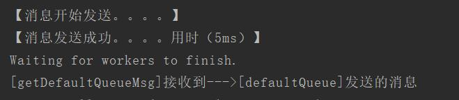

单生产者-------多消费者

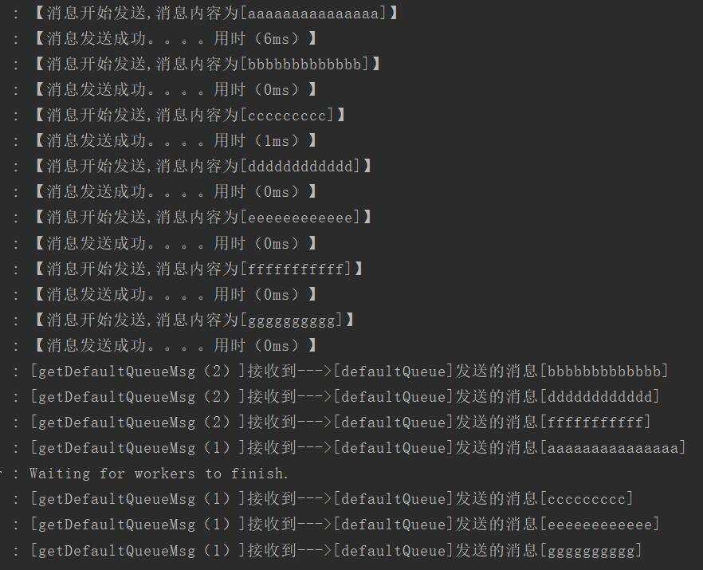

##### - **direct exchange交换机(直连交换机)**

> **解释：**
>
> 直连交换机是**rabbitmq*(默认)***的一种交换机形式，它的工作形式为，生产者需根据**routingKey(路由键)**发布消息到对应的**queue(消息队列)**，然后消费者根据队列名来消费消息,**一个队列可以绑定多个路由键，一个消费者可以监听多个队列**

**模型图：**

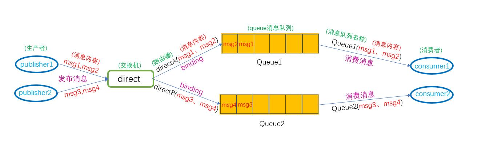


**代码实现：**

- 在**rabbitmqConfiguration**类中创建**queue消息队列**与**direct exchange交换机**,并把**queue**与**direct** **exchange**绑定起来。

```java
/**
     * direct exchange交换机(直连交换器)的消息队列
     * rabbitmq默认使用的交换机就是直连交换器。
     * @return
     */
    @Bean
    public Queue directQueue_A(){
        return new Queue("directQueueA");
    }
    @Bean
    public Queue directQueue_B(){
        return new Queue("directQueueB");
    }
    /**
     * 创建direct Exchange交换机
     *      参数：
     *          name：交换机的名字
     *          durable：是否持久化， 默认true
     *          autoDelete：是否自动删除， 默认false
     * @return
     */
    @Bean
    public DirectExchange directExchange(){
        return new DirectExchange("directExchange",true, false);
    }

    /**
     * 对消息队列和交换机进行绑定
     *      bind()：要绑定的队列
     *      to()：绑定的交换机
     *      with()：路由键
     * @return
    */
    @Bean
    public Binding bindDirectExchange_A(){
        return BindingBuilder.bind(this.directQueue_A()).to(this.directExchange()).with("directA");
    }
    @Bean
    public Binding bindDirectExchange_B(){
        return BindingBuilder.bind(this.directQueue_B()).to(this.directExchange()).with("directB");
    }

```

- 创建**MqSenderDirectExchange**类，用来实现消息生产者

```java
package com.hat.rabbitmq.mqsender;

import org.slf4j.Logger;
import org.slf4j.LoggerFactory;
import org.springframework.amqp.core.AmqpTemplate;
import org.springframework.beans.factory.annotation.Autowired;
import org.springframework.stereotype.Component;

@Component
public class MqSenderDirectExchange {
    private final static Logger log = LoggerFactory.getLogger(MqSenderDirectExchange.class);

    @Autowired
    AmqpTemplate rabbitTemplate;

    //生产者A
    public void SenderA(String msg){
        /**
         *  参数:
         *      exchange：交换机名称
         *      routingKey：路由键
         *      message：消息内容
         */
        rabbitTemplate.convertAndSend("directExchange","directA",msg);
        log.info("【SenderA】发送消息["+msg+"]");
    }

    //生产者B
    public void SenderB(String msg){
        rabbitTemplate.convertAndSend("directExchange","directB",msg);
        log.info("【SenderB】发送消息["+msg+"]");

    }
}

```

- 创建**MqReceiverDirectExchange**类，用来实现消费者

```java
package com.hat.rabbitmq.mqreceiver;

import org.slf4j.Logger;
import org.slf4j.LoggerFactory;
import org.springframework.amqp.rabbit.annotation.RabbitHandler;
import org.springframework.amqp.rabbit.annotation.RabbitListener;
import org.springframework.stereotype.Component;

@Component
public class MqReceiverDirectExchange {
    private final static Logger log = LoggerFactory.getLogger(MqReceiverDirectExchange.class);

    @RabbitListener(queues = "directQueueA")
    @RabbitHandler
    public void ReceiverA(String msg){
        log.info("【ReceiverA】接收到信息---->["+msg+"]");
    }

    @RabbitListener(queues = "directQueueB")
    @RabbitHandler
    public void ReceiverB(String msg){
        log.info("【ReceiverB】接收到信息---->["+msg+"]");
    }

}

```

- 测试代码：

这里给生产者A、B分别发布三条消息

```java
    @Test
    public void testdirect(){
        directSender.SenderA("【SenderA】发送的信息");
        directSender.SenderA("【SenderA】发送的第二条信息");
        directSender.SenderA("【SenderA】发送的第三条信息");

        directSender.SenderB("【SenderB】发送的信息");
        directSender.SenderB("【SenderB】发送的第二条信息");
        directSender.SenderB("【SenderB】发送的第三条信息");
    }
```

- 测试结果：

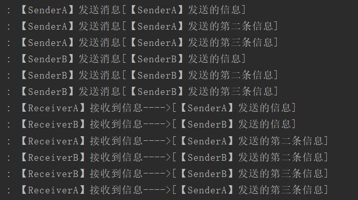

结果可以看出，消息生产者根据**路由键**发布消息到对应的消息队列，然后消费者根据**队列名称**来消费消息

**假如我想同一个队列有多个的路由键，或者同一个队列有多个消费者，这样可以吗？**

**答案是可以的，实现的模型图如下：**

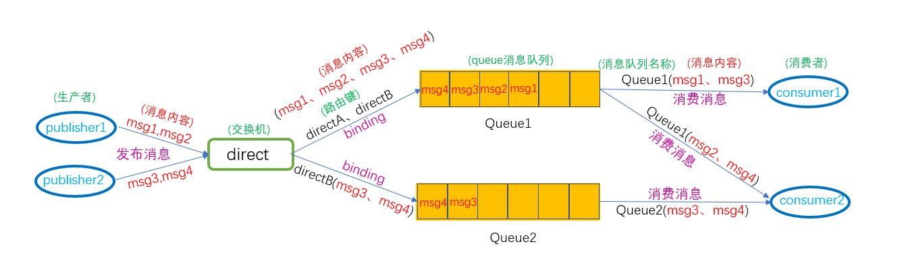

由模型图可以看出来：

- **如果一个队列绑定多个路由键：**消息发布者根据**路由键**发布消息时，会把消息发布到**所有绑定该路由键**的消息队列
- **如果一个队列被多个消费者消费：**该队列会按照**轮询机制**被监听该队列的消费者消费，如模型图中的**Queue1**，**msg1**被**consumer1**消费，**msg2**被**consumer2**消费，**msg3**被**consumer1**消费，msg4被**consumer2**消费；而**Queue2**则只被监听它的**consumer2**消费。所以**consumer2**消费的消息有**Q2**中的**msg3、msg4**和**Q1**中的**msg2、msg4**，而**consumer1**消费的只有**Q1**中的**msg1和msg3**

**用代码实现：**

- 在**rabbitmqConfiguration**类中增加一个消息队列与交换器的绑定

路由键 **directB**绑定了**directQueueA**与**directQueueB**两个队列

```java
    @Bean
    public Binding bindDirectExchange_C(){
        return BindingBuilder.bind(this.directQueue_A()).to(this.directExchange()).with("directB");
    }
```

- 修改**MqReceiverDirectExchange**类中的两个消费者

即**ReceiverB**方法监听了 **{"directQueueB","directQueueA"}**这两个队列

```java
    @RabbitListener(queues = "directQueueA")
    @RabbitHandler
    public void ReceiverA(Message msg){
        String getQueueName = msg.getMessageProperties().getConsumerQueue();
        String massage = new String(msg.getBody());
        log.info("【ReceiverA】接收到来自队列[ "+getQueueName+" ]的信息---->[ "+massage+" ]");
    }

    @RabbitListener(queues = {"directQueueB","directQueueA"})
    @RabbitHandler
    public void ReceiverB(Message msg){ //接收Message类型的返回值(包括消息队列的一些信息)
        //获取当前消息是从哪个队列中获取的
        String getQueueName = msg.getMessageProperties().getConsumerQueue();
        //获取当前消费的消息内容，获取到的是byte类型，要转成String
        String massage = new String(msg.getBody());
        log.info("【ReceiverB】接收到来自队列[ "+getQueueName+" ]的信息---->["+massage+"]");
    }
```

- 再次运行测试结果如下

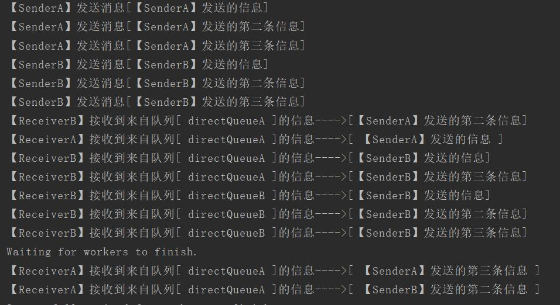

> 分析结果：
>
> **directQueueA**队列的消息有：**[*SendA一，SendA二，SendA三，SendB一，SendB二，SendB三*]**
>
> **directQueueB**队列的消息有：**[*SendB一，SendB二，SendB三*]**
>
> 消费者**ReceiverA**消费的消息有： **[*SendA一，SendA三，SendB二*]**
>
> 消费者**ReceiverB**消费的消息有： **[*SendA二，SendB一，SendB三，SendB一，SendB二，SendB三*]**（这里**前3个**是队列**directQueueA**的消息，**后3个**是队列**directQueueB**的消息）
>
> 可以看出，一个队列绑定多个路由键与一个队列绑定多个消费者是可行的，并且可知，
>
> 即使一个队列绑定多个消费者，队列中的消息依然按照**轮询机制**把消息给消费者消费

##### - fanout Exchange交换机**

> 解释：
>
> **fanout Exchange**即**广播交换机**，它可以**不用指定路由键**就把消息发送到与**fanout交换机**绑定的**所有队列**中，
>
> 通俗来讲就是，**当一个消息发布者发布了一条消息，与该交换机绑定的所有队列都会接收到这条消息，然后所有监听这些消息队列的订阅者都可以拿到消息发布者发布的这条消息**

**模型图：**

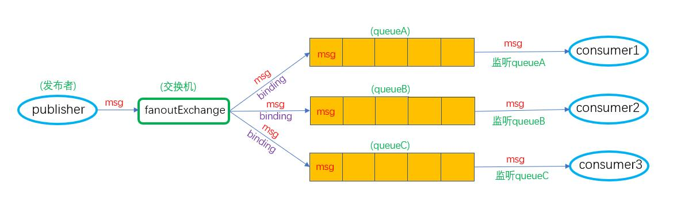

**代码实现：**

- 修改**rabbitmqConfiguration**配置类，添加消息队列、交换机和对其进行绑定

```java
    /**
    * 创建3个消息队列
    */
    @Bean
    public Queue fanoutQueue_A(){
        return new Queue("fanoutQueueA");
    }
    @Bean
    public Queue fanoutQueue_B(){
        return new Queue("fanoutQueueB");
    }
    @Bean
    public Queue fanoutQueue_C(){
        return new Queue("fanoutQueueC");
    }

    /**
     * 创建fanout Exchange交换机
     * @return
     */
    @Bean
    public FanoutExchange fanoutExchange(){
        return new FanoutExchange("fanoutExchange");
    }

    /**
     * 把消息队列与fanout交换机绑定起来，路由键可以不用设置，即使设置了也无任何变化
     * @return
     */
    @Bean
    public Binding bindFanoutExchange_A(){
        return BindingBuilder.bind(fanoutQueue_A()).to(fanoutExchange());
    }
    @Bean
    public Binding bindFanoutExchange_B(){
        return BindingBuilder.bind(fanoutQueue_B()).to(fanoutExchange());
    }
    @Bean
    public Binding bindFanoutExchange_C(){
        return BindingBuilder.bind(fanoutQueue_C()).to(fanoutExchange());
    }
```

- 创建**MqSenderFanoutExchange**类，充当发布者

```java
package com.hat.rabbitmq.mqsender;

import org.slf4j.Logger;
import org.slf4j.LoggerFactory;
import org.springframework.amqp.core.AmqpTemplate;
import org.springframework.beans.factory.annotation.Autowired;
import org.springframework.stereotype.Component;

@Component
public class MqSenderFanoutExchange {
    private static final Logger log = LoggerFactory.getLogger(MqSenderDirectExchange.class);

    //注入AmqpTemplate
    @Autowired
    AmqpTemplate rabbitTemplate;

    /**
     * 发布者，需要指定exchange(创建交换机的名称)，
     * 路由键设置为空就行，即使指定了路由键，fanout交换机也不会根据路由键查找相应队列，
     * 只要与fanout交换机绑定的队列都会收到消息
     */
    public void Sender(String msg){
        rabbitTemplate.convertAndSend("fanoutExchange","", msg);
        log.info("【fanoutExchange】发送了信息---"+msg);
    }
}

```

- 创建**MqReceiverFanoutExchange**类，充当订阅者

```java
package com.hat.rabbitmq.mqreceiver;

import org.slf4j.Logger;
import org.slf4j.LoggerFactory;
import org.springframework.amqp.rabbit.annotation.RabbitHandler;
import org.springframework.amqp.rabbit.annotation.RabbitListener;
import org.springframework.stereotype.Component;

@Component
public class MqReceiverFanoutExchange {
    private static final Logger log = LoggerFactory.getLogger(MqReceiverFanoutExchange.class);

    //监听[fanoutQueueA]队列
    @RabbitListener(queues = "fanoutQueueA")
    @RabbitHandler
    public void ReceiverA(String msg){
        log.info("[ReceiverA]接收到消息---["+msg+']');
    }
    
    //监听[fanoutQueueB]队列
    @RabbitListener(queues = "fanoutQueueB")
    @RabbitHandler
    public void ReceiverB(String msg){
        log.info("[ReceiverB]接收到消息---["+msg+']');
    }

    //监听[fanoutQueueC]队列
    @RabbitListener(queues = "fanoutQueueC")
    @RabbitHandler
    public void ReceiverC(String msg){
        log.info("[ReceiverC]接收到消息---["+msg+']');
    }

}

```

- 测试代码

```java
    @Autowired
    MqSenderFanoutExchange fanoutSender;
    @Test
    public void testfanout(){
        fanoutSender.Sender("【fanout】发送的第一条信息");
        fanoutSender.Sender("【fanout】发送的第二条信息");
    }

```

- 测试结果

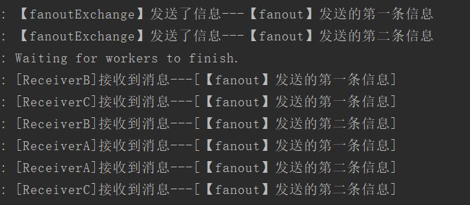

>分析结果:
>
>**可以看出3个订阅者监听的队列均收到发布者发布的消息。**


##### - **topic Exchange交换机**

>解释:
>
>topic交换机最大特点是可以根据通配符【*****(星号)】和【**#**(井号)】来匹配路由键
>
>【  *  (星号)  】：
>
>​		*可以匹配**一个**单词，如路由键为【**aa.bb.cc**】时，【**aa.bb.***】、【***.bb.cc**】和【**aa.*.cc**】可以匹配得到路由键，其他的都无法正确匹配
>
>【  #  (井号)  】：
>
>​		可以匹配**任意个**单词(**包括0个**)，如 **【aa.#】**可以匹配到**[aa.bb]**或者**[aa.bb.cc]**或者**[aa]**，总之**开头是[aa]**，后面接**多少个单词都可以**，**0个也可以**；**【#.aa】**则**结尾是[aa]**，**前面接任意个单词都可以**；**【aa.#.bb】**则**开头是[aa]且结尾是[bb]**，**中间可以接任意个单词**，**注意：单词之间都要用点(.)分隔开来**

**模型图**

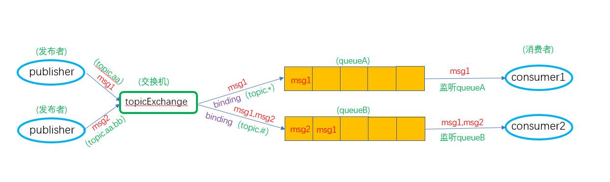

1. **测试【*(星号)】代码实现**

   

   - 在**rabbitmqConfiguration**类中创建消息队列和交换器，并且把他们绑定起来

   ```java
   @Bean
   public Queue topicQueue_A(){
       return new Queue("topicQueueA");
   }
   
   @Bean
   public TopicExchange topicExchange(){
       return new TopicExchange("topicExchange");
   }
   
   @Bean
   public Binding bindTopicExchange_A1(){
       return BindingBuilder.bind(topicQueue_A()).to(topicExchange()).with("topic.aa.*");
   }
   @Bean
   public Binding bindTopicExchange_A2(){
       return BindingBuilder.bind(topicQueue_A()).to(topicExchange()).with("*.topic.aa");
   }
   @Bean
   public Binding bindTopicExchange_A3(){
       return BindingBuilder.bind(topicQueue_A()).to(topicExchange()).with("topic.*.bb");
   }
   ```

   - 创建**MqSenderTopicExchange**类作为消息发布者

   ```java
   package com.hat.rabbitmq.mqsender;
   
   import org.slf4j.Logger;
   import org.slf4j.LoggerFactory;
   import org.springframework.amqp.core.AmqpTemplate;
   import org.springframework.beans.factory.annotation.Autowired;
   import org.springframework.stereotype.Component;
   
   @Component
   public class MqSenderTopicExchange {
       private final static Logger log = LoggerFactory.getLogger(MqSenderTopicExchange.class);
   
       @Autowired
       AmqpTemplate rabbitTemplate;
   
       //发布消息,这里为了方便测试，把路由键也作为参数传过来
       public void SenderA(String msg,String routingkey){
           rabbitTemplate.convertAndSend("topicExchange",routingkey,msg);
           log.info("【SenderA】发布消息成功————"+msg);
       }
   }
   
   ```

   - 创建**MqReceiverTopicExchange**类作为消息消费者

   ```java
   package com.hat.rabbitmq.mqreceiver;
   
   import org.slf4j.Logger;
   import org.slf4j.LoggerFactory;
   import org.springframework.amqp.rabbit.annotation.RabbitHandler;
   import org.springframework.amqp.rabbit.annotation.RabbitListener;
   import org.springframework.stereotype.Component;
   
   @Component
   public class MqReceiverTopicExchange {
       private final static Logger log = LoggerFactory.getLogger(MqReceiverTopicExchange.class);
   
       //消息消费者，监听topicQueueA队列
       @RabbitListener(queues = "topicQueueA")
       @RabbitHandler
       public void ReceiverA(String msg){
           log.info("[ReceiverA]接收到消息-----["+msg+"]");
       }
   }
   
   ```

   - 测试结果

   ```java
       @Autowired
       MqSenderTopicExchange topicSender;
       @Test
       public void testtopic(){
           topicSender.SenderA("发送的路由键为[topic.aa.test1]--1", "topic.aa.test1");
           topicSender.SenderA("发送的路由键为[topic.aa.bb.test1.tt]--2", "topic.aa.test1.tt");
           topicSender.SenderA("发送的路由键为[topic.bb.aa]--3", "topic.bb.aa");
           topicSender.SenderA("发送的路由键为[topic.test1.bb]--4", "topic.test1.bb");
           topicSender.SenderA("发送的路由键为[topic.aa]--5", "topic.aa");
           topicSender.SenderA("发送的路由键为[test1.topic.aa]--6", "test1.topic.aa");
           topicSender.SenderA("发送的路由键为[tt.test1.topic.aa]--7", "tt.test1.topic.aa");
       }
   ```

   - 测试结果

   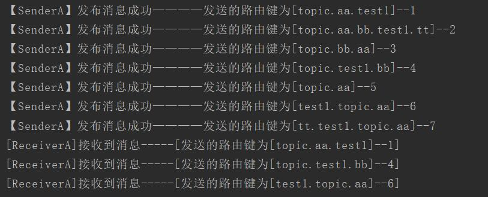

   >分析：
   >
   >在配置文件中，我对**topicQueueA**队列根据3种不同的路由键绑定topic交换机，且路由键匹配规则都不一样，分别为`【topic.aa.*】`、`【*.topic.aa】`、`【topic.*.bb】`
   >
   >测试结果中只有 ***1、4、6***符合匹配条件，因此只有 ***1、4、6***这3条消息成功发布到队列中

   

2. **测试【#(井号)】代码实现**

   - 在**rabbitmqConfiguration**增加一个topic交换机与**topicQueueB**队列绑定

   ```java
   @Bean
   public Queue topicQueue_B(){
   	return new Queue("topicQueueB");
   }
   
   @Bean
   public TopicExchange topicExchangeB(){
   	return new TopicExchange("topicExchangeB");
   }
   
   @Bean
   public Binding bindTopicExchange_B1(){
   	return BindingBuilder.bind(topicQueue_B()).to(topicExchangeB()).with("topic.aa.#");
   }
   @Bean
   public Binding bindTopicExchange_B2(){
   	return BindingBuilder.bind(topicQueue_B()).to(topicExchangeB()).with("#.topic.aa");
   }
   @Bean
   public Binding bindTopicExchange_B3(){
   	return BindingBuilder.bind(topicQueue_B()).to(topicExchangeB()).with("topic.#.bb");
   }
   
   ```

   - 在**MqSenderTopicExchange**消息发布者类中增加一个新的发布者

   ```java
    public void SenderB(String msg, String routingkey){
        rabbitTemplate.convertAndSend("topicExchangeB",routingkey,msg);
        log.info("【SenderB】发布消息成功————"+msg);
    }
   ```

   - 在**MqReceiverTopicExchange**类中增加一个消费者

   ```java
   @RabbitListener(queues = "topicQueueB")
   @RabbitHandler
   public void ReceiverB(String msg){
       log.info("[ReceiverB]接收到消息-----["+msg+"]");
   }
   ```

   - 测试代码

   ```java
   @Test
   public void testtopicB(){
       topicSender.SenderB("发送的路由键为[topic.aa.test1]--1", "topic.aa.test1");
       topicSender.SenderB("发送的路由键为[topic.aa.test1.test2]--2", "topic.aa.test1.test2");
       topicSender.SenderB("发送的路由键为[topic.aa]--3", "topic.aa");
       topicSender.SenderB("发送的路由键为[test1.topic.aa]--4", "test1.topic.aa");
       topicSender.SenderB("发送的路由键为[test2.test1.topic.aa]--5", "test2.test1.topic.aa");
       topicSender.SenderB("发送的路由键为[topic.bb.aa]--6", "topic.bb.aa");
       topicSender.SenderB("发送的路由键为[topic.aa.bb]--7", "topic.aa.bb");
       topicSender.SenderB("发送的路由键为[test2.topic.aa.test1.bb]--8", "test2.topic.aa.test1.bb");
       topicSender.SenderB("发送的路由键为[topic.aa.test1.bb.test2]--9", "topic.aa.test1.bb.test2");
       topicSender.SenderB("发送的路由键为[test2.topic.aa.test1]--10", "test2.topic.aa.test1");
       topicSender.SenderB("发送的路由键为[topic.bb]--11", "topic.bb");
   }
   ```

   - 测试结果

   

   > 分析：
   >
   > 从测试结果图中可以看出，【#】井号通配符可以匹配**任意个**单词，【#】代表的就是任意个单词，**写好指定**的单词则必须都有且顺序格式一致，否则无法匹配到相应路由键，然后**非写好定制**的单词则通过通配符来匹配。


##### - **header Exchange交换机**

> 解释：
>
> **headers Exchange**模式交换机与**fanout Exchange**一样不需要**routingkey**(路由键)，但是**headers交换机**是使用一个**header**来替代**routingKey**，**routingKey**只可以匹配**string**类型，而**header**是匹配一个以**key-value**存储的**对象**。
>
> **headers交换机**有两种匹配方式，**all**和**any**
>
> **all：**完全匹配**header**中**所有key-value**，可以多，不可以少
>
> **any：**任意匹配**一个key-value**即可。可以多，也可以少

**模型图**

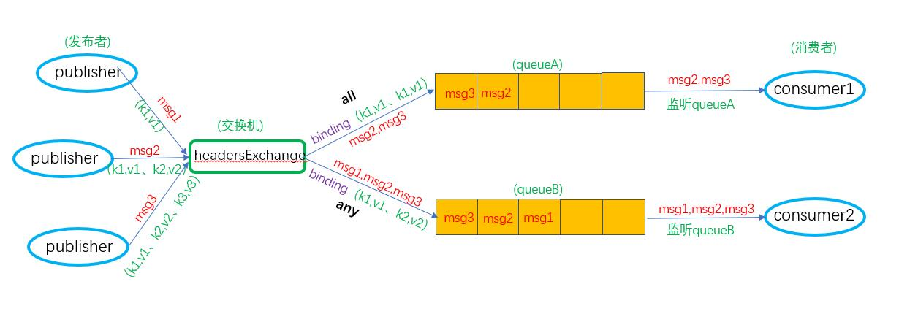

**代码实现**

- 在**rabbitmqConfiguration**类创建队列和交换机

```java
	@Bean
    public Queue headerQueueA(){
        return new Queue("headerQueueA");
    }
    @Bean
    public Queue headerQueueB(){
        return new Queue("headerQueueB");
    }

    /**
     * 创建headers Exchange交换机
     * @return
     */
    @Bean
    public HeadersExchange headersExchange(){
        return new HeadersExchange("headersExchange");
    }

    /**
     * 绑定headers Exchange和消息队列。
     *      whereAll：全属性匹配，还有[whereAny],是部分匹配。 这里参数是一个map对象(headers)
     *      match：就是匹配
     * @return
     */
    @Bean
    public Binding bindHeadersExchangeAll(){
        Map<String, Object> headers = new HashMap<>();
        headers.put("key1","value1");
        headers.put("key2","value2");
        return BindingBuilder.bind(headerQueueA()).to(headersExchange()).whereAll(headers).match();
    }

    @Bean
    public Binding bindHeadersExchangeAny(){
        Map<String, Object> headers = new HashMap<>();
        headers.put("key1","value1");
        headers.put("key2","value2");
        return BindingBuilder.bind(headerQueueB()).to(headersExchange()).whereAny(headers).match();
    }
```

- 创建消息发布者类**MqSenderHeadersExchange**

```java
package com.hat.rabbitmq.mqsender;

import org.slf4j.Logger;
import org.slf4j.LoggerFactory;
import org.springframework.amqp.core.Message;
import org.springframework.amqp.core.MessageProperties;
import org.springframework.amqp.rabbit.core.RabbitTemplate;
import org.springframework.beans.factory.annotation.Autowired;
import org.springframework.stereotype.Component;

@Component
public class MqSenderHeadersExchange {
    private static final Logger log = LoggerFactory.getLogger(MqSenderHeadersExchange.class);

    @Autowired
    RabbitTemplate rabbitTemplate;

    public void Sender(String body, MessageProperties properties){
        Message msg = new Message(body.getBytes(), properties);
        rabbitTemplate.convertAndSend("headersExchange","",msg);
        log.info("【Headers Sender】使用的header为[ "+properties.getHeaders()+ "],发布的消息---["+body+"]");
    }
}
```

- 创建消费者类**MqReceiverHeadersExchange**

```java
package com.hat.rabbitmq.mqreceiver;

import org.slf4j.Logger;
import org.slf4j.LoggerFactory;
import org.springframework.amqp.core.Message;
import org.springframework.amqp.rabbit.annotation.RabbitHandler;
import org.springframework.amqp.rabbit.annotation.RabbitListener;
import org.springframework.stereotype.Component;

@Component
public class MqReceiverHeadersExchange {
    private static final Logger log = LoggerFactory.getLogger(MqReceiverHeadersExchange.class);

    @RabbitListener(queues = "headerQueueA")
    @RabbitHandler
    public void ReceiverAll(Message msg){
        log.info("[ Receiver（All）]收到消息---["+new String(msg.getBody())+"]");
    }

    @RabbitListener(queues = "headerQueueB")
    @RabbitHandler
    public void ReceiverAny(Message msg){
        log.info("[ Receiver（Any）]收到消息---["+new String(msg.getBody())+"]");
    }
}

```

- 创建测试

```java
    @Autowired
    MqSenderHeadersExchange headerSender;

    @Test
    public void testheader(){

        MessageProperties properties1 = new MessageProperties();
        properties1.setHeader("key2","value2");

        MessageProperties properties2 = new MessageProperties();
        properties2.setHeader("key1","value1");
        properties2.setHeader("key2","value2");

        MessageProperties properties3 = new MessageProperties();
        properties3.setHeader("key2","value2");
        properties3.setHeader("key1","value1");
        properties3.setHeader("key3","value3");

        headerSender.Sender("1--发送的header为[k2,v2]",properties1);
        headerSender.Sender("2--发送的header为[k1,v1、k2,v2]",properties2);
        headerSender.Sender("3--发送的header为[k1,v1、k2,v2、k3,v3]",properties3);
    }
```

- 测试结果如下

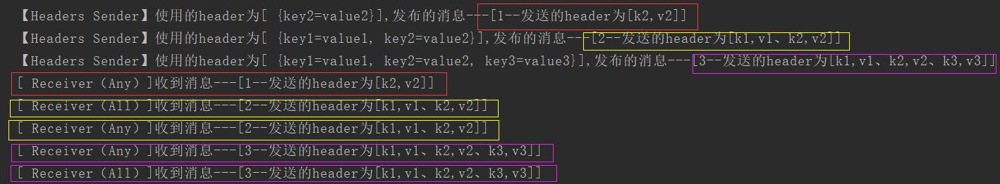

>分析：
>
>从结果可以看出，使用**All**匹配模式时要**完全匹配header**，**key-value**的个数**超过**绑定时的header时也**可以匹配**，**少于**就**无法匹配**。当使用**Any**时，只要有一个**key-value**匹配到绑定时的header，即成功匹配，即至少有一个**key-value**属性与header匹配则成功匹配

##### - **消息发布者确认机制**

>消息发布者在发布消息时，有可能会发送失败，原因可能**交换机不存在**或者**匹配的路由键不存在**，也可能是**网络问题**，在传输过程中出现问题，而正常情况下，我们是不知道消息是否成功发送到队列中。
>
>因此RabbitMQ提供了两种消息发布者确认机制，一种是使用**事务机制**，一种是**Confirm**发布者确认机制,如果使用**事务机制**，则会大大降低系统的吞吐量
>
>**Confirm**确认机制：
>
>​		**ConfirmCallback**用来判断消息是否到达**Exchange**，不管成功还是失败，**broker(rabbitmq服务端)**都会返回一个**ack**，这个**ack**是一个**boolean**值，当**ack**为**True**时，表明消息**已经到达Exchange**，当**ack**为**False**时则消息**没有到达Exchange**，原因可能是**Exchange**，也可能是其他原因导致的消息无法找到**Exchange**，然后我们可以使用**ConfirmCallback**来接收**ack**且根据**ack**来做出相应的操作。
>
>​		**ReturnCallback**用来判断消息是否根据路由键匹配到队列，如果**能**路由到队列，则**不触发回调**，如果**不能**路由到队列，则**会触发回调**，然后可以在回调方法中作出相应操作

消息发布的模型图：

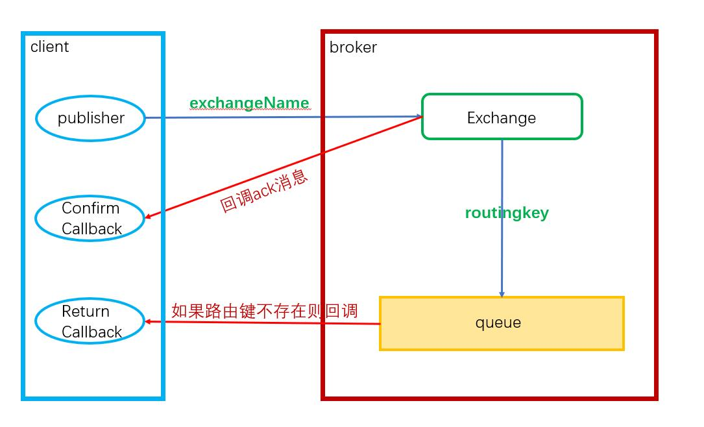

**Confirm**的实现

- 在**application.yml**配置文件中添加配置 

  `publisher-confirms: true` 配置开启confirm消息确认机制(ConfirmCallback)

  `publisher-returns: true` 配置开启ReturnCallback

- 在**rabbitmqConfiguration**配置类中添加如下代码

```java
    //注入CachingConnectionFactory连接工厂，可以设置或者获取yml配置文件中的配置
    @Autowired
    private CachingConnectionFactory factory;
    @Bean
    public RabbitTemplate rabbitTemplate(){
        RabbitTemplate rabbit = new RabbitTemplate(factory); //实例化rabbitTemplate模版连接
        /**
         * 消息发布到broker就会回调
         * 参数：
         *      correlationData：消息唯一id，确保每个消息都有一个唯一id
         *      ack：是否成功，true为可以到达交换机，false则不可以到达交换机
         *      cause：如果ack为false时，不能到达交换机的原因
         */
        rabbit.setConfirmCallback((correlationData, ack, cause) -> {
            if (ack){
                log.info("到达Exchange成功：correlationData({}),ack({}),cause({})",correlationData,ack,cause);
            }else {
                log.info("到达Exchange失败：correlationData({}),ack({}),cause({})",correlationData,ack,cause);
            }
        });

        /**
         * 当消息路由到队列失败时回调
         * 参数：
         *      message：消息内容
         *      replyCode：返回编码
         *      replyText：返回内容
         *      exchange： 交换机名称
         *      routingKey：路由键
         */
        rabbit.setMandatory(true);  //一定要设置setMandatory为True，不然失败时无法回调
        rabbit.setReturnCallback((message, replyCode, replyText, exchange, routingKey) -> {
            log.info("消息丢失:exchange({}),route({}),replyCode({}),replyText({}),message:{}",
                    exchange,routingKey,replyCode,replyText,message);
        });
        
        return rabbit;
    }
```

- 创建一个新的**Sender**

```java
package com.hat.rabbitmq.mqsender;

import org.slf4j.Logger;
import org.slf4j.LoggerFactory;
import org.springframework.amqp.rabbit.connection.CorrelationData;
import org.springframework.amqp.rabbit.core.RabbitTemplate;
import org.springframework.beans.factory.annotation.Autowired;
import org.springframework.stereotype.Component;

import java.util.UUID;

@Component
public class MqSender {
    private final static Logger log = LoggerFactory.getLogger(MqSender.class);

    @Autowired
    RabbitTemplate rabbitTemplate; //这里使用RabbitTemplate来发送消息

    public void Sender(String exchange,String routingkey,String msg){
        //实例化一个CorrelationData对象充当消息的唯一id
        CorrelationData correlationData = new CorrelationData(UUID.randomUUID().toString());
        //发布消息
        rabbitTemplate.convertAndSend(exchange,routingkey,msg,correlationData);
        log.info("【Sender】发送的消息内容[{}]到[{}]交换机，路由键为[{}]，消息id为[{}]",
                msg,exchange,routingkey,correlationData);
    }

}

```

- 测试

1. 当我发送到交换机为**directExchange**，路由键为**directA**绑定的队列时，在前面我已经创建过**directExchange**交换机和**directA**路由键，因此该测试触发了**ConfirmCallback**回调，且**ack**为**True**。

   ```java
   sender.Sender("directExchange","directA","[ 1、directExchange、directA的消息]");
   ```

   结果：

   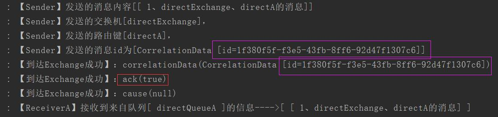

   

2.  当我发送到交换机为**exchange.no**，路由键为**keyno**绑定的队列时，该交换机与路由键我都没有创建，

   因此该测试触发了**ConfirmCallback**回调，且**ack**为**False**。

   ```java
   sender.Sender("exchange.no","keyno","[ 1、exchange.no、keyno的消息]");
   ```

   结果：

   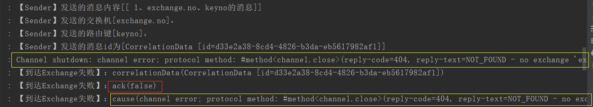

   > 在上面的结果图中，可以看到**ack**为**false**，而且当找不到名为**exchange.no**交换机时，**Channel通道**会断开，并且会输出断开的原因，而且我么也可以在**ConfirmCallback**回调方法中接收到原因

   

3.  当我发送到的交换机为**directExchange(存在)**，路由键为**keyno(不存在)**绑定的队列时。

   会触发**ConfirmCallback**回调，且**ack**为**True**，且同时会触发**ReturnCallback**回调

   ```java
   sender.Sender("directExchange","keyno","[ 2、directExchange、keyno的消息]");
   ```

   结果：

   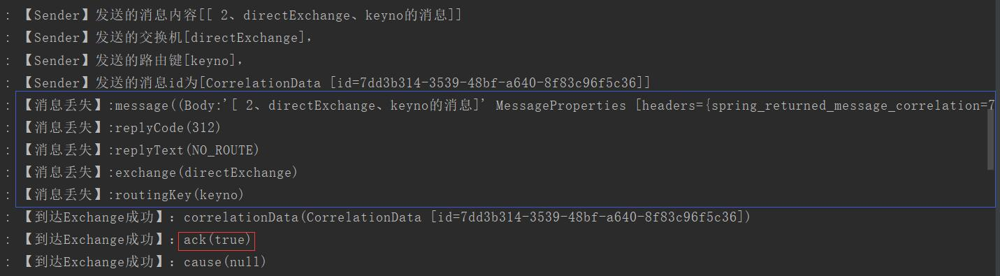

   > 在上面的结果中，可以看到**ack**为**true**，因为**directExchange**是存在的，消息可以到达**directExchange**交换机，然而**keyno**路由键并不存在，因此会触发**ReturnCallback**回调，输出一些的信息。

##### - **manual acknowledgements**（手动确认）

> 解释：
>
> 上面的四种交换机方式用的都是**消息自动确认模式（nack）**，而这种方式存在一些问题，比如消息发布者只要把消息发送成功，不管消费者是否处理完成，就把该消息标记为完成，然后在队列中删除该消息。假如消费者在处理消息的过程中突然宕机了，那么该消息没有被完全处理，而发布者也已经把该消息删除，从而造成消息丢失。
>
> 因此，可以是用**消息手动确认模式（ack）**模式来处理消息是否被成功消费。当使用**ack**模式时，消费者把消息处理完成后会返回一个**标志**给**RabbitMQ**，当**RabbitMQ**收到这个**标志**后才会认定该消息被成功消费，然后再把该消息从队列中删除，从而避免了消息还没有被成功消费就丢失。

实现代码

- 在application.yml配置文件中添加配置开启消息手动确认模式

  ```yaml
  listener:
        simple:
          acknowledge-mode: manual
  ```

  > **acknowledge-mode**有**3**个参数
  >
  > ​		**manual**：消息手动确认模式，**channel**提供了**basicAck**、**basicNack**、**basicReject**来进行手动确认
  >
  > ​		**none**：自动确认，即发送到消费者就确认，不管消费者是否处理完成
  >
  > ​		**auto**：根据消费者是否正常返回或者抛出异常来确认

  

  1. 当只开启了消息确认模式而没有进行手动确认，那么消息就会一直存放在**queue**中。

     

     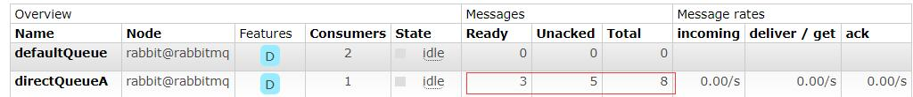

     > 当我没写手动确认代码时，发送了8个消息到队列中,可以看出，如果没写代码手动确认，则消息会一直存在队列中。图中显示有5个消息没有确认，原因是我没有关闭consumer，消息就一直处于未确认状态。

     当我关闭consumer时，消息全部回到队列中，变成ready状态

     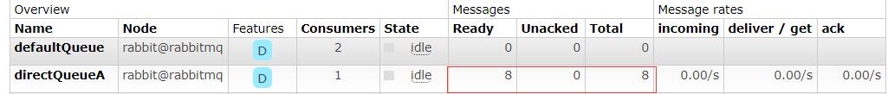

     

  2. 编写代码实现手动确认

     - 成功确认：

       **channel.basicAck(long deliveryTag,boolean multiple)：**

       参数：

       | deliveryTag | 消息的标识，第一个为1，然后依次加1，手动确认时该值作为返回值返回给broker，然后broker根据该标识把消息从队列中删除。 |
       | ----------- | ------------------------------------------------------------ |
       | multiple    | True：把当前标识(deliveryTag)之前未确认的消息全部确认（如：当前deliveryTag为7时，            前面还有4、5、6，则把4、5、6、7标识的消息都确认）                                                         False：把当前标识(deliveryTag)的消息进行确认（如当前为7，则只确认7，如果还有4、5、6,并不会对他们进行确认） |

     - 失败确认：

       **channel.basicNack(long deliveryTag,boolean multiple,boolean requeue)：**

       参数：

       | deliveryTag | 消息的标识，第一个为1，然后依次加1，手动确认时该值作为返回值返回给broker，然后broker根据该标识把消息从队列中删除。 |
       | ----------- | ------------------------------------------------------------ |
       | multiple    | True：把当前标识(deliveryTag)之前未确认的消息全部确认（如：当前deliveryTag为7时，            前面还有4、5、6，则把4、5、6、7标识的消息都确认）。                                                         False：把当前标识(deliveryTag)的消息进行确认（如当前为7，则只确认7，如果还有4、5、6,并不会对他们进行确认） |
       | requeue     | True：重新发送该消息（注意：如果设置为True时不做次数判断则会无限循环下去）。False：丢弃消息 |

     - 拒绝确认：

       **channel.basicReject(long deliveryTag,boolean requeue)**：与**basicNack**用法一样，就少了**multiple**参数

       参数：

       | deliveryTag | 消息的标识，第一个为1，然后依次加1，手动确认时该值作为返回值返回给broker，然后broker根据该标识把消息从队列中删除。 |
       | ----------- | ------------------------------------------------------------ |
       | requeue     | True：重新发送该消息（注意：如果设置为True时不做次数判断则会无限循环下去）。False：丢弃消息 |

     

     代码实现：

     - 修改**消息消费者类**，这里我用**MqReceiverDirectExchange**消费者类，实现消息成功确认

       ```java
       //这个方法增加Channel参数,这个参数可以实现手动确认
       @RabbitListener(queues = "directQueueA")
       @RabbitHandler  
       public void ReceiverA(Message msg, Channel channel) throws IOException { 
           String getQueueName = msg.getMessageProperties().getConsumerQueue();
           String massage = new String(msg.getBody());
       	//手动成功确认，把deliveryTag作为参数返回给broker
           channel.basicAck(msg.getMessageProperties().getDeliveryTag(), false);
           log.info("【ReceiverA】接收到来自队列[ " + getQueueName + " ]的信息---->[ " + massage + " ]");
       }
       ```

       > 当设置了basicAck()后，消费者把消息处理完后就把deliveryTag返回给broker，broker再根据deliveryTag删除队列中的消息。这样就实现了消息手动确认。

       

     - 再修改**MqReceiverDirectExchange**消费者类，实现消息失败确认。

       ```java
       package com.hat.rabbitmq.mqreceiver;
       
       import com.rabbitmq.client.Channel;
       import org.slf4j.Logger;
       import org.slf4j.LoggerFactory;
       import org.springframework.amqp.core.Message;
       import org.springframework.amqp.rabbit.annotation.RabbitHandler;
       import org.springframework.amqp.rabbit.annotation.RabbitListener;
       
       import org.springframework.stereotype.Component;
       
       import java.io.IOException;
       
       
       @Component
       public class MqReceiverDirectExchange {
           private final static Logger log = LoggerFactory.getLogger(MqReceiverDirectExchange.class);
           int count = 0; //记录重试的次数
           @RabbitListener(queues = "directQueueA")
           @RabbitHandler
           public void ReceiverA(Message msg, Channel channel) throws IOException {
               String getQueueName = msg.getMessageProperties().getConsumerQueue();
               String massage = new String(msg.getBody());
               //模拟如果出现异常或者出现其他问题时导致消息处理失败时的处理
               if ("这是消息5".equals(massage) || "这是消息7".equals(massage) ){
                   log.info("*************************************************");
                   count += 1;
                   if(count < 6) {
                       log.info("【重试第[{}]次】",count);
                       channel.basicNack(msg.getMessageProperties().getDeliveryTag(), false, true);
                   }else {
                       log.info("【重试次数已超过，丢弃消息[{}]】",massage);
                       channel.basicNack(msg.getMessageProperties().getDeliveryTag(), false, false);
                       count = 0;
                   }
               }else {
                   /**
                    * basicAck()：消息成功确认，参数与basicNack()一样，就少了个requeue参数
                    * 处理完消息后就把deliveryTag返回给broker，然后broker会删除对应消息
                    */
                   channel.basicAck(msg.getMessageProperties().getDeliveryTag(), false);
                   log.info("【ReceiverA】接收到来自队列[ " + getQueueName + " ]的信息---->[ " + massage + " ]");
               }
           }
       }
       
       ```

       

       往队列发送10个消息测试，结果如下图：

       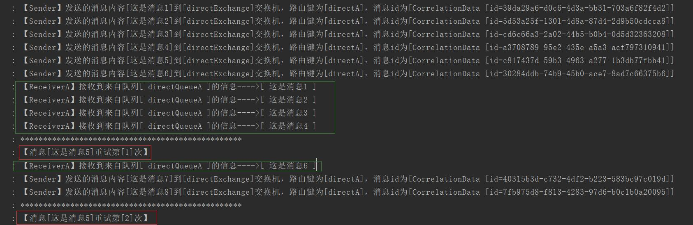

       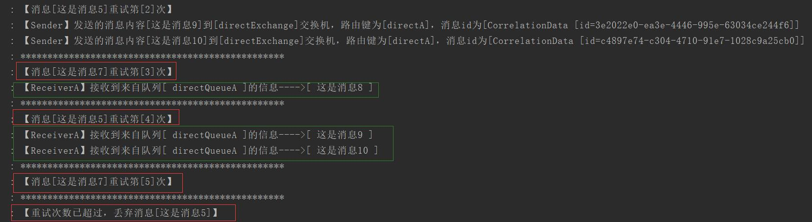

       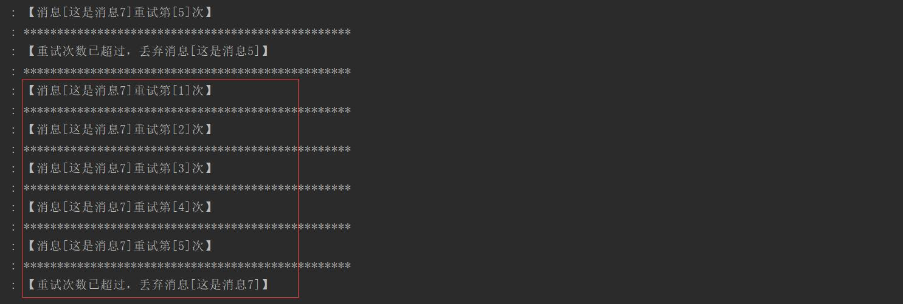

       

       >假设**第5条**消息与**第7条**消息**发生异常**或者**其他问题**，可以看出消费者在处理第**5**条时，会执行**channel.basicNack(msg.getMessageProperties().getDeliveryTag(), false, true)**方法来处理消息失败确认，因为我**第3个参数**设置为**true**，因此会把消息重新入队，然后再重新发送消息，当发送到第6次时，我把**channel.basicNack(msg.getMessageProperties().getDeliveryTag(), false, false)**的**第3个参数**设置为**false**，说明要**丢弃**这个消息。因此**【ReceiverA】**处理完第5跟第7条消息。
       >
       >**注意1：**如果消息处理失败时，不自己设置重试的次数，则该消息会无限循环重新入队，且回到队列头部，因此该消息后面的消息都会卡在那里无法被消费者接收到。

       

