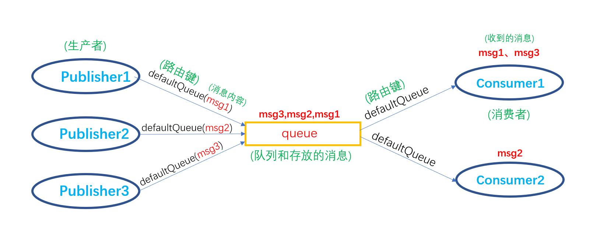

# RabbitMQ消息队列

## 一、RabbitMQ简介

### 1.什么是RabbitMQ

**AMQP(Advanced Message Queuing Protocol)**,即高级消息队列协议，是一个提供统一消息服务的应用层标准高级消息队列协议，是应用层的一个开放标准，为面向消息的中间件设计。基于此协议的客户端与消息中间件可传递消息。**RabbitMQ**则是**AMQP**的一种实现，它还支持**STOMP**和**MQTT**协议。

### 2.RabbitMQ的用处

* 解耦
* 异步处理
* 流量削峰
* 消息分发

### 3.与其他类似框架比较

| 特性                     | ActiveMQ                              | RabbitMQ                                           | RocketMQ                                                     | Kafka                                                        |
| ------------------------ | ------------------------------------- | -------------------------------------------------- | ------------------------------------------------------------ | ------------------------------------------------------------ |
| 单机吞吐量               | 万级，比 RocketMQ、Kafka 低一个数量级 | 同 ActiveMQ                                        | 10 万级，支撑高吞吐                                          | 10 万级，高吞吐，一般配合大数据类的系统来进行实时数据计算、日志采集等场景 |
| topic 数量对吞吐量的影响 |                                       |                                                    | topic 可以达到几百/几千的级别，吞吐量会有较小幅度的下降，这是 RocketMQ 的一大优势，在同等机器下，可以支撑大量的 topic | topic 从几十到几百个时候，吞吐量会大幅度下降，在同等机器下，Kafka 尽量保证 topic 数量不要过多，如果要支撑大规模的 topic，需要增加更多的机器资源 |
| 时效性                   | ms 级                                 | 微秒级，这是 RabbitMQ 的一大特点，延迟最低         | ms 级                                                        | 延迟在 ms 级以内                                             |
| 可用性                   | 高，基于主从架构实现高可用            | 同 ActiveMQ                                        | 非常高，分布式架构                                           | 非常高，分布式，一个数据多个副本，少数机器宕机，不会丢失数据，不会导致不可用 |
| 消息可靠性               | 有较低的概率丢失数据                  | 基本不丢                                           | 经过参数优化配置，可以做到 0 丢失                            | 同 RocketMQ                                                  |
| 功能支持                 | MQ 领域的功能极其完备                 | 基于 erlang 开发，并发能力很强，性能极好，延时很低 | MQ 功能较为完善，还是分布式的，扩展性好                      | 功能较为简单，主要支持简单的 MQ 功能，在大数据领域的实时计算以及日志采集被大规模使用 |


## 二、安装RabbitMQ

### 1.使用docker安装RabbitMQ

* 下载带有监控管理的**rabbitmq**：***rabbitmq-management***

  `docker pull rabbitmq:management`

* 部署**rabbitmq**容器

  ```
  docker run 
  -d                //后台运行
  -p 15672:15672    //把rabbitmq的15672端口映射到本机的15672端口，这个端口是登录管理页面用的
  -p 5672:5672      //把rabbitmq的5672端口映射到本机的5672端口，这个端口号是连接rabbitmq服务用的
  --hostname rabbitmq  //rabbitmq的主机名称
  --name myrabbitmq    //容器的名称
  -e RABBITMQ_ERLANG_COOKIE='rabbitmqCookie' 
  -v $PWD/myrabbitmq/:/var/lib/rabbitmq/ //把本机的$PWD/myrabbitmq/路径挂载到rabbitmq的/var/lib/rabbitmq/路径
  rabbitmq:management   //要启动的容器， 容器名:版本号
  ```

  

* **集群**部署**rabbitmq**容器

  再启动两个rabbitmq容器，**注意：**映射到本机的地址需要改变，不然会与部署的第一个rabbitmq容器端口号冲突。

  

  RabbitMQ的集群是依附于erlang的集群来工作的，所以必须先构建起erlang的集群镜像。erlang的集群通信的验证机制是通过**erlang.cookie**进行确认的，所以必须使RabbitMQ中的**erlang.cookie**保持一致，否者无法进行通信。RabbitMQ中的**erlang.cookie**存放在**/var/lib/rabbitmq/.erlang.cookie**中。
  
  

  **rabbitmq**：添加一个**RABBITMQ_ERLANG_COOKIE='rabbitmqCookie'**参数，这个参数的值可以随便填，只要保证要集群的其他rabbitmq容器有相同的参数值

  ```
  docker 
  run 
-d 
  -p 15672:15672 
-p 5672:5672 
  --hostname rabbitmq 
--name myrabbitmq 
  -e RABBITMQ_ERLANG_COOKIE='rabbitmqCookie' 
  -v $PWD/myrabbitmq/:/var/lib/rabbitmq/ 
  rabbitmq:management
  ```
  

  

**rabbitmq02**：

  ```
  docker 
  run 
  -d 
  -p 15673:15672 
  -p 5673:5672 
  --hostname rabbitmq02 
  --name myrabbitmq02 
  --link myrabbitmq:rabbitmq 
  -e RABBITMQ_ERLANG_COOKIE='rabbitmqCookie' 
  -v $PWD/myrabbitmq02/:/var/lib/rabbitmq/ 
  rabbitmq:management
  ```

  **rabbitmq03**:

  ```
  docker 
  run 
  -d 
  -p 15674:15672 
  -p 5674:5672 
  --hostname rabbitmq03 
  --name myrabbitmq03 
  --link myrabbitmq:rabbitmq 
  --link myrabbitmq02:rabbitmq02 
  -e RABBITMQ_ERLANG_COOKIE='rabbitmqCookie' 
  -v $PWD/myrabbitmq03/:/var/lib/rabbitmq/ 
  rabbitmq:management
  ```

  **--link**参数是连接两个或多个容器来进行通信。

  `--link <name or id>:alias`
>**解释：**
>
>**name**或**id**：是源容器的**名称**或**id**，如第一个容器中设置的**--name**参数的名称。
>
>alias： 是源容器在link下的别名

  然后把容器加入集群。

  首先进入第一个容器节点**myrabbitmq**，输入下面5条命令

  ```
  docker exec -it myrabbitmq bash    //进入myrabbitmq容器
  rabbitmqctl stop_app               //停止
  rabbitmqctl reset                  //重置
  rabbitmqctl start_app              //开启
  exit                               //退出容器返回到本机
  
  //结果如下：
  hat@ubuntu:~/docker/rabbitmq$ docker exec -it myrabbitmq bash
  root@rabbitmq:/# rabbitmqctl stop_app
  Stopping rabbit application on node rabbit@rabbitmq ...
  root@rabbitmq:/# rabbitmqctl reset
  Resetting node rabbit@rabbitmq ...
  root@rabbitmq:/# rabbitmqctl start_app
  Starting node rabbit@rabbitmq ...
   completed with 3 plugins.
  root@rabbitmq:/# exit
  exit
  ```

  然后进入第二个容器节点**myrabbitmq02**，输入下面6条命令

  ```
  docker exec -it myrabbitmq02 bash   //进入myrabbitmq02容器
  rabbitmqctl stop_app                //停止
  rabbitmqctl reset				     //重置
  rabbitmqctl join_cluster --ram rabbit@rabbitmq  //把myrabbitmq02加入到rabbitmq(第一个容器的主机名)集群，--ram是设置成内存节点，不设置则默认为磁盘节点，如myrabbitmq容器就是磁盘节点
  rabbitmqctl start_app               //开启
  exit                                //退出容器返回本机
  
  结果如下：
  hat@ubuntu:~/docker/rabbitmq$ docker exec -it myrabbitmq02 bash
  root@rabbitmq02:/# rabbitmqctl stop_app
  Stopping rabbit application on node rabbit@rabbitmq02 ...
  root@rabbitmq02:/# rabbitmqctl reset
  Resetting node rabbit@rabbitmq02 ...
  root@rabbitmq02:/# rabbitmqctl join_cluster --ram rabbit@rabbitmq
  Clustering node rabbit@rabbitmq02 with rabbit@rabbitmq
  root@rabbitmq02:/# rabbitmqctl start_app
  Starting node rabbit@rabbitmq02 ...
   completed with 3 plugins.
  root@rabbitmq02:/# exit
  exit
  ```

  最后进入第三个容器节点**myrabbitmq03**，输入下面6条命令

  ```
  docker exec -it myrabbitmq02 bash   //进入myrabbitmq03容器
  rabbitmqctl stop_app                //停止
  rabbitmqctl reset				   //重置
  rabbitmqctl join_cluster --ram rabbit@rabbitmq  //把myrabbitmq03加入到rabbitmq(第一个容器的主机名)集群
  rabbitmqctl start_app               //开启
  exit                                //退出容器返回本机
  
  结果如下：
  hat@ubuntu:~/docker/rabbitmq$ docker exec -it myrabbitmq03 bash
  root@rabbitmq03:~# rabbitmqctl stop_app
  Stopping rabbit application on node rabbit@rabbitmq03 ...
  root@rabbitmq03:~# rabbitmqctl reset
  Resetting node rabbit@rabbitmq03 ...
  root@rabbitmq03:~# rabbitmqctl join_cluster --ram rabbit@rabbitmq
  Clustering node rabbit@rabbitmq03 with rabbit@rabbitmq
  root@rabbitmq03:~# rabbitmqctl start_app
  Starting node rabbit@rabbitmq03 ...
  e completed with 3 plugins.
  root@rabbitmq03:~# exit
  exit
  ```

  完成后在浏览器输入`localhost:15672`登录rabbitmq的管理页面,帐号密码都是*guest*，可以看到结果如下

  


## 三、使用RabbitMQ

### 1.使用注解方式

#### 1.1 创建springboot工程，添加rabbitmq的依赖

```xml
<dependency>
    <groupId>org.springframework.boot</groupId>
    <artifactId>spring-boot-starter-amqp</artifactId>
</dependency>
```

#### 1.2 添加application.yml配置属性

这里我是用**yml**文件来进行配置。

```yaml
spring:
  rabbitmq:
    host: 192.168.229.130    #rabbitmq服务器的地址
    username: guest          #登录帐号，默认是guest
    password: guest          #登录密码，默认是guest
    port: 5672               #rabbitmq服务器占用的端口号，默认5672
```

#### 1.3 rabbitmq的实现

##### -  **无交换机消息队列**

> **解释**：这种消息队列一条消息只能被一个消费者消费，假如只有一个生产者生产一条消息发布到队列，而两个消费从队列中拿这个消息，则第一个消费者能拿到消息，第二个消费者不能拿到消息，当生产者再生产一条消息发布到队列，则第二个消费者可以拿到消息，消费者是按照***[轮询机制]***在队列中取消息的。


**模型图：**




**项目结构如下：**


- 创建**rabbitmqConfiguration**类，该类用来创建消息队列、交换器、绑定队列交换器等,这里先定义了一个无交换器的队列。注意要把该类定义为配置类，添加**@Configuration**注解，且要给创建队列的方法加上**@bean**注解注册到spring容器中

```java
package com.hat.rabbitmq.config;

import org.slf4j.Logger;
import org.slf4j.LoggerFactory;
import org.springframework.amqp.core.Queue;
import org.springframework.context.annotation.Bean;
import org.springframework.context.annotation.Configuration;

@Configuration //把该类定义为配置类
public class rabbitmqConfiguration {
    private static final Logger log = LoggerFactory.getLogger(rabbitmqConfiguration.class);

    /**
     * 无交换器的消息队列
     * 参数：
     *     name：队列名称，如果使用无交换器的消息队列则同时充当路由键(routing key)
     *     durable：queue持久化，即使消息代理崩溃，队列也不会消失，默认true
     *     exclusive：排他性，如果为true，那么除了当前连接可以使用该队列外，其他连接都不能使用该队列，默认false
     *     autoDelete：自动删除，在最后一个连接断开时，queue会自动删除，默认false
     * @return
   */
    @Bean //注册到spring容器
  public Queue queue(){
        //参数是队列名称，不使用交换器时队列名称相当于路由键，
      //接收者需要根据队列名称来接收消息
        return new Queue("defaultQueue",true,false,false);
    }
}

```


- 创建**MqSenderNoExchange**类，该类用来给队列发送消息

```java
package com.hat.rabbitmq.mqsender;

import org.slf4j.Logger;
import org.slf4j.LoggerFactory;
import org.springframework.amqp.core.AmqpTemplate;
import org.springframework.beans.factory.annotation.Autowired;
import org.springframework.stereotype.Component;

@Component //把该类交给spring容器管理
public class MqSender {
    private final static Logger log = LoggerFactory.getLogger(MqSender.class);

    //使用AmqpTemplate模版来发送消息
    @Autowired
    private AmqpTemplate rabbitTemplate;

    /**
     * 不使用交换器的消息队列发送者
     */
    public void defaultQueueSender(){
      long begin = System.currentTimeMillis();
        log.info("【消息开始发送。。。。】");
      //使用convertAndSend来发送消息，
        //参数： routingKey:路由键，接收器根据此路由键接收队列的消息，
        //       message：消息内容，内容可以是对象
        rabbitTemplate.convertAndSend("defaultQueue","[defaultQueue]发送的消息");
        log.info("【消息发送成功。。。。用时（"+(System.currentTimeMillis()-begin)+"ms）】");
    }
}
```

- 创建**MqReceiverNoExchange**类，该类用来接收消息

```java
package com.hat.rabbitmq.mqreceiver;

import org.slf4j.Logger;
import org.slf4j.LoggerFactory;
import org.springframework.amqp.rabbit.annotation.RabbitHandler;
import org.springframework.amqp.rabbit.annotation.RabbitListener;
import org.springframework.stereotype.Component;

@Component //把该类交给spring容器管理
public class MqReceiver {
    private final static Logger log = LoggerFactory.getLogger(MqReceiver.class);
  
    @RabbitListener(queues = "defaultQueue")  //监听路由键为[defaultQueue]的队列
    @RabbitHandler  //收到消息后执行下面方法
    public void getDefaultQueueMsg(String msg){ //参数类型，发送者什么类型就什么类型
        log.info("[getDefaultQueueMsg]接收到--->"+msg);
    }
}
```

- 编写测试类：

```java
@Autowired
MqSenderNoExchange mqSender;
@test
public void textdefault() {
        mqSender.defaultQueueSender("aaaaaaaaaaaaaaa");
        mqSender.defaultQueueSender("bbbbbbbbbbbbb");
        mqSender.defaultQueueSender("ccccccccc" );
        mqSender.defaultQueueSender("dddddddddddd" );
        mqSender.defaultQueueSender("eeeeeeeeeeee" );
        mqSender.defaultQueueSender("fffffffffff" );
        mqSender.defaultQueueSender("gggggggggg" );
    }
```


- 测试结果如下：

单生产者-------单消费者


单生产者-------多消费者


##### - **direct exchange交换机(直连交换机)**

> **解释：**
>
> 直连交换机是**rabbitmq*(默认)***的一种交换机形式，它的工作形式为，生产者需根据**routingKey(路由键)**发布消息到对应的**queue(消息队列)**，然后消费者根据队列名来消费消息,**一个队列可以绑定多个路由键，一个消费者可以监听多个队列**

**模型图：**


**代码实现：**

- 在**rabbitmqConfiguration**类中创建**queue消息队列**与**direct exchange交换机**,并把**queue**与**direct** **exchange**绑定起来。

```java
/**
     * direct exchange交换机(直连交换器)的消息队列
     * rabbitmq默认使用的交换机就是直连交换器。
     * @return
     */
    @Bean
    public Queue directQueue_A(){
        return new Queue("directQueueA");
    }
    @Bean
    public Queue directQueue_B(){
        return new Queue("directQueueB");
    }
    /**
     * 创建direct Exchange交换机
     *      参数：
     *          name：交换机的名字
     *          durable：是否持久化， 默认true
     *          autoDelete：是否自动删除， 默认false
     * @return
     */
    @Bean
    public DirectExchange directExchange(){
        return new DirectExchange("directExchange",true, false);
    }

    /**
     * 对消息队列和交换机进行绑定
     *      bind()：要绑定的队列
     *      to()：绑定的交换机
     *      with()：路由键
     * @return
    */
    @Bean
    public Binding bindDirectExchange_A(){
        return BindingBuilder.bind(this.directQueue_A()).to(this.directExchange()).with("directA");
    }
    @Bean
    public Binding bindDirectExchange_B(){
        return BindingBuilder.bind(this.directQueue_B()).to(this.directExchange()).with("directB");
    }

```

- 创建**MqSenderDirectExchange**类，用来实现消息生产者

```java
package com.hat.rabbitmq.mqsender;

import org.slf4j.Logger;
import org.slf4j.LoggerFactory;
import org.springframework.amqp.core.AmqpTemplate;
import org.springframework.beans.factory.annotation.Autowired;
import org.springframework.stereotype.Component;

@Component
public class MqSenderDirectExchange {
    private final static Logger log = LoggerFactory.getLogger(MqSenderDirectExchange.class);

    @Autowired
    AmqpTemplate rabbitTemplate;

    //生产者A
    public void SenderA(String msg){
        /**
         *  参数:
         *      exchange：交换机名称
         *      routingKey：路由键
         *      message：消息内容
         */
        rabbitTemplate.convertAndSend("directExchange","directA",msg);
        log.info("【SenderA】发送消息["+msg+"]");
    }

    //生产者B
    public void SenderB(String msg){
        rabbitTemplate.convertAndSend("directExchange","directB",msg);
        log.info("【SenderB】发送消息["+msg+"]");

    }
}

```

- 创建**MqReceiverDirectExchange**类，用来实现消费者

```java
package com.hat.rabbitmq.mqreceiver;

import org.slf4j.Logger;
import org.slf4j.LoggerFactory;
import org.springframework.amqp.rabbit.annotation.RabbitHandler;
import org.springframework.amqp.rabbit.annotation.RabbitListener;
import org.springframework.stereotype.Component;

@Component
public class MqReceiverDirectExchange {
    private final static Logger log = LoggerFactory.getLogger(MqReceiverDirectExchange.class);

    @RabbitListener(queues = "directQueueA")
    @RabbitHandler
    public void ReceiverA(String msg){
        log.info("【ReceiverA】接收到信息---->["+msg+"]");
    }

    @RabbitListener(queues = "directQueueB")
    @RabbitHandler
    public void ReceiverB(String msg){
        log.info("【ReceiverB】接收到信息---->["+msg+"]");
    }

}

```

- 测试代码：

这里给生产者A、B分别发布三条消息

```java
    @Test
    public void testdirect(){
        directSender.SenderA("【SenderA】发送的信息");
        directSender.SenderA("【SenderA】发送的第二条信息");
        directSender.SenderA("【SenderA】发送的第三条信息");

        directSender.SenderB("【SenderB】发送的信息");
        directSender.SenderB("【SenderB】发送的第二条信息");
        directSender.SenderB("【SenderB】发送的第三条信息");
    }
```

- 测试结果：


结果可以看出，消息生产者根据**路由键**发布消息到对应的消息队列，然后消费者根据**队列名称**来消费消息

**假如我想同一个队列有多个的路由键，或者同一个队列有多个消费者，这样可以吗？**

**答案是可以的，实现的模型图如下：**


由模型图可以看出来：

- **如果一个队列绑定多个路由键：**消息发布者根据**路由键**发布消息时，会把消息发布到**所有绑定该路由键**的消息队列
- **如果一个队列被多个消费者消费：**该队列会按照**轮询机制**被监听该队列的消费者消费，如模型图中的**Queue1**，**msg1**被**consumer1**消费，**msg2**被**consumer2**消费，**msg3**被**consumer1**消费，msg4被**consumer2**消费；而**Queue2**则只被监听它的**consumer2**消费。所以**consumer2**消费的消息有**Q2**中的**msg3、msg4**和**Q1**中的**msg2、msg4**，而**consumer1**消费的只有**Q1**中的**msg1和msg3**

**用代码实现：**

- 在**rabbitmqConfiguration**类中增加一个消息队列与交换器的绑定

路由键 **directB**绑定了**directQueueA**与**directQueueB**两个队列

```java
    @Bean
    public Binding bindDirectExchange_C(){
        return BindingBuilder.bind(this.directQueue_A()).to(this.directExchange()).with("directB");
    }
```

- 修改**MqReceiverDirectExchange**类中的两个消费者

即**ReceiverB**方法监听了 **{"directQueueB","directQueueA"}**这两个队列

```java
    @RabbitListener(queues = "directQueueA")
    @RabbitHandler
    public void ReceiverA(Message msg){
        String getQueueName = msg.getMessageProperties().getConsumerQueue();
        String massage = new String(msg.getBody());
        log.info("【ReceiverA】接收到来自队列[ "+getQueueName+" ]的信息---->[ "+massage+" ]");
    }

    @RabbitListener(queues = {"directQueueB","directQueueA"})
    @RabbitHandler
    public void ReceiverB(Message msg){ //接收Message类型的返回值(包括消息队列的一些信息)
        //获取当前消息是从哪个队列中获取的
        String getQueueName = msg.getMessageProperties().getConsumerQueue();
        //获取当前消费的消息内容，获取到的是byte类型，要转成String
        String massage = new String(msg.getBody());
        log.info("【ReceiverB】接收到来自队列[ "+getQueueName+" ]的信息---->["+massage+"]");
    }
```

- 再次运行测试结果如下


> 分析结果：
>
> **directQueueA**队列的消息有：**[*SendA一，SendA二，SendA三，SendB一，SendB二，SendB三*]**
>
> **directQueueB**队列的消息有：**[*SendB一，SendB二，SendB三*]**
>
> 消费者**ReceiverA**消费的消息有： **[*SendA一，SendA三，SendB二*]**
>
> 消费者**ReceiverB**消费的消息有： **[*SendA二，SendB一，SendB三，SendB一，SendB二，SendB三*]**（这里**前3个**是队列**directQueueA**的消息，**后3个**是队列**directQueueB**的消息）
>
> 可以看出，一个队列绑定多个路由键与一个队列绑定多个消费者是可行的，并且可知，
>
> 即使一个队列绑定多个消费者，队列中的消息依然按照**轮询机制**把消息给消费者消费

##### - fanout Exchange交换机**

> 解释：
>
> **fanout Exchange**即**广播交换机**，它可以**不用指定路由键**就把消息发送到与**fanout交换机**绑定的**所有队列**中，
>
> 通俗来讲就是，**当一个消息发布者发布了一条消息，与该交换机绑定的所有队列都会接收到这条消息，然后所有监听这些消息队列的订阅者都可以拿到消息发布者发布的这条消息**

**模型图：**


**代码实现：**

- 修改**rabbitmqConfiguration**配置类，添加消息队列、交换机和对其进行绑定

```java
    /**
    * 创建3个消息队列
    */
    @Bean
    public Queue fanoutQueue_A(){
        return new Queue("fanoutQueueA");
    }
    @Bean
    public Queue fanoutQueue_B(){
        return new Queue("fanoutQueueB");
    }
    @Bean
    public Queue fanoutQueue_C(){
        return new Queue("fanoutQueueC");
    }

    /**
     * 创建fanout Exchange交换机
     * @return
     */
    @Bean
    public FanoutExchange fanoutExchange(){
        return new FanoutExchange("fanoutExchange");
    }

    /**
     * 把消息队列与fanout交换机绑定起来，路由键可以不用设置，即使设置了也无任何变化
     * @return
     */
    @Bean
    public Binding bindFanoutExchange_A(){
        return BindingBuilder.bind(fanoutQueue_A()).to(fanoutExchange());
    }
    @Bean
    public Binding bindFanoutExchange_B(){
        return BindingBuilder.bind(fanoutQueue_B()).to(fanoutExchange());
    }
    @Bean
    public Binding bindFanoutExchange_C(){
        return BindingBuilder.bind(fanoutQueue_C()).to(fanoutExchange());
    }
```

- 创建**MqSenderFanoutExchange**类，充当发布者

```java
package com.hat.rabbitmq.mqsender;

import org.slf4j.Logger;
import org.slf4j.LoggerFactory;
import org.springframework.amqp.core.AmqpTemplate;
import org.springframework.beans.factory.annotation.Autowired;
import org.springframework.stereotype.Component;

@Component
public class MqSenderFanoutExchange {
    private static final Logger log = LoggerFactory.getLogger(MqSenderDirectExchange.class);

    //注入AmqpTemplate
    @Autowired
    AmqpTemplate rabbitTemplate;

    /**
     * 发布者，需要指定exchange(创建交换机的名称)，
     * 路由键设置为空就行，即使指定了路由键，fanout交换机也不会根据路由键查找相应队列，
     * 只要与fanout交换机绑定的队列都会收到消息
     */
    public void Sender(String msg){
        rabbitTemplate.convertAndSend("fanoutExchange","", msg);
        log.info("【fanoutExchange】发送了信息---"+msg);
    }
}

```

- 创建**MqReceiverFanoutExchange**类，充当订阅者

```java
package com.hat.rabbitmq.mqreceiver;

import org.slf4j.Logger;
import org.slf4j.LoggerFactory;
import org.springframework.amqp.rabbit.annotation.RabbitHandler;
import org.springframework.amqp.rabbit.annotation.RabbitListener;
import org.springframework.stereotype.Component;

@Component
public class MqReceiverFanoutExchange {
    private static final Logger log = LoggerFactory.getLogger(MqReceiverFanoutExchange.class);

    //监听[fanoutQueueA]队列
    @RabbitListener(queues = "fanoutQueueA")
    @RabbitHandler
    public void ReceiverA(String msg){
        log.info("[ReceiverA]接收到消息---["+msg+']');
    }
    
    //监听[fanoutQueueB]队列
    @RabbitListener(queues = "fanoutQueueB")
    @RabbitHandler
    public void ReceiverB(String msg){
        log.info("[ReceiverB]接收到消息---["+msg+']');
    }

    //监听[fanoutQueueC]队列
    @RabbitListener(queues = "fanoutQueueC")
    @RabbitHandler
    public void ReceiverC(String msg){
        log.info("[ReceiverC]接收到消息---["+msg+']');
    }

}

```

- 测试代码

```java
    @Autowired
    MqSenderFanoutExchange fanoutSender;
    @Test
    public void testfanout(){
        fanoutSender.Sender("【fanout】发送的第一条信息");
        fanoutSender.Sender("【fanout】发送的第二条信息");
    }

```

- 测试结果


>分析结果:
>
>**可以看出3个订阅者监听的队列均收到发布者发布的消息。**


##### - **topic Exchange交换机**

##### - **header Exchange交换机**


