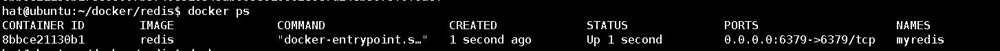
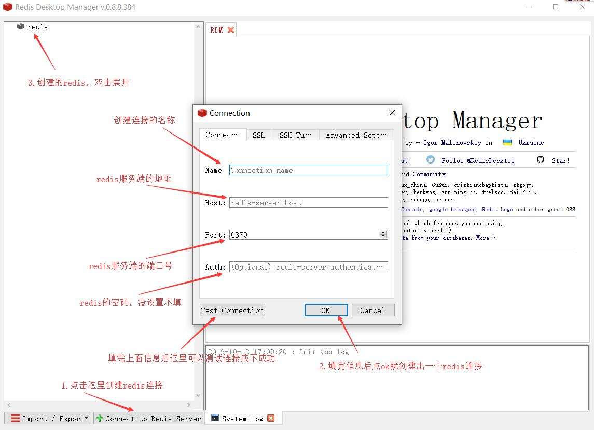
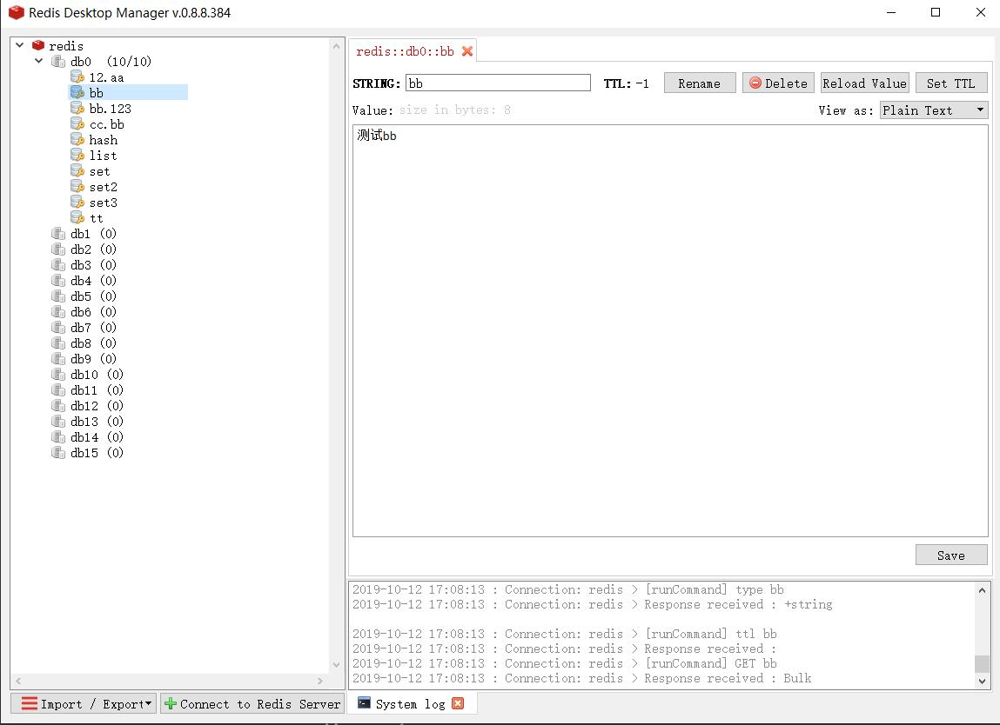

# Redis

## Redis介绍

Redis 是一个开源（BSD许可）的、使用 ANSI C 语言编写的数据库，内存中的数据结构存储系统，它可以用作数据库、缓存和消息中间件。它是一种NoSQL（非关系型数据库），采用key-value形式存放数据，且数据都存储在内存上，因此速度非常快，而且它也提供了两种数据持久化方式，RDB和AOF。它提供多种数据类型，常用的有**字符串（strings）， 散列（hashes）， 列表（lists）， 集合（sets）， 有序集合（sorted sets）**


## docker方式安装redis

- 下载redis,不指定版本则默认下载最新版本

  ```
  docker pull redis
  ```

- 创建**redis.conf**文件作为**redis**的配置文件，因为redis默认是不带配置文件的，不过它会按照它自己特定一种配置启动，然后可以去官网下载redis的配置文件，也可以复制粘贴。**注意：尽量不要使用最新的配置，最新的配置会导致无法使用docker来启动redis。**

  1. [官网配置](https://redis.io/topics/config),官网提供了好几个版本的配置文件

     > - The self documented [redis.conf for Redis 4.0](https://raw.githubusercontent.com/antirez/redis/4.0/redis.conf).
     > - The self documented [redis.conf for Redis 3.2](https://raw.githubusercontent.com/antirez/redis/3.2/redis.conf).
     > - The self documented [redis.conf for Redis 3.0](https://raw.githubusercontent.com/antirez/redis/3.0/redis.conf).
     > - The self documented [redis.conf for Redis 2.8](https://raw.githubusercontent.com/antirez/redis/2.8/redis.conf).
     > - The self documented [redis.conf for Redis 2.6](https://raw.githubusercontent.com/antirez/redis/2.6/redis.conf).
     > - The self documented [redis.conf for Redis 2.4](https://raw.githubusercontent.com/antirez/redis/2.4/redis.conf).

  2. [官方github的配置](https://github.com/antirez/redis/blob/unstable/redis.conf)，在github上的配置似乎是最新的。

- 修改**redis.conf**配置文件，主要修改以下5个配置即可

  ```
  #bind 127.0.0.1  //绑定访问地址，把这行注释掉，这个配置是绑定了本机的地址，意思只有本机可以访问redis
  protected-mode no  //保护模式，把这行设置成no，关闭保护模式，否者外部无法连接redis
  daemonize no     //守护进程，把这行设置成no，如果为yes则无法使用docker开启redis
  requirepass 123456  //密码，设置密码，连接redis时需要用的密码，默认不用密码
  appendonly yes   //AOF持久化，设置成yes开启持久化
  ```

- 使用docker开启redis

  ```
  hat@ubuntu:~/docker/redis$ docker run \                //docker启动
  > -d \											   //后台启动
  > -p 6379:6379 \									//映射的端口号
  > --name myredis \									//容器名称
  > -v $PWD/conf/redis.conf:/etc/redis/redis.conf \	   //把redis的配置文件挂载到本机
  > -v $PWD/data:/data \								//把redis的数据文件挂载到本机
  > redis redis-server /etc/redis/redis.conf	   //启动的容器名称，使用自己的配置文件启动redis-server
  ```

- 启动成功图

  

  > **如果修改配置后还是无法启动容器则去官网下载低版本的配置文件。**
  
- 使用Redis Desktop Manager客户端来连接redis

  

  

  

  **使用客户端可以更直观的看redis的数据**

## springboot整合redis

### 1.使用application.yml配置连接redis

```yaml
spring:
  redis:
    host: 192.168.229.130     #redis服务端的地址
    port: 6379                #redis服务端的端口号
    password: 123456          #redis的连接密码
    database: 0               #使用哪一个数据库(索引从0开始)
    timeout: 10000            #连接超时时间，（单位毫秒）
    ssl: false                #是否支持ssl，默认false
    url:                      #连接的url，可以覆盖host、port、password
    #集群配置
    cluster:
      max-redirects:          #在集群中执行命令时要遵循的最大重定向数
      nodes:                  #集群的节点（host:port），用逗号分开，至少一个
    #redis的哨兵模式
    sentinel:
      master:                 #服务端的名字
      nodes:                  #节点（host:port），用逗号分开
    # 使用lettuce客户端连接redis(线程安全的)
    lettuce:
      pool:
        max-active: 8         #连接池中可以分配的最大连接数，默认8，使用负值则无限制
        max-idle: 8           #连接池中最大的空闲数，默认8,使用负值则无限制
        min-idle: 0           #连接池中最小的空闲数，默认0
        max-wait: -1          #连接池中连接数用完后最大等待阻塞时间，使用负值则无限等待
        time-between-eviction-runs:   #多久进行一次检测，为负值则不检测，
      shutdown-timeout: 100   #关闭超时时间
    # 使用jedis客户端连接redis(非线程安全的)
#    jedis:
#      pool:
#        max-active: 8
#        max-idle: 8
#        min-idle: 0
#        max-wait: -1
#        time-between-eviction-runs:
```

### 2.自定义一个redisConfiguration类

>由于**RedisTemplate**模板类默认使用的序列化与序列化方式是**JdkSerializationRedisSerializer**，默认的序列化会导致存入的**redis**数据是序列化后的值，无法看到原来的值，因此该类主要重写**RedisTemplate**模板类。

```java
package com.hat.redis.config;

import com.fasterxml.jackson.annotation.JsonAutoDetect;
import com.fasterxml.jackson.annotation.PropertyAccessor;
import com.fasterxml.jackson.databind.ObjectMapper;
import org.springframework.context.annotation.Bean;
import org.springframework.context.annotation.Configuration;
import org.springframework.data.redis.connection.RedisConnectionFactory;
import org.springframework.data.redis.core.RedisTemplate;
import org.springframework.data.redis.serializer.Jackson2JsonRedisSerializer;
import org.springframework.data.redis.serializer.StringRedisSerializer;

@Configuration //告诉spring该类是配置类
public class redisConfiguration {

    /**
     * 重写redisTemplate类，解决序列化问题
     * @param connectionFactory
     * @return
     */
    @Bean
    public RedisTemplate<String,Object> redisTemplate(RedisConnectionFactory connectionFactory){
        //实例化RedisTemplate
        RedisTemplate<String,Object> template = new RedisTemplate<>();
        //给RedisTemplate设置redis连接工厂
        template.setConnectionFactory(connectionFactory);

        //提供一些功能将转换成Java对象匹配JSON结构
        ObjectMapper om = new ObjectMapper();
        //指定要检测的范围，参数1：所有域(set、get),参数2：所有类型修饰符(private到public)
        om.setVisibility(PropertyAccessor.ALL, JsonAutoDetect.Visibility.ANY);
        //指定序列化的类型，参数：非final修饰的类型
        om.enableDefaultTyping(ObjectMapper.DefaultTyping.NON_FINAL);

        //实例化Jackson2Json序列化
        Jackson2JsonRedisSerializer serializer = new Jackson2JsonRedisSerializer(Object.class);
        //给Jackson2Json设置自定义的ObjectMapper属性
        serializer.setObjectMapper(om);

        //redis的string类型的key值序列化方式
        template.setKeySerializer(new StringRedisSerializer());
        //redis的string类型的value值序列化方式
        template.setValueSerializer(serializer);

        //redis的hash类型的key值序列化方式
        template.setHashKeySerializer(new StringRedisSerializer());
        //redis的hash类型的value值序列化方式
        template.setHashValueSerializer(serializer);
        return template;
    }
}

```

### 3.编写一个RedisUtil工具类

>该工具类主要封装了**RedisTemplate**类的一些常用方法

```java
package com.hat.redis.utils;

import org.springframework.beans.factory.annotation.Autowired;
import org.springframework.data.redis.core.RedisTemplate;
import org.springframework.stereotype.Component;
import org.springframework.util.CollectionUtils;

import java.util.Date;
import java.util.List;
import java.util.Map;
import java.util.Set;
import java.util.concurrent.TimeUnit;

@Component //把该工具类交给spring管理
public class RedisUtil {
    @Autowired //注入redisTemplate模板类
    RedisTemplate<String, Object> redisTemplate;
    
    /** *******************【key的常用操作】***********************/
    /**
     * 根据key删除数据
     *
     * @param keys 可变参数，可以删除多个key
     * @return 返回删除了几条数据
     */
    public long del(String... keys) {
        if (keys.length > 0 && keys != null) {
            if (keys.length == 1) {
                redisTemplate.delete(keys[0]);
                return keys.length;
            } else {
                redisTemplate.delete(CollectionUtils.arrayToList(keys));
                return keys.length;
            }
        }
        return 0;
    }

    /**
     * 给指定key设置过期的时间，单位（秒）
     *
     * @param key  指定key
     * @param time 从当前开始，设置(x)秒后过期
     */
    public boolean expire(String key, long time) {
        return redisTemplate.expire(key, time, TimeUnit.SECONDS);
    }

    /**
     * 给指定key设置过期的时间(指定过期日期)
     *
     * @param key  指定key
     * @param date 过期的日期
     * @return
     */
    public boolean expireAt(String key, Date date) {
        return redisTemplate.expireAt(key, date);
    }

    /**
     * 获取指定key过期时间
     *
     * @param key      key值
     * @param timeUtil 指定返回的类型，null则返回（秒），如需返回其他类型则自行指定
     * @return 返回0则表示永久不过期
     */
    public long getExpire(String key, TimeUnit timeUtil) {
        if (timeUtil == null) {
            return redisTemplate.getExpire(key);
        } else {
            return redisTemplate.getExpire(key, timeUtil);
        }
    }

    /**
     * 是否存在key
     *
     * @param key 指定key
     * @return 返回true存在、false不存在
     */
    public boolean hasKey(String key) {
        return redisTemplate.hasKey(key);
    }

    /**
     * 根据匹配条件查找key（正则表达式）
     *
     * @param pattern 匹配条件
     * @return 返回符合匹配条件的key集合，没有符合条件的就返回[]
     */
    public Set<String> keys(String pattern) {
        return redisTemplate.keys(pattern);
    }

    /**
     * 把当前数据库的key移动到另外一个数据库中
     *
     * @param key     要移动的key
     * @param dbindex 数据库的索引(第几个数据库，从0开始)
     * @return 返回true移动成功，false移动失败
     */
    public boolean move(String key, int dbindex) {
        return redisTemplate.move(key, dbindex);
    }

    /**
     * 移除key的过期时间，即把设置了过期时间的key重新设置成永久不过期
     *
     * @param key
     * @return 返回true移除成功，false移除失败
     */
    public boolean persist(String key) {
        return redisTemplate.persist(key);
    }

    /**
     * 更改key名称
     *
     * @param oldKey 原来key名称
     * @param newKey 更改后key名称
     * @return 返回true更改成功，false更改失败
     */
    public boolean rename(String oldKey, String newKey) {
        try {
            redisTemplate.rename(oldKey, newKey);
            return true;
        } catch (Exception e) {
            e.printStackTrace();
            return false;
        }
    }

    /**
     * 当newKey不存在时才更改key名称
     *
     * @param oldKey
     * @param newKey
     * @return 返回true更改成功，false更改失败
     */
    public boolean renameNX(String oldKey, String newKey) {
        return redisTemplate.renameIfAbsent(oldKey, newKey);
    }

    /** *******************【string类型的常用操作】***********************/
    /**
     * 往redis中添加数据，永久不过期
     *
     * @param key   添加的key
     * @param value 对应key的value
     * @return 返回true添加成功，fasle添加失败
     */
    public boolean set(String key, String value) {
        try {
            redisTemplate.opsForValue().set(key, value);
            return true;
        } catch (Exception e) {
            e.printStackTrace();
            return false;
        }
    }

    /**
     * 往redis中添加数据，并指定过期时间，timeout小于等于0时则设置成永久不过期
     *
     * @param key     创建的key
     * @param value   对应key的value
     * @param timeout 过期时间，单位(秒)
     * @return 返回true添加成功，false添加失败
     */
    public boolean set(String key, String value, long timeout) {
        try {
            if (timeout > 0) {
                redisTemplate.opsForValue().set(key, value, timeout, TimeUnit.SECONDS);
            } else {
                set(key, value);
            }
            return true;
        } catch (Exception e) {
            e.printStackTrace();
            return false;
        }
    }

    /**
     * 只有当key不存在时才添加key-value
     *
     * @param key   创建的key
     * @param value 对应key的value
     * @return 返回true添加成功，false添加失败
     */
    public boolean setNX(String key, String value) {
        try {
            redisTemplate.opsForValue().setIfAbsent(key, value);
            return true;
        } catch (Exception e) {
            e.printStackTrace();
            return false;
        }
    }

    /**
     * 只有当key不存在时才添加key-value,并指定过期时间，timeout小于等于0时则设置成永久不过期
     *
     * @param key     创建的key
     * @param value   对应key的value
     * @param timeout 过期时间，单位(秒)
     * @return 返回true添加成功，false添加失败
     */
    public boolean setNX(String key, String value, long timeout) {
        try {
            if (timeout > 0) {
                redisTemplate.opsForValue().setIfAbsent(key, value, timeout, TimeUnit.SECONDS);
            } else {
                setNX(key, value);
            }
            return true;
        } catch (Exception e) {
            e.printStackTrace();
            return false;
        }
    }

    /**
     * 如果key存在则更改value值
     *
     * @param key   指定的key
     * @param value 新的value
     * @return 返回true更改成功，false更改失败
     */
    public boolean setIfPresent(String key, String value) {
        return redisTemplate.opsForValue().setIfPresent(key, value);
    }

    /**
     * 如果key存在则更改value值,并重新设置过期时间(如果更改前有设置过期时间),小于等于0时永久不过期
     *
     * @param key     指定的key
     * @param value   新的value
     * @param timeout 新的过期时间，单位(秒)
     * @return 返回true更改成功，false更改失败
     */
    public boolean setIfPresent(String key, String value, long timeout) {
        if (timeout > 0) {
            return redisTemplate.opsForValue().setIfPresent(key, value, timeout, TimeUnit.SECONDS);
        } else {
            return setIfPresent(key, value);
        }
    }

    /**
     * 给指定key递增(value值需为数字)
     *
     * @param key   指定的key
     * @param delta 递增数(大于0)
     * @return
     */
    public long incr(String key, long delta) {
        if (delta < 0) {
            throw new RuntimeException("递增数不能小于0");
        } else {
            return redisTemplate.opsForValue().increment(key, delta);
        }
    }

    /**
     * 给指定key递减(value值需为数字)
     *
     * @param key   指定的key
     * @param delta 递减数(大于0)
     * @return
     */
    public long decr(String key, long delta) {
        if (delta < 0) {
            throw new RuntimeException("递减数不能小于0");
        } else {
            return redisTemplate.opsForValue().decrement(key, delta);
        }
    }

    /**
     * 获取指定key的value值
     * @param key 指定的key
     * @return 返回指定key的value值
     */
    public Object get(String key){
        return redisTemplate.opsForValue().get(key);
    }


    /** *******************【Hash类型的常用操作】***********************/

    /**
     *  根据key创建一个hash类型（相当于一个表），然后再根据hashKey-value创建数据
     *  结构： key：
     *             hashKey - value
     *             hashKey2 - value2
     * @param key    指定的key，一个key中可以有多对数据
     * @param hashKey  与数据映射的hashKey值
     * @param value     hashKey对应的value
     * @return  返回true添加成功，false添加失败
     */
    public boolean hset(String key,Object hashKey,Object value){
        try {
            redisTemplate.opsForHash().put(key,hashKey,value);
            return true;
        } catch (Exception e) {
            e.printStackTrace();
            return false;
        }
    }

    /**
     * 查找key中hashKey的value值
     * @param key  指定的key
     * @param hashKey   与数据映射的hashKey值
     * @return  返回与hashKey对应的value值
     */
    public Object hget(String key, Object hashKey){
        return redisTemplate.opsForHash().get(key,hashKey);
//        System.out.println("***************************");
//        System.out.println(redisTemplate.opsForHash().keys(key));
//        System.out.println("***************************");
//        System.out.println(redisTemplate.opsForHash().size(key));
//        System.out.println("***************************");
//        System.out.println(redisTemplate.opsForHash().values(key));

    }

    /**
     * 往key中添加多条hash数据
     * @param key  指定的key
     * @param map  多条hash数据封装成map
     * @return  返回true添加成功，false添加失败
     */
    public boolean hsetAll(String key, Map<Object,Object> map){
        try {
            redisTemplate.opsForHash().putAll(key, map);
            return true;
        } catch (Exception e) {
            e.printStackTrace();
            return false;
        }
    }

    /**
     * 获取指定key中的所有hash数据并返回
     * @param key 指定key
     * @return 返回指定key的所有数据
     */
    public List hgetAll(String key){
        return redisTemplate.opsForHash().values(key);
    }

    /**
     * 只有当hashKey不存在时才添加该数据
     * @param key  指定的key
     * @param hashKey  与value映射的hashKey
     * @param value   hashKey对应的value
     * @return  返回true添加成功，false添加失败
     */
    public boolean hsetNX(String key,Object hashKey, Object value){
        return redisTemplate.opsForHash().putIfAbsent(key,hashKey,value);
    }

    /**
     * 指定key中hashKey的值递增(delta > 0 )或递减(delta < 0)(value需为数字，否者会报异常)
     * @param key  指定的key
     * @param hashKey  与value映射的hashKey
     * @param delta 递增数(负数则为递减)
     * @return 返回递增或递减后的值
     */
    public double hincr(String key,Object hashKey,double delta){
        return redisTemplate.opsForHash().increment(key,hashKey,delta);
    }

    /**
     *  判断key中是否存在hashKey
     * @param key  指定key
     * @param hashKey  与value映射的hashKey
     * @return  返回true存在，false不存在
     */
    public boolean hasKey(String key,Object hashKey){
        return redisTemplate.opsForHash().hasKey(key,hashKey);
    }

    /**
     * 查询key中所有键值对（hashKey-value）
     * @param key 指定key
     * @return 返回[hashKey=value，hashKey2=value2]形式的对象
     */
    public Map hentries(String key){
        return redisTemplate.opsForHash().entries(key);
    }

    /**
     * 删除key中指定的hashKeys键值对，hashKey可以传多个来删除多对数据
     * @param key  指定的key
     * @param hashKeys  与value映射的hashKey
     * @return 返回删除的数据个数
     */
    public long  hdel(String key,Object... hashKeys){
        return redisTemplate.opsForHash().delete(key,hashKeys);
    }

    /**
     * 在一个hash表(key)中添加键(hashKey)值(value)对数据，且设置过期时间
     * @param key  指定的key
     * @param hashKey  与value映射的hashKey
     * @param value    与hashKey对应的value
     * @param timeout   过期时间，单位(秒)，注意，小于等于0则永久不过期
     * @return  返回true成功，返回false失败
     */
    public boolean hset(String key,Object hashKey,Object value,long timeout){
        try {
            redisTemplate.opsForHash().put(key,hashKey,value);
            if(timeout > 0){
                expire(key,timeout);
            }
            return true;
        } catch (Exception e) {
            e.printStackTrace();
            return false;
        }
    }

    /** *******************【List类型的常用操作】***********************/

    /**
     * 在key中(list表)的表头添加一条数据(value)，或者在指定数据(prevalue)前添加一条数据(value)
     * @param key  指定的list表的key
     * @param prevalue 在prevalue前添加数据，如果在表头添加数据则该参数为null
     * @param value  添加的数据
     * @return 添加成功时返回表中有多少条数据，添加失败则返回-1
     */
    public long LLeftPush(String key,Object prevalue,Object value){
        if (prevalue == null) {
            return redisTemplate.opsForList().leftPush(key, value);
        }else {
            return redisTemplate.opsForList().leftPush(key,prevalue,value);
        }
    }

    /**
     * 在list表名为key的表头添加多条数据(value)
     * @param key  指定的key
     * @param values 要添加的多个值，添加顺序：从左往右依次往表头添加数据
     * @return 添加成功时返回添加数据后的列表长度，失败时返回-1
     */
    public long LLeftPushAll(String key, Object... values){
        return redisTemplate.opsForList().leftPushAll(key, values);
    }

    /**
     * 删除list表名为key的表头元素，并返回被删除元素的值
     * @param key 指定的key
     * @return 返回被删除元素的值
     */
    public Object LLeftPop(String key){
        return redisTemplate.opsForList().leftPop(key);
    }

    /**
     * 在key中(list表)的表尾添加一条数据(value)，或者在指定数据(aftervalue)后添加一条数据(value)
     * @param key  指定的key
     * @param aftervalue  在aftervalue值后面添加数据，null时则在表尾添加数据
     * @param value  添加的数据值
     * @return 添加成功时返回添加数据后的list表长度，失败时返回-1
     */
    public long LRightPush(String key,Object aftervalue,Object value){
        if(aftervalue == null) {
            return redisTemplate.opsForList().rightPush(key, value);
        }else {
            return redisTemplate.opsForList().rightPush(key,aftervalue,value);
        }
    }

    /**
     * 在list表名为key中的表尾添加多条数据
     * @param key 指定的key
     * @param values 多个value值
     * @return 成功时返回添加数据后的list表长度
     */
    public long LRightPushAll(String key,Object... values){
        return redisTemplate.opsForList().rightPushAll(key,values);
    }

    /**
     * 删除list表名为key的表尾元素，并返回被删除元素的值
     * @param key list表名指定的key
     * @return 返回被删除元素的值
     */
    public Object LRightPop(String key){
        return redisTemplate.opsForList().rightPop(key);
    }

    /**
     * 在key中(list表)根据index索引值修改数据
     * @param key  指定key(相当于一个list表)
     * @param index 数据索引（从0开始）
     * @param value 数据值
     * @return 返回true则插入或修改数据成功，false则失败
     */
    public boolean LSet(String key,long index, Object value){
        try {
            redisTemplate.opsForList().set(key,index,value);
            return true;
        } catch (Exception e) {
            e.printStackTrace();
            return false;
        }
    }

    /**
     * 在list表名为key中获取索引为index的值
     * @param key 指定的key
     * @param index 索引
     * @return 查到值则返回该值，查不到则返回null
     */
    public Object LGet(String key,long index){
        return redisTemplate.opsForList().index(key,index);
    }

    /**
     * 在list表名为key中查找多个值(根据开始和结束索引)
     * @param key 指定的key
     * @param start 开始的索引
     * @param end  结束的索引
     * @return 返回查找成功的值的列表
     */
    public List LGetMulti(String key,long start,long end){
        return redisTemplate.opsForList().range(key,start,end);
    }

    /**
     * 名为key的list表的长度
     * @param key 指定的key
     * @return 返回list表的长度
     */
    public long LSize(String key){
        return redisTemplate.opsForList().size(key);
    }

    /**
     * 在名为key的list表中根据索引删除list表中的数据
     * @param key 指定的key
     * @param start 开始的索引
     * @param end 结束的索引
     * @return 返回true删除成功，false删除失败
     */
    public boolean LTrim(String key,long start,long end){
        try {
            redisTemplate.opsForList().trim(key,start,end);
            return true;
        } catch (Exception e) {
            e.printStackTrace();
            return false;
        }
    }

    /**
     * 在名为key的list表中删除count个值为value的元素
     * @param key 指定的key
     * @param count 删除的个数，0时删除全部值为value的元素，正数则从前往后开始删除，负数则从后往前删除count的绝对值个元素
     * @param value 要删除的元素值
     * @return 返回删除成功的元素个数
     */
    public long LRemove(String key,long count,Object value){
        return redisTemplate.opsForList().remove(key,count,value);
    }

    /** *******************【Set类型的常用操作】***********************/

    /**
     * 往名为key的set表中添加一个或多个元素
     * @param key 指定的key
     * @param values 添加的元素(一个或多个)
     * @return 返回添加成功后的set表长度
     */
    public Long SAdd(String key,Object... values){
        return redisTemplate.opsForSet().add(key,values);
    }

    /**
     * 判断在key中是否存在value值
     * @param key 指定的key
     * @param value 要判断的value值
     * @return 返回true则存在，false则不存在
     */
    public boolean SIsMember(String key,Object value){
        return redisTemplate.opsForSet().isMember(key,value);
    }

    /**
     * 输出key中所有成员
     * @param key 指定的key
     * @return 返回所有成员的集合
     */
    public Set SMember(String key){
        return redisTemplate.opsForSet().members(key);
    }

    /**
     * 随机返回一个或多个成员（count小于等于1则随机返回一个成员，大于1时在集合的所有成员中返回count次成员，成员会重复）
     * @param key 指定的key
     * @param count 返回几个成员，
     * @return 返回成员的值
     */
    public Object SRandomMember(String key,long count){
        if (count>1){
            return redisTemplate.opsForSet().randomMembers(key,count);
        }else {
            return redisTemplate.opsForSet().randomMember(key);
        }
    }

    /**
     * 随机返回一个或多个成员（count小于等于1则随机返回一个成员，大于1时在集合的所有成员中返回多个不重复成员）
     * @param key 指定的key
     * @param count 返回几个成员
     * @return 返回成员的值
     */
    public Object SDistinctRandomMember(String key,long count){
        return redisTemplate.opsForSet().distinctRandomMembers(key,count);
    }

    /**
     * 返回key集合的长度
     * @param key 指定的key
     * @return
     */
    public long SSize(String key){
        return redisTemplate.opsForSet().size(key);
    }

    /**
     * 从key集合中随机取出count(小于1时默认为1)个成员并在集合中删除此成员
     * @param key 指定的key
     * @param count 取出成员的个数
     * @return 返回成员的值
     */
    public Object SPop(String key,long count){
        if (count>1) {
            return redisTemplate.opsForSet().pop(key, count);
        }else{
            return redisTemplate.opsForSet().pop(key);
        }
    }

    /**
     * 删除一个或多个成员
     * @param key 指定的key
     * @param values 要删除的成员的值
     * @return 返回删除的个数
     */
    public long SRemove(String key, Object... values){
        return redisTemplate.opsForSet().remove(key, values);
    }

    /**
     * 把key集合中的value成员移动到destKey集合中
     * @param key key集合
     * @param value key集合中的value
     * @param destKey 移动到的集合
     * @return 返回true移动成功，false移动失败
     */
    public boolean SMove(String key, Object value, String destKey){
        return redisTemplate.opsForSet().move(key,value,destKey);
    }

    /**
     * 返回key集合与othersKey集合（一个或多个）的差集(key有，othersKey（一个或多个）没有的成员值)
     * @param key key集合
     * @param othersKey othersKey集合（一个或多个）
     * @return 返回key集合与其他集合的的差集
     */
    public Set SDiff(String key, String... othersKey){
        return redisTemplate.opsForSet().difference(key,CollectionUtils.arrayToList(othersKey));
    }

    /**
     * 返回key集合与othersKey集合(一个或多个)的交集
     * @param key key集合
     * @param othersKey 其他集合
     * @return 返回交集
     */
    public Set SIntersect(String key,String... othersKey){
        return redisTemplate.opsForSet().intersect(key,CollectionUtils.arrayToList(othersKey));
    }

    /**
     * 返回key集合与othersKey集合(一个或多个)的并集
     * @param key key集合
     * @param othersKey 其他集合
     * @return 返回并集
     */
    public Set SUnion(String key,String... othersKey){
        return redisTemplate.opsForSet().union(key,CollectionUtils.arrayToList(othersKey));
    }
}

```

### 4.使用RedisUtil

```java
@Autowired
RedisUtil redisUtil; //这样注入进来就可以直接使用RedisUtil封装的操作了
```

### 5.Redis的命名规则

- key不能过长，虽然redis中key的最大容量是512M，但是我们一般不会把key设置的太大，这不仅会占用过多内存空间，也会影响查询速度。

- key不能过短，key的长度也不可以设置得太短，不然的话会非常影响可读性。

- 一个完整的key最好使用一个固定的分隔符来隔开。如【 : 】冒号。【 _ 】下划线虽然也可以用，不过在某些情况下可能会影响可读性，比如使用数据库中的一个带下划线字段拼接出一个key时，拼接后成（key_user_user_id），这里是使用[ key ]、[ user ]、[ user_id ]3个单词拼接的，因此会影响可读性

- 一个完整的key例子：   

  1. redis数据库名称(区分使用了redis哪一个数据库)
  2. mysql数据库表名(区分使用了哪一个表)
  3. mysql唯一字段名
  4. 唯一字段名的值(区分同样该mysql表中的其他数据)

  如： `redisName:user:user_id:001`