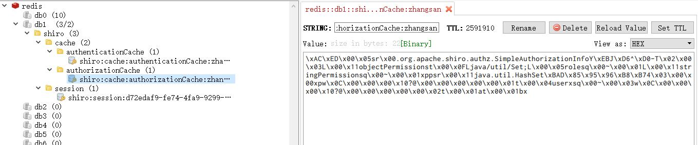
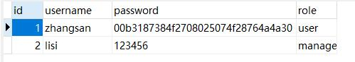
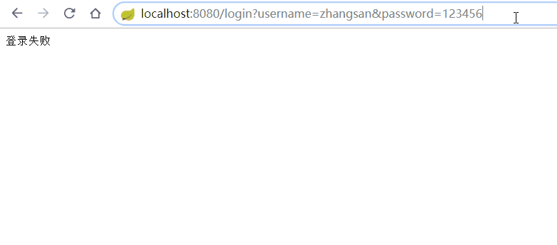
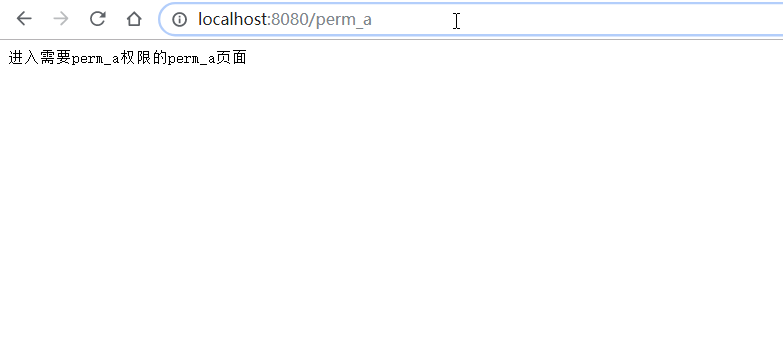

# Shiro

## Shiro介绍

Shiro是Apache开源的的一个java安全框架，相比Spring Security更简单、更灵活。其可以为任何应用提供安全服务，从命令行应用到移动应用再到大型的web和企业应用。

Shiro可以帮我们完成**认证(Authentication)**、**授权(Authorization)**、**密码加密(Cryptography)**、**会话管理(Session Management)**,它还支持一些辅助功能，例如**web应用安全**、**单元测试**和**多线程**。

## Shiro的核心

它有3个核心组件**Subject**、**SecurityManager**和**Realms**

- **Subject：**主体，代表当前的一个用户，每个访问当前应用的东西都代表一个Subject，不一定是真正的一个人访问才算，例如爬虫也算是一个Subject，我们可以通过这个Subject对其进行一些安全操作，如登录、注销、获取session和执行授权检查等
- **SecurityManager：**安全管理器，**Shiro体系的核心**，它管理着所有Subject,一般一个应用有一个SecurityManager
- **Realms：**域，它充当Shiro与应用程序的安全数据之间的桥梁，当应用需要安全相关的数据时，可以从Realms中查找，一个应用可以有多个Realm

## springboot整合Shiro的实现

### 1. 简单demo实现

### **1.1.创建一个demo**

目录结构如下：


### **1.2.数据库设计与测试数据**


### **1.3.在pom.xml文件中添加shiro的依赖**

```xml
<?xml version="1.0" encoding="UTF-8"?>
<project xmlns="http://maven.apache.org/POM/4.0.0" xmlns:xsi="http://www.w3.org/2001/XMLSchema-instance"
         xsi:schemaLocation="http://maven.apache.org/POM/4.0.0 https://maven.apache.org/xsd/maven-4.0.0.xsd">
    <modelVersion>4.0.0</modelVersion>
    <parent>
        <groupId>org.springframework.boot</groupId>
        <artifactId>spring-boot-starter-parent</artifactId>
        <version>2.1.9.RELEASE</version>
        <relativePath/> <!-- lookup parent from repository -->
    </parent>
    <groupId>com..hat</groupId>
    <artifactId>04_shiro</artifactId>
    <version>0.0.1-SNAPSHOT</version>
    <name>04_shiro</name>
    <description>Demo project for Spring Boot with Shiro</description>

    <properties>
        <java.version>1.8</java.version>
    </properties>

    <dependencies>
        <!--添加mysql依赖-->
        <dependency>
            <groupId>org.springframework.boot</groupId>
            <artifactId>spring-boot-starter-data-jdbc</artifactId>
        </dependency>
        <!--添加web依赖-->
        <dependency>
            <groupId>org.springframework.boot</groupId>
            <artifactId>spring-boot-starter-web</artifactId>
        </dependency>
        <dependency>
            <groupId>org.mybatis.spring.boot</groupId>
            <artifactId>mybatis-spring-boot-starter</artifactId>
            <version>2.1.0</version>
        </dependency>
        <!--添加mysql连接依赖-->
        <dependency>
            <groupId>mysql</groupId>
            <artifactId>mysql-connector-java</artifactId>
            <scope>runtime</scope>
        </dependency>

        <!--添加shiro依赖-->
        <dependency>
            <groupId>org.apache.shiro</groupId>
            <artifactId>shiro-spring</artifactId>
            <version>1.4.0</version>
        </dependency>

        <dependency>
            <groupId>org.springframework.boot</groupId>
            <artifactId>spring-boot-starter-test</artifactId>
            <scope>test</scope>
        </dependency>
    </dependencies>

    <build>
        <plugins>
            <plugin>
                <groupId>org.springframework.boot</groupId>
                <artifactId>spring-boot-maven-plugin</artifactId>
            </plugin>
        </plugins>
    </build>

</project>

```

### **1.4.创建application.yml配置文件**

这里写了数据库的连接与mybatis的一些配置

```yaml
spring:
  datasource:
    url: "jdbc:mysql://localhost:3306/testshiro?characterEncoding=utf8&serverTimezone=UTC"    #数据库连接
    username: root
    password: 123456
    driver-class-name: com.mysql.cj.jdbc.Driver    #数据库驱动
mybatis:
  type-aliases-package: com.hat.shiro.bean      #别名的包(bean类)
  mapper-locations: classpath:mybatis/mappers/*.xml   #mapper的路径
  configuration:
    log-impl: org.apache.ibatis.logging.stdout.StdOutImpl            #打印sql语句
    map-underscore-to-camel-case: true     #开启驼峰命名法
```

### **1.5.创建User、Perms两个javabean**

1. **User类，这里实现了Serializable序列化，要使用Shiro的RememberMe功能需要实现序列化接口**

```java
package com.hat.shiro.bean;


import java.io.Serializable;

public class User implements Serializable {
    private String username;
    private String password;
    private String role;


    public User(String username, String password,String role) {
        this.username = username;
        this.password = password;
        this.role = role;
    }

    public User() {
    }

    public String getRole() {
        return role;
    }

    public void setRole(String role) {
        this.role = role;
    }


    public String getUsername() {
        return username;
    }

    public void setUsername(String username) {
        this.username = username;
    }

    public String getPassword() {
        return password;
    }

    public void setPassword(String password) {
        this.password = password;
    }

    @Override
    public String toString() {
        return "User{" +
                "username='" + username + '\'' +
                ", password='" + password + '\'' +
                ", role='" + role + '\'' +
                '}';
    }
}

```

2. **Perms类是存放每个角色的权限**

```java
package com.hat.shiro.bean;

public class Perms {
    private String role;
    private String perm;

    public Perms() {
    }

    public Perms(String role, String perm) {
        this.role = role;
        this.perm = perm;
    }

    public String getRole() {
        return role;
    }

    public void setRole(String role) {
        this.role = role;
    }

    public String getPerm() {
        return perm;
    }

    public void setPerm(String perm) {
        this.perm = perm;
    }

    @Override
    public String toString() {
        return "Perms{" +
                "role='" + role + '\'' +
                ", perm='" + perm + '\'' +
                '}';
    }
}

```

### **1.6.编写mybatis所需的mapper映射**

1. **UserMapper**接口，根据用户名查询密码

```java
package com.hat.shiro.mapper;

import com.hat.shiro.bean.User;

public interface UserMapper {
    User getPasswordByUsername(String username);
}

```

2. **PermsMapper接口，根据角色查询权限**

```java
package com.hat.shiro.mapper;

import com.hat.shiro.bean.Perms;

import java.util.List;

public interface PermMapper {
    List<Perms> getPerm(String role);
}

```

### **1.7.编写service接口与实现类**

1. **UserService**

```java
package com.hat.shiro.service;

import com.hat.shiro.bean.User;

public interface UserService {
    User getPasswordByUsername(String username);
}

```

2. **UserServiceImpl**

```java
package com.hat.shiro.service.impl;

import com.hat.shiro.bean.User;
import com.hat.shiro.mapper.UserMapper;
import com.hat.shiro.service.UserService;
import org.springframework.beans.factory.annotation.Autowired;
import org.springframework.stereotype.Service;

@Service
public class UserServiceImpl implements UserService {
    @Autowired
    UserMapper userMapper;
    @Override
    public User getPasswordByUsername(String username) {
        return userMapper.getPasswordByUsername(username);
    }
}

```

3. **PermService**

```java
package com.hat.shiro.service;

import com.hat.shiro.bean.Perms;

import java.util.List;

public interface PermService {
    List<Perms> getPerm(String role);
}

```

4. **PermServiceImpl**

```java
package com.hat.shiro.service.impl;

import com.hat.shiro.bean.Perms;
import com.hat.shiro.mapper.PermMapper;
import com.hat.shiro.service.PermService;
import org.springframework.beans.factory.annotation.Autowired;
import org.springframework.stereotype.Service;

import java.util.List;

@Service
public class PermServiceImpl implements PermService {
    @Autowired
    PermMapper permMapper;

    @Override
    public List<Perms> getPerm(String role) {
        return permMapper.getPerm(role);
    }
}

```

### **1.8.编写mapper查询数据库的xml文件**

1. **userMapper.xml根据用户名查询该用户**

```xml
<?xml version="1.0" encoding="UTF-8" ?>

<!DOCTYPE mapper
        PUBLIC "-//mybatis.org//DTD mapper 3.0//EN"
        "http://mybatis.org/dtd/mybatis-3-mapper.dtd">
<mapper namespace="com.hat.shiro.mapper.UserMapper">
    <select id="getPasswordByUsername" resultType="com.hat.shiro.bean.User">
        select * from User where username = #{id}
    </select>
</mapper>
```

2. **permMapper.xml根据角色查询权限**

```xml
<?xml version="1.0" encoding="UTF-8" ?>

<!DOCTYPE mapper
        PUBLIC "-//mybatis.org//DTD mapper 3.0//EN"
        "http://mybatis.org/dtd/mybatis-3-mapper.dtd">
<mapper namespace="com.hat.shiro.mapper.PermMapper">
    <select id="getPerm" resultType="com.hat.shiro.bean.Perms">
        select * from roles_perms where role = #{role}
    </select>
</mapper>
```

3. **在启动类中添加mapperScan注解,完成mapper的映射**

   `@MapperScan("com.hat.shiro.mapper") //扫描mapper映射的路径`

### 1.9.创建自定义的CustomRealm(核心)

```java
package com.hat.shiro.config;

import com.hat.shiro.bean.Perms;
import com.hat.shiro.bean.User;
import com.hat.shiro.service.PermService;
import com.hat.shiro.service.UserService;
import org.apache.shiro.authc.*;
import org.apache.shiro.authz.AuthorizationInfo;
import org.apache.shiro.authz.SimpleAuthorizationInfo;
import org.apache.shiro.realm.AuthorizingRealm;
import org.apache.shiro.subject.PrincipalCollection;
import org.springframework.beans.factory.annotation.Autowired;

import java.util.*;

//自定义继承AuthorizingRealm的CustomRealm类并重写两个方法
public class CustomRealm extends AuthorizingRealm {
    @Autowired
    UserService userService;
    @Autowired
    PermService permService;

    @Override
    protected AuthorizationInfo doGetAuthorizationInfo(PrincipalCollection principalCollection) {
        System.out.println("进入授权方法");
        //实例化SimpleAuthorizationInfo类
        SimpleAuthorizationInfo info = new SimpleAuthorizationInfo();
        //获取主体(Subject)的信息
        User user = (User) principalCollection.getPrimaryPrincipal();
        //获取该用户角色的所有权限
        List<Perms> perms = permService.getPerm(user.getRole());
        //用来存放权限的set列表
        Set<String> set_perm = new HashSet<>();
        //遍历权限存入set_perm
        for (Perms perm : perms){
            set_perm.add(perm.getPerm());
        }
        //添加角色
        info.addRole(user.getRole());
        //添加权限
        info.addStringPermissions(set_perm);

        return info;
    }

    @Override
    protected AuthenticationInfo doGetAuthenticationInfo(AuthenticationToken authenticationToken) throws AuthenticationException {
        System.out.println("进入认证方法");
        //获取用户的token信息
        UsernamePasswordToken token = (UsernamePasswordToken) authenticationToken;
        //根据帐号查询对应密码
        User user = userService.getPasswordByUsername(token.getUsername());
        //实例化SimpleAuthenticationInfo，参数:
        //      principle：主体，相当于当前用户，传入user对象
        //      credentials/hashedCredentials：密码/hash后的密码(使用加密密码时使用)
        //      credentialsSalt：密码加密的盐值，可以不用
        //      realmName：使用的realm的名字，自定义的CustomRealm类名
        SimpleAuthenticationInfo info = new SimpleAuthenticationInfo(user,user.getPassword(),getName());
        //返回一个认证信息实例
        return info;
    }
}

```

>**AuthorizationInfo：**该方法是**用户(Subject)**认证成功后访问需要特定**角色(roles)**或者特定**权限(perms)**时会执行，可以在这个方法里面为当前**用户(Subject)**添加角色和权限，添加完成后才可以访问需要特定角色或者权限的路径。
>
>**AuthenticationInfo：**该方法是认证**用户(Subject)**的，相当于根据帐号密码登录。

### 1.10.创建ShiroConfig类(核心)

```java
package com.hat.shiro.config;

import org.apache.shiro.mgt.SecurityManager;
import org.apache.shiro.spring.web.ShiroFilterFactoryBean;
import org.apache.shiro.web.mgt.DefaultWebSecurityManager;
import org.springframework.beans.factory.annotation.Qualifier;
import org.springframework.context.annotation.Bean;
import org.springframework.context.annotation.Configuration;

import java.util.LinkedHashMap;
import java.util.Map;

//把ShiroConfig类标注为配置类
@Configuration
public class ShiroConfig {

    /**
     * shiro的过滤器方法,该方法用来指定一些过滤规则
     *
     * @Qualifier注解：注入名为securityManager的bean
     * @return
     */
    @Bean
    public ShiroFilterFactoryBean shiroFilterFactoryBean(@Qualifier("securityManager") SecurityManager securityManager){
        //创建ShiroFilterFactoryBean实例
        ShiroFilterFactoryBean shiroFilterFactoryBean = new ShiroFilterFactoryBean();
        //设置安全管理器(SecurityManager),必须要设置，不然在初始化阶段会抛出异常
        shiroFilterFactoryBean.setSecurityManager(securityManager);
        //用户未认证通过时跳转的页面，不指定时默认是 /login.jsp
        shiroFilterFactoryBean.setLoginUrl("/login");
        //用户认证通过时跳转到的页面，不指定时默认是 /
        shiroFilterFactoryBean.setSuccessUrl("/main");
        //用户认证通过，但是无授权时跳转到的页面
        shiroFilterFactoryBean.setUnauthorizedUrl("/unauthorized");
        //路由过滤器链，注意是LinkedHashMap，因为要按照顺序来指定规则
        Map<String,String> chain = new LinkedHashMap<>();
        //Shiro提供了11种过滤规则,以下是几种常用过滤器：
        //      anon：匿名，例："/login","anon"；/login路由所有用户都可以访问
        //      authc：认证，例："/main/*","authc"；/main及其所有子路由需要用户认证成功后才可以访问
        //      Perms：权限，例："/space","Perms[perm1]"; /space路由需要有user权限才可以访问，可以多个，用逗号隔开
        //      roles：角色，例："/role","roles[role1，role2]"; /role路由需要同时为role1、role2角色时才可以访问
        //      user：如果使用了“记住我”功能的用户访问/**时走这个过滤器
        //      logout：注销，访问/logout地址就退出登录，删除该用户的存在Subject的信息,并且页面回到setLoginUrl()设置的路径
        chain.put("/login","anon");
        chain.put("/main","authc");
        chain.put("/user","roles[user]");
        chain.put("/manager","roles[manager]");
        chain.put("/perm_a","perms[a,b]");
        chain.put("/perm_b","perms[c,d]");
        chain.put("/logout","logout");
        //这个过滤规则必须放在最后，意思是除了/login路径外的所有路径都需要用户认证通过才可以访问
        chain.put("/**","user");
        //设置过滤链
        shiroFilterFactoryBean.setFilterChainDefinitionMap(chain);
        return shiroFilterFactoryBean;
    }

    /**
     * shiro的安全管理器方法
     * @param customRealm 自定义的realm
     * @return
     */
    @Bean(name = "securityManager")
    public SecurityManager securityManager(@Qualifier("customRealm") CustomRealm customRealm){
        //实例化DefaultWebSecurityManager，记住是有Web的这个安全管理器
        DefaultWebSecurityManager securityManager = new DefaultWebSecurityManager();
        //SecurityManager需要设置自定义的Realm
        securityManager.setRealm(customRealm);
        return securityManager;
    }

    /**
     * 实例化自定义的Realm并且把它交给spring管理供SecurityManager使用
     * @return
     */
    @Bean(name = "customRealm")
    public CustomRealm customRealm(){
        CustomRealm realm = new CustomRealm();
        return realm;
    }

}

```

> **shiro提供的过滤器(filter)有：**
>
> - **身份认证相关过滤器：**anon、authc、authcBasic、logout、user
> - **授权相关过滤器：**roles、perms、port、ssl、rest
>
> **过滤器的写法：**
>
> ​	**需要用有顺序的LinkedHashMap（key-value）来存放过滤规则，key对应路径(可以使用通配符)，value对应过滤器，都是使用字符串来设置，一个路径可以对应多个过滤器，多个过滤器之间使用逗号隔开如"user,roles[role1]"，roles与perms过滤器可以有多个过滤属性，只需要在[ ]里用逗号隔开，如"roles[role1,role2]"、"perms[perm1，perm2]"，不过这样设置的话需要同时满足[ ]里的所有属性才行。如果想变成该用户(subject)只要满足roles或perms中的任意一个属性就可以访问，需要重写RolesAuthorizationFilter方法或者PermissionsAuthorizationFilter方法**
>
> **注意：**" /** "路径必须放在最下面

过滤器：

| 过滤器名称 | 过滤器类                                                     | 过滤器描述                                                   |
| ---------- | ------------------------------------------------------------ | ------------------------------------------------------------ |
| anon       | org.apache.shiro.web.filter.authc.AnonymousFilter            | **匿名过滤器**，不需要认证即可访问                           |
| authc      | org.apache.shiro.web.filter.authc.FormAuthenticationFilte    | **认证过滤器**，需要认证成功后才可以访问                     |
| authcBasic | org.apache.shiro.web.filter.authc.BasicHttpAuthenticationFilter | **Basic HTTP身份验证认证**                                   |
| logout     | org.apache.shiro.web.filter.authc.LogoutFilter               | **注销过滤器**，注销当前用户                                 |
| user       | org.apache.shiro.web.filter.authc.UserFilter                 | **用户过滤器**，使用了RememberMe功能或者已经身份认证成功的走这个过滤器 |
| roles      | org.apache.shiro.web.filter.authz.RolesAuthorizationFilter   | **角色过滤器**，拥有指定角色的用户才可以访问                 |
| perms      | org.apache.shiro.web.filter.authz.PermissionsAuthorizationFilter | **权限过滤器**，拥有指定权限的用户才可以访问                 |
| port       | org.apache.shiro.web.filter.authz.PortFilter                 | **端口过滤器**，假如指定port[8080]，用户访问了8081端口时会重定向到8080端口，相当于用户只能访问8080端口 |
| ssl        | org.apache.shiro.web.filter.authz.SslFilter                  | **ssl过滤器**，只有请求协议是https才能通过                   |
| rest       | org.apache.shiro.web.filter.authz.HttpMethodPermissionFilter | **rest过滤器**，可以过滤http通信时的请求方式，如get、post等  |

### 1.11.创建shiroController写路由

```java
package com.hat.shiro.controller;

import org.apache.shiro.SecurityUtils;
import org.apache.shiro.authc.*;
import org.apache.shiro.subject.Subject;
import org.springframework.web.bind.annotation.RequestMapping;
import org.springframework.web.bind.annotation.RestController;


@RestController
public class shiroController {

    @RequestMapping("/login")
    public Object login(String username, 
                        String password){
        //获取主体
        Subject subject = SecurityUtils.getSubject();
        //判断是否已经认证过，认证过则不再重复认证
        if (!subject.isAuthenticated()) {
            //创建token
            UsernamePasswordToken token = new UsernamePasswordToken(username, password);
            //设置记住我，下次不用登录即可访问，
            token.setRememberMe(true);
            try {
                //把token交给Subject认证是否登录成功
                subject.login(token);
            } catch (UnknownAccountException e) {  //帐号不存在时抛出的异常
                e.printStackTrace();
                return "认证失败，帐号不存在";
            } catch (IncorrectCredentialsException e) {  //密码错误时抛出的异常
                e.printStackTrace();
                return "认证失败，密码错误";
            } catch (LockedAccountException e) {   //账户被锁定时抛出的异常
                e.printStackTrace();
                return "认证失败，账户被锁定";
            } catch (AuthenticationException e) {  //以上异常的父类
                e.printStackTrace();
                return "登录失败";
            }
        }
        return "进入登录页面";
    }

    @RequestMapping("/login/aa")
    public Object loginaa(){
        return "进入/login/aa页面";
    }

    @RequestMapping("/main")
    public Object main(){
        return "进入main页面";
    }

    @RequestMapping("/main/bb")
    public Object mainbb(){
        return "进入/main/bb页面";
    }

    @RequestMapping("/user")
    public Object user(){
        return "进入需要user角色的user页面";
    }

    @RequestMapping("/manager")
    public Object manager(){
        return "进入需要manager角色的manager页面";
    }

    @RequestMapping("/perm_a")
    public Object perm_a(){
        return "进入需要perm_a权限的perm_a页面";
    }

    @RequestMapping("/perm_b")
    public Object perm_b(){
        return "进入需要perm_b权限的perm_b页面";
    }

    @RequestMapping("/unauthorized")
    public Object unauthorized(){
        return "无权限进入页面";
    }

}

```

### 1.12.启动项目进行测试

1. **没有登录的时候访问其他路径都会转到/login路径**


2. **登录了zhangsan帐号,该账号拥有role：user；perm：a，b**

   

3. **登录了lisi帐号，该账号拥有role：manager；perm：a，b，c，d**

   

这样一个简单的springboot整合shiro的demo就完成了。


### 2. shiro+redis实现shiro的缓存

### 2.1.引入redis依赖和shiro-redis依赖

```xml
        <!--添加shiro-redis插件-->
        <dependency>
            <groupId>org.crazycake</groupId>
            <artifactId>shiro-redis</artifactId>
            <version>3.2.3</version>
        </dependency>

        <!--添加redis依赖-->
        <dependency>
            <groupId>org.springframework.boot</groupId>
            <artifactId>spring-boot-starter-data-redis</artifactId>
        </dependency>
```

### 2.2. 在application.yml中添加redis连接属性配置

```yaml
spring:
  # 连接redis的一些配置属性
  redis:
    host: 10.24.35.207
    port: 6379
    password: 123456
    database: 1      #使用第2个数据库
    jedis:
      pool:
        max-active: 8
        max-idle: 8
        min-idle: 0
```

### 2.3.修改configConfig类

1. **声明一些用来连接redis的属性变量和添加redisManager方法，该方法是连接redis时需要的配置，该方法由shiro-redis提供**

   ```java
       @Value("${spring.redis.host}") //获取application.yml的spring.redis.hosts属性的值
       private String host;
       @Value("${spring.redis.port}")
       private String port;
       @Value("${spring.redis.password}")
       private String password;
       @Value("${spring.redis.database}")
       private Integer database;    
   
   
   	/**
        * redis管理器，用来设置连接redis的属性配置
        * @return
        */
       @Bean
       public RedisManager redisManager(){
           //实例化redis管理器
           RedisManager redisManager = new RedisManager();
           //默认是127.0.0.1：6379，注意这个host包括端口号
           redisManager.setHost(host+":"+port);
           //连接redis的密码
           redisManager.setPassword(password);
           //设置redis连接超时时间，默认2000ms
           redisManager.setTimeout(0);
           //设置使用第几个数据库，默认0
           redisManager.setDatabase(database);
           return redisManager;
       }
   ```

2. **添加RedisCacheManager方法，该方法是管理shiro用户认证与授权的缓存，也是由shiro-redis提供**

   ```java
       /**
        * redis缓存管理器，存放认证和授权信息的缓存，如role、perm和登录等
        * @return
        */
       @Bean
       public RedisCacheManager redisCacheManager(){
           //实例化RedisCacheManager
           RedisCacheManager redisCacheManager = new RedisCacheManager();
           //设置redis管理器
           redisCacheManager.setRedisManager(redisManager());
           //设置主体的id名称，这个值必须是唯一的，默认是id
           redisCacheManager.setPrincipalIdFieldName("username");
           //设置缓存保存时间，默认1800秒，单位秒
           redisCacheManager.setExpire(60 * 60 * 24 * 30); //30天过期
           //设置缓存的key的前缀，默认"shiro:cache:"
   //        redisCacheManager.setKeyPrefix("shiro:cache:");
           return redisCacheManager;
       }
   ```

3. **添加RedisSessionDAO方法，该方法是redis给session进行持久化，也是有shiro-redis提供**

   ```java
       /**
        * RedisSessionDAO是使用redis为会话内容(session)进行持久化
        * 保存session的缓存，该缓存在每次访问时都会刷新过期时间
        * @return
        */
       @Bean
       public RedisSessionDAO redisSessionDAO(){
           //实例化RedisSessionDAO
           RedisSessionDAO redisSessionDAO = new RedisSessionDAO();
           //设置redis管理器
           redisSessionDAO.setRedisManager(redisManager());
           //session保存的时间，最好设置成比默认session保存的时间长，默认是30分钟，单位秒
           redisSessionDAO.setExpire(60 * 60 * 24 * 30); //30天过期
           //设置session缓存的key前缀，默认"shiro:session:"
   //        redisSessionDAO.setKeyPrefix("shiro:session:");
           //sessionId生成器，默认是JavaUuidSessionIdGenerator。
   //        redisSessionDAO.setSessionIdGenerator(new JavaUuidSessionIdGenerator());
           return redisSessionDAO;
       }
   ```

4. **添加SessionManager方法，该方法是管理session缓存**

   ```java
       /**
        * session管理器
        * @return
        */
       @Bean
       public SessionManager sessionManager(){
           DefaultWebSessionManager defaultWebSessionManager = new DefaultWebSessionManager();
           //设置session持久类
           defaultWebSessionManager.setSessionDAO(redisSessionDAO());
           //不显示url后面的jsession，默认true
           defaultWebSessionManager.setSessionIdUrlRewritingEnabled(false);
           //设置全局session过期时间，默认1800秒，单位毫秒
           defaultWebSessionManager.setGlobalSessionTimeout(60 * 60 * 24 * 15 *1000); //15天过期
           return defaultWebSessionManager;
       }
   ```

5. **修改CustomRealm方法**

   ```java
       /**
        * 实例化自定义的Realm并且把它交给spring管理供SecurityManager使用
        * @return
        */
       @Bean(name = "customRealm")
       public CustomRealm customRealm(){
           CustomRealm realm = new CustomRealm();
           
   // shiro+redis缓存新增----开始
   //        realm.setCachingEnabled(true);  //启动缓存，默认true
   //        realm.setAuthorizationCachingEnabled(true); //启动授权缓存，默认true
           //启动用户认证缓存，默认false
           realm.setAuthenticationCachingEnabled(true);
           //设置用户认证的缓存名称
           realm.setAuthenticationCacheName("authenticationCache");
           //设置角色授权和权限授权的缓存名称
           realm.setAuthorizationCacheName("authorizationCache");
   // shiro+redis缓存新增----结束
           
           return realm;
       }
   ```

6. **修改SecurityManager方法**

   ```java
       /**
        * shiro的安全管理器方法
        * @param customRealm 自定义的realm
        * @return
        */
       @Bean(name = "securityManager")
       public SecurityManager securityManager(@Qualifier("customRealm") CustomRealm customRealm){
           //实例化DefaultWebSecurityManager，记住是有Web的这个安全管理器
           DefaultWebSecurityManager securityManager = new DefaultWebSecurityManager();
           //SecurityManager需要设置自定义的Realm
           securityManager.setRealm(customRealm);
   
   // shiro+redis缓存新增----开始
           //设置session管理器，保存session缓存到redis
           securityManager.setSessionManager(sessionManager());
           //设置redis缓存管理器，保存认证和授权信息到redis
           securityManager.setCacheManager(redisCacheManager());
   // shiro+redis缓存新增----结束
   
           return securityManager;
       }
   ```

7. 用浏览器访问页面，结果如下：

   

   > **这是登录了zhangsan帐号的结果，可以看到有用户认证缓存(authenticationCache)、权限授权缓存(authorizationCache)和session缓存。当zhangsan帐号退出时，授权缓存会删除，而用户认证和session缓存则不会删除**

8. **完整的shiroConfig类如下**

```java
package com.hat.shiro.config;

import org.apache.shiro.mgt.SecurityManager;
import org.apache.shiro.session.mgt.SessionManager;
import org.apache.shiro.spring.web.ShiroFilterFactoryBean;
import org.apache.shiro.web.mgt.DefaultWebSecurityManager;
import org.apache.shiro.web.session.mgt.DefaultWebSessionManager;
import org.crazycake.shiro.RedisCacheManager;
import org.crazycake.shiro.RedisManager;
import org.crazycake.shiro.RedisSessionDAO;
import org.springframework.beans.factory.annotation.Qualifier;
import org.springframework.beans.factory.annotation.Value;
import org.springframework.context.annotation.Bean;
import org.springframework.context.annotation.Configuration;

import java.util.LinkedHashMap;
import java.util.Map;

//把ShiroConfig类标注为配置类
@Configuration
public class ShiroConfig {

    @Value("${spring.redis.host}")//获取application.yml的spring.redis.hosts属性的值
    private String host;
    @Value("${spring.redis.port}")
    private String port;
    @Value("${spring.redis.password}")
    private String password;
    @Value("${spring.redis.database}")
    private Integer database;


    /**
     * shiro的过滤器方法,该方法用来指定一些过滤规则
     *
     * @Qualifier注解：注入名为securityManager的bean
     * @return
     */
    @Bean
    public ShiroFilterFactoryBean shiroFilterFactoryBean(@Qualifier("securityManager") SecurityManager securityManager){
        //创建ShiroFilterFactoryBean实例
        ShiroFilterFactoryBean shiroFilterFactoryBean = new ShiroFilterFactoryBean();
        //设置安全管理器(SecurityManager),必须要设置，不然在初始化阶段会抛出异常
        shiroFilterFactoryBean.setSecurityManager(securityManager);
        //用户未认证通过时跳转的页面，不指定时默认是 /login.jsp
        shiroFilterFactoryBean.setLoginUrl("/login");
        //用户认证通过时跳转到的页面，不指定时默认是 /
        shiroFilterFactoryBean.setSuccessUrl("/main");
        //用户认证通过，但是无授权时跳转到的页面
        shiroFilterFactoryBean.setUnauthorizedUrl("/unauthorized");
        //路由过滤器链，注意是LinkedHashMap，因为要按照顺序来指定规则
        Map<String,String> chain = new LinkedHashMap<>();
        //Shiro提供了11种过滤规则,以下是几种常用过滤器：
        //      anon：匿名，例："/login","anon"；/login路由所有用户都可以访问
        //      authc：认证，例："/main/*","authc"；/main及其所有子路由需要用户认证成功后才可以访问
        //      Perms：权限，例："/space","Perms[perm1]"; /space路由需要有user权限才可以访问，可以多个，用逗号隔开
        //      roles：角色，例："/role","roles[role1，role2]"; /role路由需要同时为role1、role2角色时才可以访问
        //      user：如果使用了“记住我”功能的用户访问/**时走这个过滤器
        //      logout：注销，访问/logout地址就退出登录，删除该用户的存在Subject的信息,并且页面回到setLoginUrl()设置的路径
        chain.put("/login","anon");
        chain.put("/main","authc");
        chain.put("/user","roles[user]");
        chain.put("/manager","roles[manager]");
        chain.put("/perm_a","perms[a,b]");
        chain.put("/perm_b","perms[c,d]");
        chain.put("/logout","logout");
        //这个过滤规则必须放在最后，意思是除了/login路径外的所有路径都需要用户认证通过才可以访问
        chain.put("/**","user");
        //设置过滤链
        shiroFilterFactoryBean.setFilterChainDefinitionMap(chain);
        return shiroFilterFactoryBean;
    }

    /**
     * shiro的安全管理器方法
     * @param customRealm 自定义的realm
     * @return
     */
    @Bean(name = "securityManager")
    public SecurityManager securityManager(@Qualifier("customRealm") CustomRealm customRealm){
        //实例化DefaultWebSecurityManager，记住是有Web的这个安全管理器
        DefaultWebSecurityManager securityManager = new DefaultWebSecurityManager();
        //SecurityManager需要设置自定义的Realm
        securityManager.setRealm(customRealm);

        //设置session管理器，保存session缓存到redis
        securityManager.setSessionManager(sessionManager());
        //设置redis缓存管理器，保存认证和授权信息到redis
        securityManager.setCacheManager(redisCacheManager());

        return securityManager;
    }

    /**
     * 实例化自定义的Realm并且把它交给spring管理供SecurityManager使用
     * @return
     */
    @Bean(name = "customRealm")
    public CustomRealm customRealm(){
        CustomRealm realm = new CustomRealm();

//        realm.setCachingEnabled(true);  //启动缓存，默认true
//        realm.setAuthorizationCachingEnabled(true); //启动授权缓存，默认true
        //启动用户认证缓存，默认false
        realm.setAuthenticationCachingEnabled(true);
        //设置用户认证的缓存名称
        realm.setAuthenticationCacheName("authenticationCache");
        //设置角色授权和权限授权的缓存名称
        realm.setAuthorizationCacheName("authorizationCache");
        return realm;
    }

    /**
     * redis管理器，用来设置连接redis的属性配置
     * @return
     */
    @Bean
    public RedisManager redisManager(){
        //实例化redis管理器
        RedisManager redisManager = new RedisManager();
        //默认是127.0.0.1：6379，注意这个host包括端口号
        redisManager.setHost(host+":"+port);
        //连接redis的密码
        redisManager.setPassword(password);
        //设置redis连接超时时间，默认2000ms
        redisManager.setTimeout(0);
        //设置使用第几个数据库，默认0
        redisManager.setDatabase(database);
        return redisManager;
    }

    /**
     * redis缓存管理器，存放认证和授权信息的缓存，如role、perm和登录等
     * @return
     */
    @Bean
    public RedisCacheManager redisCacheManager(){
        //实例化RedisCacheManager
        RedisCacheManager redisCacheManager = new RedisCacheManager();
        //设置redis管理器
        redisCacheManager.setRedisManager(redisManager());
        //设置主体的id名称，这个值必须是唯一的，默认是id
        redisCacheManager.setPrincipalIdFieldName("username");
        //设置缓存保存时间，默认1800秒，单位秒
        redisCacheManager.setExpire(60 * 60 * 24 * 30); //30天过期
        //设置缓存的key的前缀，默认"shiro:cache:"
//        redisCacheManager.setKeyPrefix("shiro:cache:");
        return redisCacheManager;
    }

    /**
     * RedisSessionDAO是使用redis为会话内容(session)进行持久化
     * 保存session的缓存，该缓存在每次访问时都会刷新过期时间
     * @return
     */
    @Bean
    public RedisSessionDAO redisSessionDAO(){
        //实例化RedisSessionDAO
        RedisSessionDAO redisSessionDAO = new RedisSessionDAO();
        //设置redis管理器
        redisSessionDAO.setRedisManager(redisManager());
        //session保存的时间，最好设置成比默认session保存的时间长，默认是30分钟，单位秒
        redisSessionDAO.setExpire(60 * 60 * 24 * 30); //30天过期
        //设置session缓存的key前缀，默认"shiro:session:"
//        redisSessionDAO.setKeyPrefix("shiro:session:");
        //sessionId生成器，默认是JavaUuidSessionIdGenerator。
//        redisSessionDAO.setSessionIdGenerator(new JavaUuidSessionIdGenerator());
        return redisSessionDAO;
    }

    /**
     * session管理器
     * @return
     */
    @Bean
    public SessionManager sessionManager(){
        DefaultWebSessionManager defaultWebSessionManager = new DefaultWebSessionManager();
        //设置session持久类
        defaultWebSessionManager.setSessionDAO(redisSessionDAO());
        //不显示url后面的jsession，默认true
        defaultWebSessionManager.setSessionIdUrlRewritingEnabled(false);
        //设置全局session过期时间，默认1800秒，单位毫秒
        defaultWebSessionManager.setGlobalSessionTimeout(60 * 60 * 24 * 15 *1000); //15天过期
        return defaultWebSessionManager;
    }

}
```

### 3.使用密码加密

### 3.1.在shiroConfig类中添加HashedCredentialsMatcher方法

```java
    @Bean
    public HashedCredentialsMatcher hashedCredentialsMatcher(){
        HashedCredentialsMatcher credentialsMatcher = new HashedCredentialsMatcher();
        //使用md5算法加密
        credentialsMatcher.setHashAlgorithmName("MD5");
        //加密的迭代次数，如:md5(md5())
        credentialsMatcher.setHashIterations(2);
        //保存密码使用hex编码，默认true，使用base64则设为false
        credentialsMatcher.setStoredCredentialsHexEncoded(true);
        return credentialsMatcher;
    }
```

### 3.2.修改CustomRealm方法，添加一条属性

```java
        //启动用户认证缓存，默认false。注意：如果开启认证缓存的话在使用密码加密时会抛出序列化异常
//        realm.setAuthenticationCachingEnabled(true);

        //设置使用密码加密算法
        realm.setCredentialsMatcher(hashedCredentialsMatcher());

```

> **注意：要把`realm.setAuthenticationCachingEnabled(true);`注释掉或者改成false，如果启动了认证缓存，使用密码加密时会报序列化异常**


### 3.3.在CustomRealm类中修改AuthenticationInfo(认证)方法

把SimpleAuthenticationInfo的参数增加**盐值**，盐值最好要根据自己的意愿设置一个单词，注意是**ByteSource**类型

```java
 SimpleAuthenticationInfo info = new SimpleAuthenticationInfo(user,user.getPassword(),ByteSource.Util.bytes("salt"),getName());
```

### 3.4.自己创建了一个md5加密测试类

这个类主要是根据加密的逻辑生成一个加密的值，然后把这个值存到数据库，方便测试用。

```java
package com.hat.shiro.utils;


import org.apache.shiro.crypto.hash.SimpleHash;
import org.apache.shiro.util.ByteSource;

/**
 * 测试md5和盐值加密密码
 */
public class md5 {

    public static final String md5(String password, String salt){
        //加密方式
        String hashAlgorithmName = "MD5";
        //盐：为了即使相同的密码不同的盐加密后的结果也不同
        ByteSource byteSalt = ByteSource.Util.bytes(salt);
        //密码
        Object source = password;
        //加密次数
        int hashIterations = 2;
        SimpleHash result = new SimpleHash(hashAlgorithmName, source, byteSalt, hashIterations);
        return result.toString();
    }

    public static void main(String[] args) {
        String password = md5("123456", "salt");
        System.out.println(password);
        //加密后的结果
        //00b3187384f2708025074f28764a4a30
    }
}
```

### 3.5.修改数据库User表的用户密码，用于测试



### 3.6.在浏览器输入localhost:8080/login?username=zhangsan&password=123456登录即可

### 3.7.注意事项：

如果在设置加密密码之前进行了缓存认证，即有以前未加密的信息存到缓存中。需要清除缓存才行，不然会一直报

 `**Submitted credentials for token [.....]  did not match the expected credentials.**`这个异常。如果有报这个异常时清除下缓存即可

### 4. 使用注解方式来设置权限

1. **继续修改shiroConfig类添加两个方法**

   ```java
       /**
        * 以下两个bean开启权限和角色注解支持
        * DefaultAdvisorAutoProxyCreator与AuthorizationAttributeSourceAdvisor都要配置才生效
        * 在controller类中使用@RequiresPermissions("pernm_a")
        *                  和@RequiresRoles("role")
        * @param
        * @return
        */
       @Bean
       public DefaultAdvisorAutoProxyCreator defaultAdvisorAutoProxyCreator(){
           DefaultAdvisorAutoProxyCreator defaultAdvisorAutoProxyCreator = new DefaultAdvisorAutoProxyCreator();
           defaultAdvisorAutoProxyCreator.setProxyTargetClass(true);
           return defaultAdvisorAutoProxyCreator;
       }
       @Bean
       public AuthorizationAttributeSourceAdvisor authorizationAttributeSourceAdvisor(
               @Qualifier("securityManager") SecurityManager securityManager){
           AuthorizationAttributeSourceAdvisor advisor = new AuthorizationAttributeSourceAdvisor();
           advisor.setSecurityManager(securityManager);
           return advisor;
       }
   ```

2. **在controller类中添加两个路由**

   ```java
       //注解方式设置权限
       @RequiresPermissions("perm_c")
       @RequestMapping("/perm_c")
       public Object perm_c(){
           return "进入需要perm_c权限的perm_c页面";
       }
   
   	//注解方式设置角色权限
       @RequiresRoles("user,manager")
       @RequestMapping("/roles")
       public Object roles(){
           return "进入需要user,manager角色的user,manager页面";
       }
   ```

3. 使用浏览器测试

   

   > **注解方式设置权限就完成了，但是又出现新的问题，使用注解方式设置权限后，当该用户无该权限时不会跳转到setUnauthorizedUrl设置的页面，而是直接抛出500错误**

4. **解决使用注解方式设置权限不跳转到无权限页面**

   **在shiroConfig类中添加以下bean，把捕获到的AuthorizationException异常都显示/unauthorized页面的内容，而不显示500错误**

   ```java
    /**
        * 捕获异常并设置显示指定页面的内容
        * @return
        */
       @Bean
       public SimpleMappingExceptionResolver simpleMappingExceptionResolver(){
           SimpleMappingExceptionResolver resolver = new SimpleMappingExceptionResolver();
           Properties properties = new Properties();
           properties.setProperty("org.apache.shiro.authz.AuthorizationException","/unauthorized");
           resolver.setExceptionMappings(properties);
           return resolver;
       }
   ```

   重新运行项目，打开浏览器再测试如下：

   

   > **从上图可以看出，当无权限访问时不会直接显示500错误了，而是显示了指定页面(/unauthorized)的内容，**
   >
   > **但是使用了注解方式设置权限的页面不会直接跳转到/unauthorized页面。而使用过滤链设置的权限还是会跳转到/unauthorized页面**

   

