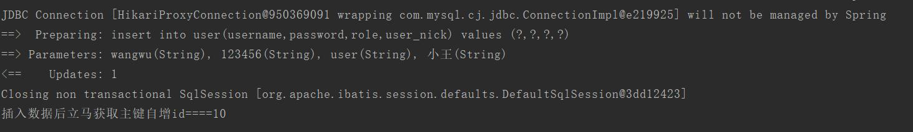
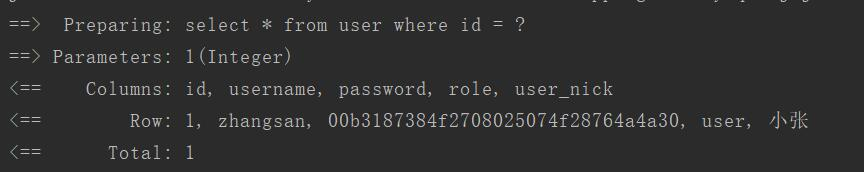
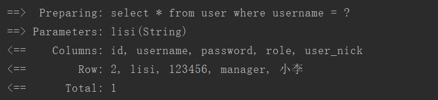
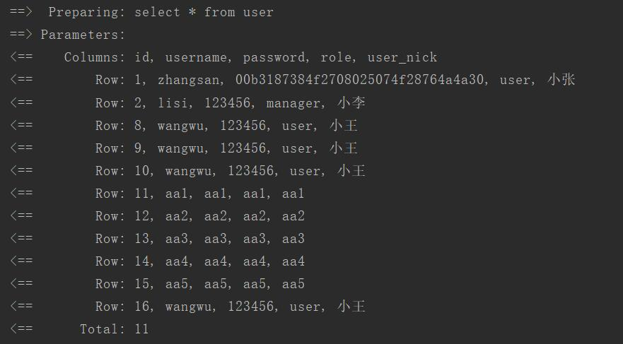
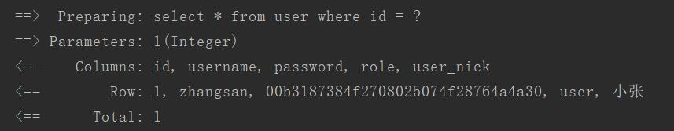
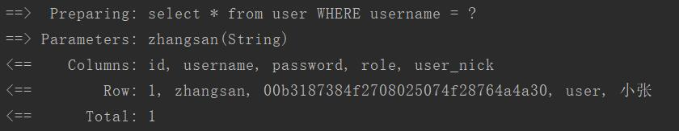
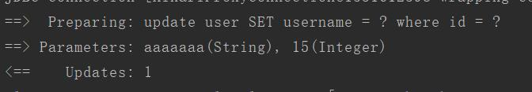
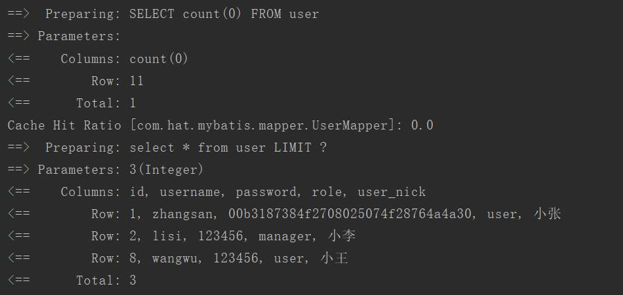

# Mybatis

## Mybatis介绍

MyBatis 是一款优秀的持久层框架，它支持定制化 SQL、存储过程以及高级映射。MyBatis 避免了几乎所有的 JDBC 代码和手动设置参数以及获取结果集。MyBatis 可以使用简单的 XML 或注解来配置和映射原生类型、接口和 Java 的 POJO（Plain Old Java Objects，普通 的Java 对象）为数据库中的记录。

## Mybatis的优缺点

### 优点：

- **使用连接池来连接数据库，减少了频繁的连接与关闭操作，与JDBC相比不用每个数据库操作都要写一堆重复的代码，减少性能消耗**
- **用xml文件编写sql代码使之与java类完全分开，便于维护和管理**
- **可以更方便使用动态sql**

### 缺点：

- **需要写许多sql语句代码**
- **sql语句非常依赖数据库，导致数据库移植性差，不可以轻易更改数据库**

## Mybati的工作原理和工作流程

mybatis根据配置文件(application.yml或者mybatis-config.xml)使用sqlsessionFactoryBuilder构建sqlsessionFactory，sqlsessionFactory根据openSession()获取sqlSession。sqlSession包含了执行sql语句的所有方法，可以通过sqlSession直接运行映射的sql语句，完成对数据的增删改查和事物的提交工作，用完之后关闭SQLSession。以下是工作原理流程图(从网上搬过来的)


**这里有两篇关于mybatis的实现原理与工作流程的博客，可以更直观更深入了解mybatis是如何运作的**

[**mybatis实现原理**](https://blog.csdn.net/u014745069/article/details/80788127)

[**mybatis工作流程**](https://www.cnblogs.com/dongying/p/4142476.html)


## springboot整合mybatis

### 1.实现mybatis

### 1.1 创建一个springboot项目且添加依赖

```xml
<?xml version="1.0" encoding="UTF-8"?>
<project xmlns="http://maven.apache.org/POM/4.0.0" xmlns:xsi="http://www.w3.org/2001/XMLSchema-instance"
         xsi:schemaLocation="http://maven.apache.org/POM/4.0.0 https://maven.apache.org/xsd/maven-4.0.0.xsd">
    <modelVersion>4.0.0</modelVersion>
    <parent>
        <groupId>org.springframework.boot</groupId>
        <artifactId>spring-boot-starter-parent</artifactId>
        <version>2.2.0.RELEASE</version>
        <relativePath/> <!-- lookup parent from repository -->
    </parent>
    <groupId>com.hat</groupId>
    <artifactId>05_mybatis</artifactId>
    <version>0.0.1-SNAPSHOT</version>
    <name>05_mybatis</name>
    <description>Demo project for Spring Boot with mybatis</description>

    <properties>
        <java.version>1.8</java.version>
    </properties>

    <dependencies>
        <dependency>
            <groupId>org.springframework.boot</groupId>
            <artifactId>spring-boot-starter-web</artifactId>
        </dependency>

        <!--jdbc依赖-->
        <dependency>
            <groupId>org.springframework.boot</groupId>
            <artifactId>spring-boot-starter-data-jdbc</artifactId>
        </dependency>

        <!--mybatis依赖-->
        <dependency>
            <groupId>org.mybatis.spring.boot</groupId>
            <artifactId>mybatis-spring-boot-starter</artifactId>
            <version>2.1.0</version>
        </dependency>

        <!--mysql依赖-->
        <dependency>
            <groupId>mysql</groupId>
            <artifactId>mysql-connector-java</artifactId>
            <scope>runtime</scope>
        </dependency>

        <dependency>
            <groupId>org.springframework.boot</groupId>
            <artifactId>spring-boot-starter-test</artifactId>
            <scope>test</scope>
            <exclusions>
                <exclusion>
                    <groupId>org.junit.vintage</groupId>
                    <artifactId>junit-vintage-engine</artifactId>
                </exclusion>
            </exclusions>
        </dependency>
    </dependencies>


    <build>
        <plugins>
            <plugin>
                <groupId>org.springframework.boot</groupId>
                <artifactId>spring-boot-maven-plugin</artifactId>
            </plugin>
        </plugins>
    </build>

</project>

```

项目目录结构如下：


### 1.2 创建applicaton.yml配置

```yaml
spring:
  datasource:
    url: "jdbc:mysql://127.0.0.1:3306/testshiro?characterEncoding=utf-8&serverTimezone=UTC"
    username: root
    password: 123456
    driver-class-name: com.mysql.cj.jdbc.Driver
mybatis:
  mapper-locations: classpath:mapper/*.xml       #扫描mapper xml文件路径
  #别名的实体类与resultMap属性功能相似，
  #如果实体类里的属性名与数据库表里的字段名一样，可以不设置resultMap。否则必须使用redultMap。
  type-aliases-package: "com.hat.mybatis.bean"
  configuration:
    map-underscore-to-camel-case: true  #开启驼峰命名法，可以把mysql里有下划线的字段名转成驼峰命名，如user_nick转成userNick
    log-impl: org.apache.ibatis.logging.stdout.StdOutImpl  #打印数据库语句日志
```

### 1.3 创建User实体

```java
package com.hat.mybatis.bean;

public class User {
    private Integer id;
    private String username;
    private String password;
    private String role;
    private String userNick;


    public User() {
    }

    public User(Integer id, String username, String password, String role, String nick) {
        this.id = id;
        this.username = username;
        this.password = password;
        this.role = role;
        this.userNick = nick;
    }

    public Integer getId() {
        return id;
    }

    public void setId(Integer id) {
        this.id = id;
    }

    public String getUsername() {
        return username;
    }

    public void setUsername(String username) {
        this.username = username;
    }

    public String getPassword() {
        return password;
    }

    public void setPassword(String password) {
        this.password = password;
    }

    public String getRole() {
        return role;
    }

    public void setRole(String role) {
        this.role = role;
    }


    public String getNick() {
        return userNick;
    }

    public void setNick(String nick) {
        this.userNick = nick;
    }

    @Override
    public String toString() {
        return "User{" +
                "id=" + id +
                ", username='" + username + '\'' +
                ", password='" + password + '\'' +
                ", role='" + role + '\'' +
                ", nick='" + userNick + '\'' +
                '}';
    }
}

```

### 1.4 创建UserMapper接口

```java
package com.hat.mybatis.mapper;

import com.hat.mybatis.bean.User;

/**
 * mapper接口，只需创建一个接口，mapper xml文件会映射到此接口
 */
//@Mapper      //第一种扫描方法，当有许多mapper接口时建议在spring启动类中添加@MapperScan注解
public interface UserMapper {
    User getUserByUsername(String username);
}
```

> **注意：这些mapper接口需要被扫描，一种方法是在这些接口上面添加@mapper注解，不过当有很多mapper接口时就需要写很多@mapper注解。另一种方法是在spring启动类中添加@mapperScan("com.hat.mybatis.mapper")注解（参数是mapper接口文件的全路径），扫描该文件夹里所有mapper接口**

### 1.5 创建userMapper.xml映射文件(即写sql语句的文件)

```xml
<?xml version="1.0" encoding="UTF-8" ?>

<!DOCTYPE mapper
        PUBLIC "-//mybatis.org//DTD Mapper 3.0//EN"
        "http://mybatis.org/dtd/mybatis-3-mapper.dtd">
<!--namespace：必须，作用一：该命名空间可以把不同的语句区分开来，建议使用全路径名以防出现冲突
                     作用二：与mapper接口进行绑定，把sql语句映射到mapper接口中-->
<mapper namespace="com.hat.mybatis.mapper.UserMapper">
    <!--resultType：结果集的类型，查询结果的数据是什么类型-->
    <select id="getUserByUsername" resultType="User">
        select * from user where username=#{username}
    </select>
</mapper>

```

### 1.6 编写service层接口代码(UserService)和实现service接口代码(UserServiceImpl)

1. UserService

   ```java
   package com.hat.mybatis.service;
   
   import com.hat.mybatis.bean.User;
   
   public interface UserService {
       User getUserByUsername(String username);
   }
   ```

2. UserServiceImpl

   ```java
   package com.hat.mybatis.service.impl;
   
   import com.hat.mybatis.bean.User;
   import com.hat.mybatis.mapper.UserMapper;
   import com.hat.mybatis.service.UserService;
   import org.springframework.beans.factory.annotation.Autowired;
   import org.springframework.stereotype.Service;
   
   @Service
   public class UserServiceImpl implements UserService {
   
       @Autowired
       UserMapper userMapper;
   
       @Override
       public User getUserByUsername(String username) {
           return userMapper.getUserByUsername(username);
       }
   }
   ```

### 1.7 编写controller类UserController

```java
package com.hat.mybatis.controller;

import com.hat.mybatis.service.UserService;
import org.springframework.beans.factory.annotation.Autowired;
import org.springframework.web.bind.annotation.PathVariable;
import org.springframework.web.bind.annotation.RequestMapping;
import org.springframework.web.bind.annotation.RestController;

@RestController
public class UserController {

    @Autowired
    UserService userService;

    @RequestMapping("/user/{username}")
    public Object getUser(@PathVariable String username){
        //根据用户名查询该用户的信息并返回给前端
        return userService.getUserByUsername(username);
    }
}
```

### 1.8 springboot启动类添加mapper接口扫描注解

```java
package com.hat.mybatis;

import org.mybatis.spring.annotation.MapperScan;
import org.springframework.boot.SpringApplication;
import org.springframework.boot.autoconfigure.SpringBootApplication;

@SpringBootApplication
@MapperScan("com.hat.mybatis.mapper") //扫描mapper接口注解，参数要用全路径名
public class Application {

    public static void main(String[] args) {
        SpringApplication.run(Application.class, args);
    }

}

```

### 1.9 启动项目使用postman测试


### 1.10 关于resultMap的一些补充

在上面的例子中，我使用了在application.yml配置文件中配置别名的方式供mybatis的映射文件mapper.xml使用`type-aliases-package: "com.hat.mybatis.bean"`，这种方式对**数据库的字段名与实体类的变量名一致**的时候很方便，但是当数据库的字段名与实体类的变量名不一样时就需要在mapper.xml文件中使用resultMap方式来设置别名。

实现：

- 把application.yml配置文件中的**type-aliases-package**注释掉

- 在userMapper.xml文件中添加resultMap的属性配置

  ```xml
  <?xml version="1.0" encoding="UTF-8" ?>
  
  <!DOCTYPE mapper
          PUBLIC "-//mybatis.org//DTD Mapper 3.0//EN"
          "http://mybatis.org/dtd/mybatis-3-mapper.dtd">
  <!--namespace：必须，作用一：该命名空间可以把不同的语句区分开来，建议使用全路径名以防出现冲突
                       作用二：与mapper接口进行绑定，把sql语句映射到mapper接口中-->
  <mapper namespace="com.hat.mybatis.mapper.UserMapper">
      
      <!--resultMap属性配置。  id：resultMap的名字，type：实体类的全路径-->
      <resultMap id="userResultMap" type="com.hat.mybatis.bean.User">
          <!--这个id属性是数据库的主键-->
          <id property="id" column="id"/> 
          <!--result 属性是数据库其他字段-->
          <!-- property: 实体类中的变量名；column：数据库中的字段名-->
          <result property="username" column="username"/>
          <result property="password" column="password"/>
          <result property="role" column="role"/>
          <result property="userNick" column="user_nick"/>
      </resultMap>
      
      <!--resultType：结果集的类型，查询结果的数据是什么类型-->
      <!--<select id="getUserByUsername" resultType="User">-->
          <!--select * from user where username=#{username}-->
      <!--</select>-->
      
      <!--如果使用了resultMap的话，就需要把resultType改成resultMap-->
      <select id="getUserByUsername" resultMap="userResultMap">
      select * from user where username=#{username}
      </select>
  </mapper>
  ```

  > **注意：**
  >
  > - **resultMap标签中的id属性就是 select语句中resultMap的参数**
  > - **resultMap标签里的id标签是数据库的主键**
  > - **result标签与id标签里的property属性是实体类的变量名，必须与实体类中的变量名一致，否则会报异常；column属性是数据的字段名，必须与数据库中的字段名一致，否则查询结果中该字段的值是null，property与column要相对应，否则结果会错乱**

- 启动项目测试结果如下：

  

- 如果我把resultMap中的user_nick改成nick，则结果如下：

  

  可以看出来，nick变量的值是null

- resultMap默认开启自动映射，即自己没手动设置映射，则会执行自动映射，且手动与自动可以同时存在，顺序是先执行自动映射再执行手动映射，只要我设置了resultMap标签的id属性和type属性，不写子标签的id和result，结果也能正常出来。我把id和result标签注释掉，这里就触发了自动映射。

  ```xml
  <?xml version="1.0" encoding="UTF-8" ?>
  
  <!DOCTYPE mapper
          PUBLIC "-//mybatis.org//DTD Mapper 3.0//EN"
          "http://mybatis.org/dtd/mybatis-3-mapper.dtd">
  <!--namespace：必须，作用一：该命名空间可以把不同的语句区分开来，建议使用全路径名以防出现冲突
                       作用二：与mapper接口进行绑定，把sql语句映射到mapper接口中-->
  <mapper namespace="com.hat.mybatis.mapper.UserMapper">
      <!--resultMap属性配置。  id：resultMap的名字，type：实体类的全路径-->
      <resultMap id="userResultMap" type="com.hat.mybatis.bean.User">
          <!--&lt;!&ndash;这个id属性是数据库的主键&ndash;&gt;-->
          <!--<id property="id" column="id"/>-->
          <!--&lt;!&ndash;result 属性是数据库其他字段&ndash;&gt;-->
          <!--&lt;!&ndash; property: 实体类中的变量名；column：数据库中的字段名&ndash;&gt;-->
          <!--<result property="username" column="username"/>-->
          <!--<result property="password" column="password"/>-->
          <!--<result property="role" column="role"/>-->
          <!--<result property="nick" column="nick"/>-->
      </resultMap>
      <!--resultType：结果集的类型，查询结果的数据是什么类型-->
      <!--<select id="getUserByUsername" resultType="User">-->
          <!--select * from user where username=#{username}-->
      <!--</select>-->
  
      <!--如果使用了resultMap的话，就需要把resultType改成resultMap-->
      <select id="getUserByUsername" resultMap="userResultMap">
      select * from user where username=#{username}
      </select>
  </mapper>
  
  ```

  

  再重开项目执行的结果：

  

### 1.11 mapper.xml映射文件的标签描述

mybatis提供了9种顶级标签，分别是**`<cache>`**、**`<cache-ref>`**、**`<resultMap>`**、**`<parameterMap>`(已弃用)**、**`<sql>`**、**`<insert>`**、**`<update>`**、**`<delete>`**、**`<select>`**。


#### select标签

`<select>`标签是查询语句。它的属性如下：

| 属性          | 描述                                                         |
| ------------- | ------------------------------------------------------------ |
| id            | 命名空间的唯一标识符，与mapper接口命名的接口名一样           |
| parameterType | 接收参数的类型                                               |
| resultType    | 结果集的类型，与resultMap只能2选1                            |
| resultMap     | 结果集的类型（自定义的resultMap才可以使用），与resultType只能2选1 |
| flushCache    | 清空缓存，当设置为true时，一旦该语句被调用则清空一级和二级缓存，默认false |
| useCache      | 使用缓存，true时本条语句结果会被二级缓存缓存，默认 select标签为true |
| timeout       | 超时时间，在抛出异常之前等待多少秒，默认 未设置              |
| fetchSize     | 尝试使返回查询结果的行数与该设置的值相等，默认 未设置        |
| statementType | STATEMENT、PERPARED、CALLABLE中选一个，默认PREPARED          |
| resultSetType | FORWARD_ONLY、SCROLL_SENSITIVE、SCROLL_INSENSITIVE、DEFAULT中选一个，默认DEFAU |

例子：

```xml
    <select id="getUserByUsername" resultMap="userResultMap">
    	select * from user where username=#{username}
    </select>
```

注意：关于**#{ }**，这个表示参数占位符，括号内的是**getUserByUsername**接口的参数。如果有多个参数则按照**getUserByUsername**接口对应的参数名称来传递。**${ }**也可以传递参数，但是传递的是字符串(String)。一半能用**#{ }**的就用**#{ }**，而且**#{ }**还可以防止sql注入问题，不过如果传递**表名或者字段名**的话就必须使用**${ }**。

例：但username = 'zhangsan' 、tableName = 'user'时

select * from user where username=#{username} 解析为 **select * from user where username = ?**

select * from user where username=${username} 解析为 **select * from user where username = 'zhangsan'**

select * from #{tableName} where username=#{username}解析为 **select * from ? where username = ?** 

select * from ${tableName} where username=#{username}解析为 **select * from 'user' where username = ?**


#### insert、update和delete标签

增删改这三种标签类似。他们的属性如下：

| 属性             | 描述                                                         |
| ---------------- | ------------------------------------------------------------ |
| id               | 命名空间的唯一标识符，与mapper接口命名的接口名一样           |
| parameterType    | 接收参数的类型                                               |
| flushCache       | 清空缓存，当设置为true时，一旦该语句被调用则清空一级和二级缓存，默认true |
| timeout          | 超时时间，在抛出异常之前等待多少秒，默认 未设置              |
| statementType    | STATEMENT、PERPARED、CALLABLE中选一个，默认PREPARED          |
| useGeneratedKeys | (仅insert和update可用) 当设置成true时Mybatis会使用jdbc的getGeneratedKeys方法来获取数据库的内部生成的主键，即添加完数据到数据库后可以查询到主键id的值，否则得到的id的null，默认false |
| keyProperty      | (仅insert和update可用) 实体中与数据库表的主键对应的字段，如id。唯一标记一个属性，MyBatis 会通过 getGeneratedKeys 的返回值或者通过 insert 语句的 selectKey 子元素设置它的键值，默认值：未设置。如果希望得到多个生成的列，也可以是逗号分隔的属性名称列表。 |
| keyColumn        | 仅对 insert 和 update 有用）数据库的主键字段，通过生成的键值设置表中的列名，这个设置仅在某些数据库（像 PostgreSQL）是必须的，当主键列不是表中的第一列的时候需要设置。如果希望使用多个生成的列，也可以设置为逗号分隔的属性名称列表。 |

例子：

```xml
<insert id="insertUser">
  insert into user (username,password,role,user_nick)
  values (#{username},#{password},#{role},#{user_nick})
</insert>
<delete id="delUser">
  delete from user where username = #{username}
</delete>
<update id="updateUser">
  update user set
    username = #{username},
    password = #{password},
    role = #{role},
    user_nick = #{user_nick}
  where id = #{id}
</update>
```

- **如果按照上面例子中插入数据，插入玩后直接获取自增的主键id，发现返回的null。如果想在插入数据后直接获取该数据的主键id该怎么做呢？**

  那么**useGeneratedKeys、keyProperty**就派上用场了，只要设置这两个属性就可以在插入数据后直接获取该数据的主键id了。下面是实现的代码

  在mapper接口中增加一个插入数据的接口,这里的@param注解是当有多个参数时使用的，xml映射文件中使用@param(“user”)设置的user参数就可以确保使用哪一个参数

  `int insertUser(@Param("user") User user);`

  serveice类和serviceImpl的简单实现代码就不贴了，跟之前的差不多

  在xml映射文件中添加insert语句，把useGeneratedKeys属性设置为true，keyProperty属性是实体类中与数据库表主键对应的变量，这里是id

  ```xml
      <!--插入一条数据，并且可以直接获取自增主键id-->
      <insert id="insertUser" useGeneratedKeys="true" keyProperty="id">
          insert into user(username,password,role,user_nick)
          values (#{user.username},#{user.password},#{user.role},#{user.nick})
      </insert>
  ```

  编写一个controller控制类

  ```java
      @RequestMapping("/insert")
      public int insertUser(String username,String password,String role,String nick){
          User user = new User();
          user.setUsername(username);
          user.setPassword(password);
          user.setRole(role);
          user.setNick(nick);
          int res = userService.insertUser(user);
          System.out.println("插入数据后立马获取主键自增id===="+user.getId());
          return res;
      }
  ```

  结果如下：

  

  

- **批量增删改**

  在顶级标签内都有一个`<foreach>`标签。也就是参数传一个list过来，然后使用`<foreach>`标签遍历数据插入到数据库表中

  实现代码：

  ```xml
  <insert id="insertUserList" useGeneratedKeys="true"
      keyProperty="id">
    insert into user (username, password, role, user_nick) values
    <foreach item="item" collection="list" separator=",">
      (#{item.username}, #{item.password}, #{item.role}, #{item.nick})
    </foreach>
  </insert>
  ```

#### foreach标签的属性(非顶级)

| 属性       | 描述                                |
| ---------- | ----------------------------------- |
| collection | 传递的参数名称，List集合或Set集合等 |
| item       | 遍历时的每一条数据                  |
| index      | 当前元素在集合中的位置下标          |
| separator  | 各个元素之间的间隔符                |


#### sql标签

该标签是sql的代码段，即只写一段sql语句，然后可以供其他语句使用。与`<include>`一起使用，定义为万`<sql>`后使用`<include>`来使用sql片段语句。

| 属性  | 描述                       |
| ----- | -------------------------- |
| id    | （sql）sql标签的唯一标识符 |
| refid | （include）引用sql的id     |

例子：

```xml
    <sql id="selectsql">
        select * from ${tableName}
    </sql>
    <select id="selectUseSql" resultMap="userResultMap">
        <include refid="selectsql"/>
        where username=#{username} 
    </select>
```

还有其他标签的描述可以到官方文档查看：

官方文档https://mybatis.org/mybatis-3/zh/sqlmap-xml.html

### 1.12 动态sql

mybatis提供了几钟条件语句，分别是if、choose（when,otherwise）、trim(where、set)

#### **if**

if语句可以用来判断某个字段符合某个条件才使用if语句里的sql代码。

示例：

```xml
    <select id="findByIf" resultMap="userResultMap">
        select * from user where username = #{username}
        <if test="role != null">
            and role = #{role}
        </if>
    </select>
```

当参数有role时，if语句的test属性则为true，意味着if语句里的role = #{role}也会拼接到sql语句中，拼接后的sql语句为：

`select * from user where username = #{username} and role = #{role}`

如果参数中没有role的话。sql语句为：

`select * from user where username = #{username}`

#### **choose，when，otherwise**

这3个一般是一起使用，相当于 if---elif---else，即只有一个满足条件的语句会被使用到

示例：

```xml
    <select id="findByChoose" resultMap="userResultMap">
        select * from user
        <choose>
            <when test="id != null">
                where id = #{id}
            </when>
            <when test="username != null">
                where username = #{username}
            </when>
            <otherwise>

            </otherwise>
        </choose>
    </select>
```

如果只传了id参数，localhost:8080/findbychoose?id=1

则sql语句为：



如果传了username参数，localhost:8080/findbychoose?username=lisi

则sql语句为：



如果什么参数都不传，localhost:8080/findbychoose

则sql语句为：



如果即传了id参数又传了username参数，localhost:8080/findbychoose?username=lisi&id=1，而我数据库中lisi的id是2。id为1的是zhangsan

sql语句为：



可见id参数优先级更高，因此choose条件是从上往下依次判断的，一旦命中就算结束，下面其他的when语句都不会再判断

#### **trim， where，set**

这3个语句是解决where语句多出的一些sql连接词，如and或or等这些，这种情况一般在if语句中出现的多。

**where：**

场景：

```xml
    <select id="findByIf" resultMap="userResultMap">
        select * from user where
        <if test="username != null">
            and username = #{username}
        </if>
        <if test="role != null">
            and role = #{role}
        </if>
    </select>
```

该查询语句，如果username参数命中，则sql语句变成 

`select * from user where and username = #{username}`   这sql语句明显是不对的。因此where就是用来解决这种在多出来的and或or等连接符

示例：

```xml
    <select id="findByIf" resultMap="userResultMap">
        select * from user
        <where>
            <if test="username != null">
                and username = #{username}
            </if>
            <if test="role != null">
                and role = #{role}
            </if>
        </where>
    </select>
```

where语句会把拼接sql的第一个if语句中前面的and去掉，当localhost:8080/findbyif?username=zhangsan时

sql语句为：



同理localhost:8080/findbyif?role=user时是一样的。

当两个参数都满足时localhost:8080/findbyif?username=zhangsan&role=aaa

sql语句为：


所以where语句会把第一个条件前面的and去掉，后面条件的and会保留

**trim**

如果把and放到了语句的后面where语句就会不起作用报出异常了。因此要使用trim来解决这个问题。

trim有几个属性：

| 属性            | 描述                                                         |
| --------------- | ------------------------------------------------------------ |
| prefix          | sql语句前置，即在trim标签内的语句前面插入的sql语句，如where等sql语句 |
| prefixOverrides | 要删除前面的and或or等，可以写多个，用 \| 分开，即或。如and \| or |
| suffix          | sql语句后置，即在trim标签内的语句后面插入的sql语句如desc等sql语句 |
| suffixOverrides | 要删除后面的and或or等，可以写多个，用 \| 分开，如and \| or   |

示例：

```xml
    <select id="findByIf" resultMap="userResultMap">
        select * from user
        <!--把where语句前置到if语句的前面，如果后面有and|or则删掉-->
        <trim prefix="where" suffixOverrides="and | or">
            <if test="username != null">
                 username = #{username} and
            </if>
            <if test="role != null">
                role = #{role} and
            </if>
        </trim>
        <!--把desc语句后置到 order by id 后面，如果前面有and|or则删掉-->
        <trim suffix="desc" prefixOverrides="and | or">
            order by id
        </trim>
    </select>
```

请求localhost:8080/findbyif?username=wangwu&role=user后的sql语句为：


**set**

set语句与where语句类似，只不过set是在update时使用的。

场景：

```xml
<update id="updateBySet" useGeneratedKeys="true" keyProperty="id">
        update user
        set
            <if test="username != null">username = #{username},</if>
            <if test="password != null">password = #{password},</if>
            <if test="role != null">role = #{role},</if>
            <if test="userNick != null">user_nick = #{userNick}</if>
        where id = #{id}
    </update>
```

如果我只修改username一个值，localhost:8080/updatebyset?username=aaaaaaa&id=15

则sql语句是：

`update user set username = #{username}, where id = #{id}`  这条sql语句明显不对。

如果使用set标签代替set

示例：

```xml
    <update id="updateBySet" useGeneratedKeys="true" keyProperty="id">
        update user
        <set>
            <if test="username != null">username = #{username},</if>
            <if test="password != null">password = #{password},</if>
            <if test="role != null">role = #{role},</if>
            <if test="userNick != null">user_nick = #{userNick}</if>
        </set>
        where id = #{id}
    </update>
```

sql语句为：



因此，set标签是跟where标签类似，set标签会删除最后面多出的逗号。如果有些复杂的set标签也无法解决的，我们也可以用trim来删除那些多余的东西。用法也是跟查询一样的。

还想了解其他的一些动态sql语句标签，可以看官方文档https://mybatis.org/mybatis-3/zh/dynamic-sql.html

### 1.13 mybatis的缓存

**一级缓存**

mybatis默认开启了一级缓存，可以在配置文件中设置**local-cache-scope**属性，该属性有两个值--**SESSION**(默认)和**STATEMENT**。该两个值只是缓存的范围不同

> - **SESSION：**在一个同一个会话（sqlSession）中的语句会被缓存。
> - **STATEMENT：**只会缓存当前这个STATEMENT的语句，即只会缓存当前执行的一条sql操作语句

**注意：**在springboot项目中，mybatis的一级缓存虽然是开启的，但是是失效的，如果想让一级缓存工作，需要给该服务开启事务，在rest方法上添加@Transactional注解

当不开启事务时：

```java
    @RequestMapping("/user/{username}")
//    @Transactional
    public Object getUser(@PathVariable String username){
        //根据用户名查询该用户的信息并返回给前端
        System.out.println(userService.getUserByUsername(username)+"[1111111]");
        System.out.println(userService.getUserByUsername(username)+"[2222222]");
        User user = userService.getUserByUsername(username);
        System.out.println(user+"[3333333]");
        return user;
    }
```

结果如下：


>**可以看出来一级缓存是失效的，且每个sqlSession都是不一样的。**


当开启了事务：

```java
    @RequestMapping("/user/{username}")
    @Transactional
    public Object getUser(@PathVariable String username){
        //根据用户名查询该用户的信息并返回给前端
        System.out.println(userService.getUserByUsername(username)+"[1111111]");
        System.out.println(userService.getUserByUsername(username)+"[2222222]");
        User user = userService.getUserByUsername(username);
        System.out.println(user+"[3333333]");
        return user;
    }
```

结果如下：


> 可以看出只运行了一次数据库查询，且sqlSession都是一样的。这样就成功让一级缓存生效了

一级缓存的补充。


- 比如在**查询--修改--查询**这样的情景中（同一个sqlSession），首先进行了查询，那么sqlSession会缓存了该数据，然后我们修改这这项数据，最后再查询。那么第2次的查询会重新进行数据库查询。
- 查询（sqlSession1）-- 修改（sqlSession2）-- 查询（sqlSession1）-- 查询（sqlSession2）这样的一个情景中，第二个查询（sqlSession1）的结果是第一个查询（sqlSession1）中缓存的数据，就是**修改之前**的数据；第四个查询（sqlSession2）是**修改之后**的数据，且该数据是进行数据库查询的。

**上面的两个补充中可以更好的佐证一级缓存是在sqlSession内部缓存的。**

2. **二级缓存**

   mybatis的二级缓存与一级缓存类似，不过二级缓存的范围是整个命名空间（namespace），且二级缓存的可以使用第三方的缓存来实现。当开启二级缓存后数据库操作顺序为：**二级缓存——>一级缓存——>数据库**

   开启二级缓存只需要在mapper.xml映射文件中添加 `<cache/>`标签即可。二级缓存有4种清除策略，可以设置**eviction**属性来使用不同的清除策略，策略描述如下：

   | 策略 | 描述                                                     |
| ---- | -------------------------------------------------------- |
   | LRU  | 最近最少使用：移除最长时间不被使用的对象。（默认｝       |
| FIFO | 先进先出：按对象进入缓存的顺序来移除它们。               |
   | SOFT | 软引用：基于垃圾回收器状态和软引用规则移除对象。         |
| WEAK | 弱引用：更积极地基于垃圾收集器状态和弱引用规则移除对象。 |
   

**注意：开启二级缓存需要实体类User实现序列化**

   **实体类User实现序列化：**

   `public class User implements Serializable{`

   **在mapper.xml映射文件开启二级缓存：**

   ```xml
   <?xml version="1.0" encoding="UTF-8" ?>
   
   <!DOCTYPE mapper
           PUBLIC "-//mybatis.org//DTD Mapper 3.0//EN"
           "http://mybatis.org/dtd/mybatis-3-mapper.dtd">
   <!--namespace：必须，作用一：该命名空间可以把不同的语句区分开来，建议使用全路径名以防出现冲突
                        作用二：与mapper接口进行绑定，把sql语句映射到mapper接口中-->
   <mapper namespace="com.hat.mybatis.mapper.UserMapper">
       <!--开启二级缓存-->
       <cache/>
       <!--resultMap属性配置。  id：resultMap的名字，type：实体类的全路径-->
       <resultMap id="userResultMap" type="com.hat.mybatis.bean.User">
           <!--&lt;!&ndash;这个id属性是数据库的主键&ndash;&gt;-->
           <!--<id property="id" column="id"/>-->
           <!--&lt;!&ndash;result 属性是数据库其他字段&ndash;&gt;-->
           <!--&lt;!&ndash; property: 实体类中的变量名；column：数据库中的字段名&ndash;&gt;-->
           <!--<result property="username" column="username"/>-->
           <!--<result property="password" column="password"/>-->
           <!--<result property="role" column="role"/>-->
           <!--<result property="nick" column="nick"/>-->
       </resultMap>
       <!--resultType：结果集的类型，查询结果的数据是什么类型-->
       <!--<select id="getUserByUsername" resultType="User">-->
           <!--select * from user where username=#{username}-->
       <!--</select>-->
   
    <!--如果使用了resultMap的话，就需要把resultType改成resultMap-->
       <select id="getUserByUsername" resultMap="userResultMap">
    select * from user where username=#{username}
       </select>
</mapper>
   
   ```

**启动项目测试结果如下：**


> **这里我发送了两次请求，黄色框中是创建了两个sqlSession，这里只查询了一次数据。**


   二级缓存也存在一些失效的时候，比如在多表查询时，改变了表中的数据后，再次查询结果是第一次查询时的结果，也就是读取了缓存中的脏数据。因此可以使用`<cache-ref>`标签关联两个namespace来解决这个问题。

   这里创建一套使用多表内连接查询的例子：

   - 创建UserWithPerms实体类
   
     ```java
     package com.hat.mybatis.bean;
     
     import java.io.Serializable;
     //使用二级缓存实体类必须实现序列化
     public class UserWithPerms implements Serializable {
         private int id;
         private String username;
         private String password;
         private String userNick;
         private String role;
         private String perm;
     
         public UserWithPerms() {
         }
     
         public int getId() {
             return id;
         }
     
         public void setId(int id) {
             this.id = id;
         }
     
         public String getUsername() {
             return username;
         }
     
         public void setUsername(String username) {
             this.username = username;
         }
     
         public String getPassword() {
             return password;
         }
     
         public void setPassword(String password) {
             this.password = password;
         }
     
         public String getUserNick() {
             return userNick;
         }
     
         public void setUserNick(String userNick) {
             this.userNick = userNick;
         }
     
         public String getPerm() {
             return perm;
         }
     
         public void setPerm(String perm) {
             this.perm = perm;
         }
     
     
     
         public String getRole() {
             return role;
         }
     
         public void setRole(String role) {
             this.role = role;
         }
     
         @Override
         public String toString() {
             return "UserWithPerms{" +
                     "id=" + id +
                     ", username='" + username + '\'' +
                     ", password='" + password + '\'' +
                     ", userNick='" + userNick + '\'' +
                  ", role='" + role + '\'' +
                     ", perm='" + perm + '\'' +
                  '}';
         }
     }
     
     ```
   
   - 创建UserWithPermMapper接口类
   
     ```java
     package com.hat.mybatis.mapper;
     
     ```

  import com.hat.mybatis.bean.UserWithPerms;
     
  public interface UserWithPermMapper {
         UserWithPerms getUserWithPerm(String username);
     }
     
     ```

   - 创建UserWithPermService和UserWithPermServiceImpl实现类
   
     ```java
     package com.hat.mybatis.service;
     
     ```

  import com.hat.mybatis.bean.UserWithPerms;
     
     public interface UserWithPermService {
         UserWithPerms getUserWithPerm(String username);
     }
     
     ```
       
     ```java
     package com.hat.mybatis.service.impl;
     
     import com.hat.mybatis.bean.UserWithPerms;
     import com.hat.mybatis.mapper.UserWithPermMapper;
     import com.hat.mybatis.service.UserWithPermService;
     import org.springframework.beans.factory.annotation.Autowired;
     import org.springframework.stereotype.Service;
     
     @Service
     public class UserWithPermServiceImpl implements UserWithPermService {
         @Autowired
         UserWithPermMapper userWithPermMapper;
      @Override
         public UserWithPerms getUserWithPerm(String username) {
          return userWithPermMapper.getUserWithPerm(username);
         }
     }
     
     ```

   - 创建UserWithPermMapper.xml映射文件
   
     ```java
     <?xml version="1.0" encoding="UTF-8" ?>
     
     <!DOCTYPE mapper
             PUBLIC "-//mybatis.org//DTD Mapper 3.0//EN"
             "http://mybatis.org/dtd/mybatis-3-mapper.dtd">
     <mapper namespace="com.hat.mybatis.mapper.UserWithPermMapper">
         <!--开启二级缓存-->
         <cache/>
         <!--设置resultMap-->
         <resultMap id="UWPResultMap" type="com.hat.mybatis.bean.UserWithPerms"></resultMap>
      <!--两表使用内连接查询-->
         <select id="getUserWithPerm" resultMap="UWPResultMap">
          SELECT * FROM user inner join roles_perms on user.role = roles_perms.role
             where user.username = #{username}
         </select>
     </mapper>
     ```
   
   - 创建Permission实体类（下面修改权限时用的）
   
     ```java
     package com.hat.mybatis.bean;
     
     import java.io.Serializable;
     
     public class Permission implements Serializable {
         private int id;
         private String role;
         private String perm;
     
         public Permission() {
             super();
         }
     
         public Permission(int id, String role, String perm) {
             this.id = id;
             this.role = role;
             this.perm = perm;
     
         }
     
         public int getid() {
             return id;
         }
     
         public void setid(int id) {
             this.id = id;
         }
     
         public String getRole() {
             return role;
         }
     
         public void setRole(String role) {
             this.role = role;
         }
     
         public String getPerm() {
             return perm;
         }
     
         public void setPerm(String perm) {
             this.perm = perm;
         }
     
         @Override
         public String toString() {
             return "Permission{" +
                     "id=" + id +
                  ", role='" + role + '\'' +
                     ", perm='" + perm + '\'' +
                  '}';
         }
     }
     
     ```
   
   - 创建PermsMapper接口
   
     ```java
     package com.hat.mybatis.mapper;
     
     import com.hat.mybatis.bean.Permission;
     
     import java.util.List;
     
     ```

  public interface PermsMapper {
     
      //根据p_id修改权限
         Integer updatePerm(int p_id, String perm);
     }
     
     ```

   - 创建PermsService和PermsServiceImpl实现类
   
     ```java
     package com.hat.mybatis.service;
     
     import com.hat.mybatis.bean.Permission;
        
     import java.util.List;
     
     public interface PermsService {
         Integer updatePerm(int p_id,String perm);
     }
     ```
   
     ```java
     package com.hat.mybatis.service.impl;
     
     import com.hat.mybatis.bean.Permission;
     import com.hat.mybatis.mapper.PermsMapper;
     import com.hat.mybatis.service.PermsService;
     import org.springframework.beans.factory.annotation.Autowired;
     import org.springframework.stereotype.Service;
     
     import java.util.List;
     
     @Service
     public class PermsServiceImpl implements PermsService {
         @Autowired
         PermsMapper permsMapper;
         //这里第一个参数是权限表中的id，perm是修改后的权限
      @Override
         public Integer updatePerm(int p_id,String perm) {
          return permsMapper.updatePerm(p_id,perm);
         }
     }
     
     ```
   
   - 创建PermsMapper映射文件
   
     ```xml
     <?xml version="1.0" encoding="UTF-8" ?>
     
     <!DOCTYPE mapper
             PUBLIC "-//mybatis.org//DTD Mapper 3.0//EN"
             "http://mybatis.org/dtd/mybatis-3-mapper.dtd">
     
     <mapper namespace="com.hat.mybatis.mapper.PermsMapper">
         <!--开启二级缓存-->
         <cache/>
      <resultMap id="permsResultMap" type="com.hat.mybatis.bean.Permission">
         </resultMap>
      <update id="updatePerm" >
             update roles_perms set perm = #{perm} where id = #{p_id}
         </update>
     </mapper>
     ```
   
   - 继续在userController类中添加路由
   
     ```java
     	//修改权限的api
         @RequestMapping("/update/perm")
         @Transactional
         public int updatePerm(int id,String perm){
             int result = permsService.updatePerm(id,perm);
             return result;
         }
     	//多表查询的api
         @RequestMapping("/getuser")
      @Transactional
         public Object getUserPerms(String username){
          UserWithPerms userWithPerms = userWithPermService.getUserWithPerm(username);
             System.out.println(userWithPerms);
          return userWithPerms;
         }
     ```
  ```
   
- 查询——>修改权限——>查询结果如下：
   
  
   
  
   
  > **发现使用多表查询时，二级缓存也失效了。修改数据后再次查询的结果是修改数据前缓存的数据。**
   
     
   
   - 在PermsMapper.xml映射文件中添加`<cache-ref>`,这样两个映射文件对应的SQL操作都使用的是同一块缓存了
   
     
   
     ```xml
     <?xml version="1.0" encoding="UTF-8" ?>
     
     <!DOCTYPE mapper
             PUBLIC "-//mybatis.org//DTD Mapper 3.0//EN"
             "http://mybatis.org/dtd/mybatis-3-mapper.dtd">
     
     <mapper namespace="com.hat.mybatis.mapper.PermsMapper">
         <!--开启二级缓存-->
         <cache/>
         
         <!--缓存引用UserWithPermMapper的namespace。
         这样当前映射文件和UserWithPermMapper映射文件都是用同一个缓存-->
         <cache-ref namespace="com.hat.mybatis.mapper.UserWithPermMapper"/>
         
         <resultMap id="permsResultMap" type="com.hat.mybatis.bean.Permission">
         </resultMap>
         <select id="getPermsByUsername" resultMap="permsResultMap">
          select * from roles_perms where role = #{role}
         </select>
      <update id="updatePerm" >
             update roles_perms set perm = #{perm} where id = #{p_id}
      </update>
     </mapper>
  ```

- 再次测试结果如下：
  
     
   
     > **在结果图中可以看出，修改数据后再查询时，会从数据库中查数据，且数据是修改后的数据。这样就可以解决多表查询时二级缓存失效的问题。**
     >
     > **注意：`<cache-ref>`是在修改数据的那个映射文件中添加的，不可以反过来。**
   
     最后。关于mybatis缓存机制的源码可以看这篇文章 [mybatis缓存机制](https://tech.meituan.com/2018/01/19/mybatis-cache.html)

### 1.14 使用注解方式代替映射文件

mybatis提供了@select、@update、@delete、@insert这几种注解，只需要在**mapper接口**中添加这些注解就行，参数就是sql语句。比如：

```java
    @Select("select * from user where username = #{username}")
    User getUser(String username);
```

不过这种方式只能进行一些简单的sql数据库操作。如果有复杂的sql操作还是需要使用xml映射文件方式来编写。

### 2. 使用mybatis代码生成器mybatis-generator插件

### 2.1 在pom.xml文件中引入mybatis-generator插件

```xml
    <plugin>
        <groupId>org.mybatis.generator</groupId>
        <artifactId>mybatis-generator-maven-plugin</artifactId>
        <version>1.3.7</version>
        <!--这里要添加mysql连接的依赖-->
        <dependencies>
            <dependency>
                <groupId>mysql</groupId>
                <artifactId>mysql-connector-java</artifactId>
                <!--<scope>runtime</scope>-->
                <version>8.0.18</version>
            </dependency>
        </dependencies>
    </plugin>
```

### 2.2 在resource路径下创建generatorConfig.xml来配置生成器属性，这个xml文件名必须是generatorConfig

```xml
<?xml version="1.0" encoding="UTF-8"?>
<!DOCTYPE generatorConfiguration
        PUBLIC "-//mybatis.org//DTD MyBatis Generator Configuration 1.0//EN"
        "http://mybatis.org/dtd/mybatis-generator-config_1_0.dtd">

<generatorConfiguration>
    <!--
        context：上下文，可配置多个
            id：（必须）上下文标识，要唯一
            defaultModelType：（可选）默认模型类型(生成实体类的类型)
                conditional：（默认）如果表中只有一个字段则不会单独生成一个实体类，而是并入到基本实体类中
                flat：一个表生成一个实体类
                hierarchical：主键分一个实体类，BLOB类型(如果有)的字段分一个实体类，其余字段分一个实体类，生成器会自动创建继承关系
            targetRuntime：（可选）生成代码的运行时环境
                MyBatis3：（默认）会生成sample
                MyBatis3Simple：不会生成sample
                MyBatis3DynamicSql：如果使用此运行环境，那么defaultModelType无论设置什么都是flat，映射器只使用注解方式。
    -->
    <context id="mycontext" targetRuntime="MyBatis3Simple" defaultModelType="flat">

        <!--
            property：数据库分隔符
                javaFileEncoding：java文件编码
        -->
        <property name="javaFileEncoding" value="UTF-8"/>
        <!--
            commentGenerator：注释生成器
                suppressDate：日期注释，false(默认)则生成日期注释，true则不生成日期注释
                addRemarkComments：数据库表和列的注释，false(默认)则不生成列和表注释，true反之
                suppressAllComments：所有注释，false(默认)则生成所有注释，true反之
        -->
        <commentGenerator>
            <property name="suppressDate" value="true"/>
            <property name="addRemarkComments" value="false"/>
            <property name="suppressAllComments" value="true"/>
        </commentGenerator>

        <!--jdbc的数据库连接：驱动类、链接地址、用户名、密码-->
        <jdbcConnection
                driverClass="com.mysql.cj.jdbc.Driver"
                connectionURL="jdbc:mysql://127.0.0.1:3306/testshiro?characterEncoding=utf8&amp;serverTimezone=UTC"
                userId="root"
                password="123456">
            <!--<property name="nullCatalogMeansCurrent" value="true"/>-->
        </jdbcConnection>

        <!-- 非必需，类型处理器，在数据库类型和java类型之间的转换控制,默认false-->
        <javaTypeResolver>
            <property name="forceBigDecimals" value="false"/>
        </javaTypeResolver>
        
        <!-- Model模型生成器,用来生成含有主键key的类，记录类 以及查询Example类
            targetPackage     指定生成的实体类所在的包名
            targetProject     指定在该项目下所在的路径
        -->
        <javaModelGenerator targetPackage="com.hat.mybatis.bean"
                            targetProject="src/main/java">

            <!-- 是否允许子包，即targetPackage.schemaName.tableName，默认false -->
            <property name="enableSubPackages" value="false"/>
            <!-- 是否对model添加 构造函数 ，默认false-->
            <property name="constructorBased" value="false"/>
            <!-- 是否对类CHAR类型的列的数据进行trim操作，默认false-->
            <property name="trimStrings" value="true"/>
            <!-- 建立的Model对象是否 不可改变  即生成的Model对象不会有 setter方法，只有构造方法，默认false-->
            <property name="immutable" value="false"/>
        </javaModelGenerator>

        <!--Mapper映射文件生成所在的目录 为每一个数据库的表生成对应的SqlMap文件 -->
        <sqlMapGenerator targetPackage="mapper" targetProject="src/main/resources">
        </sqlMapGenerator>

        <!-- 生成mapper接口的代码
                type="ANNOTATEDMAPPER",生成Java Model 和基于注解的Mapper对象
                type="MIXEDMAPPER",生成基于注解的Java Model 和相应的Mapper对象
                type="XMLMAPPER",生成SQLMap XML文件和独立的Mapper接口
        -->
        <javaClientGenerator targetPackage="com.hat.mybatis.mapper"
                             targetProject="src/main/java" type="XMLMAPPER">
        </javaClientGenerator>

        <!-- 数据表进行生成操作 tableName:表名，可以使用sql通配符; domainObjectName:对应的实体类名，不设置则按照表名创建 -->
        <!-- %：所有表；table标签可以选择生成哪些sql语句，详情：http://mybatis.org/generator/configreference/table.html-->
        <table tableName="user_info" domainObjectName="UserInfo"/>
    </context>

</generatorConfiguration>
```

关于`</generatorConfiguration>`更详细的的讲解可以到[官方文档](http://mybatis.org/generator/configreference/xmlconfig.html)查看

### 2.3 使用代码生成器生成实体类、mapper接口、mapper.xml映射文件


### 3 使用PageHelper实现分页功能

### 3.1  引入pagehelper依赖

```xml
        <dependency>
            <groupId>com.github.pagehelper</groupId>
            <artifactId>pagehelper-spring-boot-starter</artifactId>
            <version>1.2.12</version>
        </dependency>
```

### 3.2 使用分页

我直接修改localhost:8080/findbychoose这个查询，直接在controller类中实现即可

```java
    @RequestMapping("/findbychoose")
    public Object findByChoose(@RequestParam(defaultValue = "1") int page,
                               @RequestParam(required = false) Integer id,
                               @RequestParam(required = false) String username){
        User user = new User();
        user.setId(id);
        user.setUsername(username);
        //设置第几页和一页多少条数据，这一行必须在查询语句的上方
        PageHelper.startPage(page,3);
        //查询
        List<User> users = userService.findByChoose(user);
        //把查询的结果集给PageInfo处理
        PageInfo<User> pageInfo = new PageInfo<>(users);
        return pageInfo;
    }
```

### 3.2 分页结果

请求localhost:8080/findbychoose 。因为我把page参数设置了默认值1，意味着分页查询第1页的数据。

执行的sql语句如下：



而pageInfo封装的内容如下：

```json
{
    "total": 11,   //总数据条数
    "list": [  //当前页的数据
        {
            "id": 1,
            "username": "zhangsan",
            "password": "00b3187384f2708025074f28764a4a30",
            "role": "user",
            "permissions": null,
            "nick": "小张"
        },
        {
            "id": 2,
            "username": "lisi",
            "password": "123456",
            "role": "manager",
            "permissions": null,
            "nick": "小李"
        },
        {
            "id": 8,
            "username": "wangwu",
            "password": "123456",
            "role": "user",
            "permissions": null,
            "nick": "小王"
        }
    ],
    "pageNum": 1,   //第几页
    "pageSize": 3,  //每页显示的数据个数
    "size": 3,      //长度
    "startRow": 1,  //从第几行开始
    "endRow": 3,    //第几行结束
    "pages": 4,     //总页数
    "prePage": 0,   //前一页是第几页
    "nextPage": 2,  //后一页是第几页
    "isFirstPage": true,  //是否第一页
    "isLastPage": false,  //是否最后一页
    "hasPreviousPage": false,  //有没有前一页
    "hasNextPage": true,    //有没有后一页
    "navigatePages": 8,    //导航页码数
    "navigatepageNums": [  //所有导航页码
        1,
        2,
        3,
        4
    ],
    "navigateFirstPage": 1, //导航条上的第1页
    "navigateLastPage": 4   //导航条上的最后一页
}
```

使用PageHelper实现简单的分页查询就完成了。

