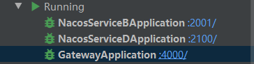

# Spring Cloud

## 一、nacos配置中心、注册中心

### 1.文档及下载

* [nacos官方文档](https://nacos.io/zh-cn/docs/what-is-nacos.html)
* [下载地址](https://github.com/alibaba/nacos/releases)

### 2.win10配置nacos server

需要的环境

> 1. 64 bit OS，支持 Linux/Unix/Mac/Windows，推荐选用 Linux/Unix/Mac。
> 2. 64 bit JDK 1.8+；[下载](http://www.oracle.com/technetwork/java/javase/downloads/jdk8-downloads-2133151.html) & [配置](https://docs.oracle.com/cd/E19182-01/820-7851/inst_cli_jdk_javahome_t/)。
> 3. Maven 3.2.x+；[下载](https://maven.apache.org/download.cgi) & [配置](https://maven.apache.org/settings.html)。

#### 2.1--单机：

* 解压nacos压缩包后进入**nacos-server-1.3.1\nacos\bin**目录点击**startup.cmd**运行

  启动成功：


* 通过**127.0.0.1:8848/nacos**（默认这个路径）访问管理界面，帐号密码都是nacos

#### 2.2--集群：

* 持久化处理

  创建一个数据库，然后导入**nacos-server-1.3.1\nacos8848\conf**目录下的**nacos-mysql.sql**数据库文件，这样就会创建nacos所需要的表。

  创建完后的表：

  

* 把nacos复制几份

  

* 进入**nacos-server-1.3.1\nacos8848\conf**文件夹下，**cluster.conf.example**把这个文件的命名改成**cluster.conf**，（这里可以复制一份再改名字，那就可以保留example文件），在这个文件里添加nacos集群的服务器ip与端口

  * cluster.conf.example的内容

  ```
  #
  # Copyright 1999-2018 Alibaba Group Holding Ltd.
  #
  # Licensed under the Apache License, Version 2.0 (the "License");
  # you may not use this file except in compliance with the License.
  # You may obtain a copy of the License at
  #
  #      http://www.apache.org/licenses/LICENSE-2.0
  #
  # Unless required by applicable law or agreed to in writing, software
  # distributed under the License is distributed on an "AS IS" BASIS,
  # WITHOUT WARRANTIES OR CONDITIONS OF ANY KIND, either express or implied.
  # See the License for the specific language governing permissions and
  # limitations under the License.
  #
  
  #it is ip
  #example
  192.168.16.101:8847
  192.168.16.102
  192.168.16.103
  
  ```

  * 只要把里面的ip改成集群的服务器ip与端口，例：

  ```
  #
  # Copyright 1999-2018 Alibaba Group Holding Ltd.
  #
  # Licensed under the Apache License, Version 2.0 (the "License");
  # you may not use this file except in compliance with the License.
  # You may obtain a copy of the License at
  #
  #      http://www.apache.org/licenses/LICENSE-2.0
  #
  # Unless required by applicable law or agreed to in writing, software
  # distributed under the License is distributed on an "AS IS" BASIS,
  # WITHOUT WARRANTIES OR CONDITIONS OF ANY KIND, either express or implied.
  # See the License for the specific language governing permissions and
  # limitations under the License.
  #
  
  #it is ip
  #example
  127.0.0.1:8848
  127.0.0.1:8849
  127.0.0.1:8850
  
  ```

  * 同样在**conf**目录下，修改**application.properties**配置文件

    修改的内容如下：

    ```properties
    server.port=8848
    
    spring.datasource.platform=mysql
    
    ### Count of DB:
    db.num=1
    
    ### Connect URL of DB:
    db.url.0=jdbc:mysql://127.0.0.1:3306/nacos?characterEncoding=utf8&connectTimeout=1000&socketTimeout=3000&autoReconnect=true&useUnicode=true&useSSL=false&serverTimezone=UTC
    db.user=root
    db.password=123456
    ```

  * 对nacos8849与nacos8850也做同样的配置，如果单机搭建集群的话端口号要不一样

* 启动集群

  到每个集群的bin目录下打开cmd，输入命令：**startup.cmd -m cluster**启动。

  注意：不能双击**startup.cmd**启动nacos，因为双击启动的话默认会进入**standalone(单机)**模式

* 通过127.0.0.1:8848/nacos登录进管理页面，可以看到集群的信息


### 3.linux下使用docker配置nacos

使用docker下载nacos。

下载命令：**`docker pull nacos/nacos-server`**。该命令默认下载最新版本。

使用**docker images**命令可以查看下载的内容。

通用属性配置：

| 属性名称                          | 描述                                                         | 选项                                                         |
| --------------------------------- | ------------------------------------------------------------ | ------------------------------------------------------------ |
| MODE                              | 系统启动方式: 集群/单机                                      | cluster/standalone默认 **cluster**                           |
| NACOS_SERVERS                     | nacos cluster address                                        | p1:port1空格ip2:port2 空格ip3:port3                          |
| PREFER_HOST_MODE                  | 支持IP还是域名模式                                           | hostname/ip 默认 **ip**                                      |
| NACOS_SERVER_PORT                 | Nacos 运行端口                                               | 默认 **8848**                                                |
| NACOS_SERVER_IP                   | 多网卡模式下可以指定IP                                       |                                                              |
| SPRING_DATASOURCE_PLATFORM        | standalone support mysql                                     | mysql / 空 默认:空                                           |
| MYSQL_SERVICE_HOST                | mysql地址                                                    |                                                              |
| MYSQL_SERVICE_PORT                | mysql端口号                                                  | 默认 : **3306**                                              |
| MYSQL_SERVICE_DB_NAME             | mysql数据库名称                                              |                                                              |
| MYSQL_SERVICE_USER                | 数据库用户名                                                 |                                                              |
| MYSQL_SERVICE_PASSWORD            | 数据库密码                                                   |                                                              |
| ~~MYSQL_MASTER_SERVICE_HOST~~     | **latest(目前latest 是1.1.4)以后**版本镜像移除, 使用 MYSQL_SERVICE_HOST |                                                              |
| ~~MYSQL_MASTER_SERVICE_PORT~~     | **latest(目前latest 是1.1.4)以后**版本镜像移除, 使用 using MYSQL_SERVICE_PORT | 默认 : **3306**                                              |
| ~~MYSQL_MASTER_SERVICE_DB_NAME~~  | **latest(目前latest 是1.1.4)以后**版本镜像移除, 使用 MYSQL_SERVICE_DB_NAME |                                                              |
| ~~MYSQL_MASTER_SERVICE_USER~~     | **latest(目前latest 是1.1.4)以后**版本镜像移除, 使用 MYSQL_SERVICE_USER |                                                              |
| ~~MYSQL_MASTER_SERVICE_PASSWORD~~ | **latest(目前latest 是1.1.4)以后**版本镜像移除, 使用, using MYSQL_SERVICE_PASSWORD |                                                              |
| ~~MYSQL_SLAVE_SERVICE_HOST~~      | **latest(目前latest 是1.1.4)以后**版本镜像移除               |                                                              |
| ~~MYSQL_SLAVE_SERVICE_PORT~~      | **latest(目前latest 是1.1.4)以后**版本镜像移除               | 默认 :3306                                                   |
| MYSQL_DATABASE_NUM                | It indicates the number of database                          | 默认 :**1**                                                  |
| JVM_XMS                           | -Xms                                                         | 默认 :2g                                                     |
| JVM_XMX                           | -Xmx                                                         | 默认 :2g                                                     |
| JVM_XMN                           | -Xmn                                                         | 默认 :1g                                                     |
| JVM_MS                            | -XX:MetaspaceSize                                            | 默认 :128m                                                   |
| JVM_MMS                           | -XX:MaxMetaspaceSize                                         | 默认 :320m                                                   |
| NACOS_DEBUG                       | enable remote debug                                          | y/n 默认 :n                                                  |
| TOMCAT_ACCESSLOG_ENABLED          | server.tomcat.accesslog.enabled                              | 默认 :false                                                  |
| NACOS_AUTH_SYSTEM_TYPE            | 权限系统类型选择,目前只支持nacos类型                         | 默认 :nacos                                                  |
| NACOS_AUTH_ENABLE                 | 是否开启权限系统                                             | 默认 :false                                                  |
| NACOS_AUTH_TOKEN_EXPIRE_SECONDS   | token 失效时间                                               | 默认 :18000                                                  |
| NACOS_AUTH_TOKEN                  | token                                                        | 默认 :SecretKey012345678901234567890123456789012345678901234567890123456789 |
| NACOS_AUTH_CACHE_ENABLE           | 权限缓存开关 ,开启后权限缓存的更新默认有15秒的延迟           | 默认 : false                                                 |

#### 3.1--单机：

启动命令：

```
docker run 
--name nacos-standalone 
-e MODE=standalone 
-p 8848:8848 \
-e SPRING_DATASOURCE_PLATFORM= \
-e MYSQL_SERVICE_HOST= \
-e MYSQL_SERVICE_PORT= \
-e MYSQL_SERVICE_DB_NAME= \
-e MYSQL_SERVICE_USER= \
-e MYSQL_SERVICE_PASSWORD= \
-d nacos/nacos-server:latest
```

#### 3.2--集群：

部署nacos集群---docker需要使用**docker-compose**来部署

需要安装**docker-compose**

下载**[nacos-docker](https://github.com/nacos-group/nacos-docker)**

直接使用git命令克隆下来**git clone https://github.com/nacos-group/nacos-docker.git**

进入**nacos-docker/example/**目录，编写一个yml文件，比如：**nacos-cluster.yml**。

可以参考**example**目录下的**cluster-hostname.yml（根据服务器域名(hostname)来集群部署）**和**cluster-ip.yml（根据服务器ip来集群部署）**。

**nacos-cluster.yml**内容如下（**根据hostname来实现集群部署**）：

```yaml
version: "3"
services:
  nacos1:
    hostname: nacos1      # 域名
    container_name: nacos1     # 容器名字
    image: nacos/nacos-server:latest    # 镜像版本
    volumes:
      - ./cluster-logs/nacos1:/root/docker/nacos/logs/1   # 把容器内的./cluster-logs/nacos1挂在到/root/docker/nacos/logs/1
      - ./init.d/custom.properties:/root/docker/nacos/init.d/1/custom.properties #同上
    ports:
      - "8848:8848"    # 把容器内的8848映射到本地的8848端口
      - "9555:9555"
    environment:
      - MODE=cluster # 集群模式
      - NACOS_SERVERS=nacos1:8848 nacos2:8848 nacos3:8848
      - PREFER_HOST_MODE=hostname
      - SPRING_DATASOURCE_PLATFORM=mysql   # 持久化处理，下面的信息填上面创建的数据库
      - MYSQL_SERVICE_HOST=      # mysql数据库对应的ip
      - MYSQL_SERVICE_PORT=      # mysql数据库对应的端口
      - MYSQL_SERVICE_DB_NAME=   # mysql数据库库名
      - MYSQL_SERVICE_USER=      # mysql数据库用户名
      - MYSQL_SERVICE_PASSWORD=  # mysql数据库密码
      - MYSQL_DATABASE_NUM=1     # 数据源为1个
      - JVM_XMS=128m             # java虚拟机内存大小，默认是2g，根据自己服务器内存大小调整
      - JVM_XMX=128m
      - JVM_XMN=128m
    restart: on-failure          # 失败时重启
  nacos2:
    hostname: nacos2
    image: nacos/nacos-server:latest
    container_name: nacos2
    volumes:
      - ./cluster-logs/nacos2:/root/docker/nacos/logs/2
      - ./init.d/custom.properties:/root/docker/nacos/init.d/2/custom.properties
    ports:
      - "8849:8848"   # 把容器内的8848映射到本地的8849端口
    environment:
      - MODE=cluster # 集群模式
      - NACOS_SERVERS=nacos1:8848 nacos2:8848 nacos3:8848
      - PREFER_HOST_MODE=hostname
      - SPRING_DATASOURCE_PLATFORM=mysql
      - MYSQL_SERVICE_HOST=       # mysql数据库对应的ip
      - MYSQL_SERVICE_PORT=       # mysql数据库对应的端口
      - MYSQL_SERVICE_DB_NAME=
      - MYSQL_SERVICE_USER=
      - MYSQL_SERVICE_PASSWORD=
      - MYSQL_DATABASE_NUM=1      # 数据源为1个
      - JVM_XMS=128m
      - JVM_XMX=128m
      - JVM_XMN=128m
    restart: on-failure
  nacos3:
    hostname: nacos3
    image: nacos/nacos-server:latest
    container_name: nacos3
    volumes:
      - ./cluster-logs/nacos3:/root/docker/nacos/logs/3
      - ./init.d/custom.properties:/root/docker/nacos/init.d/3/custom.properties
    ports:
      - "8850:8848"
    environment:
      - MODE=cluster # 集群模式
      - NACOS_SERVERS=nacos1:8848 nacos2:8848 nacos3:8848
      - PREFER_HOST_MODE=hostname
      - SPRING_DATASOURCE_PLATFORM=mysql
      - MYSQL_SERVICE_HOST=    # mysql数据库对应的ip
      - MYSQL_SERVICE_PORT=    # mysql数据库对应的端口
      - MYSQL_SERVICE_DB_NAME=
      - MYSQL_SERVICE_USER=
      - MYSQL_SERVICE_PASSWORD=
      - MYSQL_DATABASE_NUM=1   # 数据源为1个
      - JVM_XMS=128m
      - JVM_XMX=128m
      - JVM_XMN=128m
    restart: on-failure

```

编写完成后保存该文件，在**nacos-docker/example/**目录下使用**docker-compose命令启动**nacos集群

`docker-compose -f nacos-cluster.yml up -d`

启动成功后有类似如下的提示信息


由于我之前有启动过一次，所以我现在再启动时会变成**Recreating**，主要看nacos后面的**done**

启动成功后可以使用**`docker ps`**命令来查看自己启动的nacos集群(这里我服务器内存小，所以只启动了两个)


然后可以在浏览器**127.0.0.1:8848/nacos（127.0.0.1:8849/nacos）**登录查看nacos的状态，**LEADER是当前的主节点，如果LEADER挂了的话会从FOLLOWER中竞选出一个新的LEADER**


### 4.nacos管理界面介绍


### 5.nacos配置中心

首先先在nacos配置中心中新增一个配置文件,填写完信息后点击发布即可


发布完成后可以看到该配置文件（这里我是在**默认的命名空间（public）**下创建的）


然后我们新创建一个spirngboot项目。

在pom文件中添加nacos配置中心的依赖（目前nacos只支持**springboot2.3之前的版本**）

```xml
<dependency>
    <groupId>com.alibaba.cloud</groupId>
    <artifactId>spring-cloud-starter-alibaba-nacos-config</artifactId>
    <version>2.2.1.RELEASE</version>
</dependency>
```

然后创建**bootstrap.yml**文件来读取nacos配置中心里的配置文件

```yaml
spring:
  cloud:
    nacos:
      config:
        server-addr: 127.0.0.1:8848,127.0.0.1:8849   # nacos配置中心的地址，集群用逗号（,）分开
        # 配置文件的文件类型（与自己在配置中心起的dataId后的扩展名一致，
        # 比如test-config.yml，那就yml；如test-config.yaml，那就yaml。默认是properties）
        file-extension: yml    
#        name: test-config     # DataId  (不填该属性时默认为 ${spring.application.name} 的值)
        group: TEST_GROUP      # Group组名（默认是 DEFAULT_GROUP）
        namespace:   # 命名空间，默认是public。如果有其他的命名空间则填命名空间id（如：6c485c62-aad3-49f1-b988-697ebea81c6f）
        username: nacos   #  nacos服务器用户名，默认是nacos
        password: nacos   #  nacos服务器密码，默认是nacos
  application:
    name: test-config     # 该应用的名字，这里使用了nacos配置中心里的DataId
```

接着创建**application.yml**配置文件（可以不用）

```yaml
test:
  name: ${name}
  age: ${age}
```

写一个测试用的**controller**类，这里我用@Value注解来读取**application.yml**里的属性

```java
package com.hat.nacos_server.controller;

import org.springframework.beans.factory.annotation.Value;
import org.springframework.web.bind.annotation.GetMapping;
import org.springframework.web.bind.annotation.RestController;

@RestController
public class testController {

    @Value("${test.name}")
    private String name;
    @Value("${test.age}")
    private String age;


    @GetMapping("t")
    public String t(){
        return name+age;
    }
}
```

然后启动应用，请求该接口获取到属性的值


可以获取到nacos配置中心里的name与age

但是，如果现在修改配置中心里的**test-config**配置文件里的属性值，再次请求测试接口，返回的内容还是修改之前的内容。

我们把age的值修改成66


点击确认发布后，可以看下我们启动的程序的日志,可以看到他会把新的属性值打印出来


但是我们现在再次请求测试接口,获取到的属性值并没有改变


所以我们现在需要动态刷新配置文件，只需要在**testController类**上添加注解**@RefreshScope**

```java
package com.hat.nacos_server.controller;

import org.springframework.beans.factory.annotation.Value;
import org.springframework.web.bind.annotation.GetMapping;
import org.springframework.web.bind.annotation.RestController;

@RestController
@RefreshScope
public class testController {

    @Value("${test.name}")
    private String name;
    @Value("${test.age}")
    private String age;


    @GetMapping("t")
    public String t(){
        return name+age;
    }
}
```

然后我们重启应用，再次请求测试接口，现在从配置中读取到的**age**是**66**


现在再去配置中心修改**age**的值，修改成**123**


修改完成后我们也可以现在应用的日志里查看改变的内容


然后再次请求测试接口，可以发现age的值已经更新了


**需要注意的是：**

这里**@RefreshScope**注解是用来类上面的，而且使用**@Value**注解来获取属性值的话必须用在类里面自动刷新才可以生效，否则**@Value**是不生效的，如果类上没有**@RefreshScope**注解，那么**@value**注解拿到的属性值还是项目启动时获取到的值。

我们也可以将application.yml里的属性映射到实体类中，然后统一进行刷新，这样就不用每次在代码中**使用@Value**读取属性值时都要在类里写一个**@RefreshScope**注解。

创建一个实体类**ConfigProperties**

```java
package com.hat.nacos_server.bean.configModel;

import lombok.Getter;
import lombok.Setter;
import org.springframework.boot.context.properties.ConfigurationProperties;
import org.springframework.stereotype.Component;


@Component    //注入到spring容器
@Setter    //lombok的set
@Getter    //lombok的get
@ConfigurationProperties(prefix = "test")   //映射application.yml配置文件里前缀是test的属性
public class ConfigProperties {
    private String name;
    private String age;
}

```

使用这些属性时只要使用**@Autowired**注解把这个实体类注入进来就可以使用，testController改成如下

```java
package com.hat.nacos_server.controller;

import com.hat.nacos_server.bean.configModel.ConfigProperties;
import org.springframework.beans.factory.annotation.Autowired;
import org.springframework.web.bind.annotation.GetMapping;
import org.springframework.web.bind.annotation.RestController;

@RestController
public class testController {

    @Autowired
    private ConfigProperties properties;

    @GetMapping("t")
    public String t(){
        return properties.getName()+properties.getAge();
    }
}

```

然后我们发送请求，结果如下：


然后我们修改配置中心里的配置文件


再次发送请求，可以看到读取到的属性值也已经改变了


### 6.nacos配置中心--扩展配置

**在一个项目中，往往不会只有一个配置文件，一般都会有多个配置文件组合起来。比如开发环境、各种工具的连接等等这些配置文件都可以区分出来。所以可以使用nacos扩展配置来读取这些配置。**

在配置中心上再创建两个配置文件**test2-config.yml**、**test3-config.yml**


**test2-config.yml**，这个配置文件里面有个**test.city**属性：


**test3-config.yml**，这个配置文件里也有**test.city**属性：


然后修改程序的**bootstrap.yml**配置文件

```yaml
spring:
  cloud:
    nacos:
      config:
        server-addr: 127.0.0.1:8848,127.0.0.1:8849   # nacos配置中心的地址，集群用逗号（,）分开
        # 配置文件的文件类型（与自己在配置中心起的dataId后的扩展名一致，
        # 比如test-config.yml，那就yml；如test-config.yaml，那就yaml。默认是properties）
        file-extension: yml
        name: test-config     # DataId  (不填该属性时默认为  spring.application.name 的值)
        group: TEST_GROUP      # Group组名（默认是 DEFAULT_GROUP）
        extension-configs[0]:   # 不自动刷新
          data-id: test2-config.yml   # 配置文件的名字，这里必须加上后缀
          group: DEFAULT_GROUP   # 配置文件所在的group，不填默认是DEFAULT_GROUP
        extension-configs[1]:
          data-id: test3-config.yml
          group: TEST_GROUP
          refresh: true    # 自动刷新
  application:
    name: test-config     # 该应用的名字，这里使用了nacos配置中心里的DataId（不包括后面的.yml）
```

>扩展配置的属性**extension-configs**源码里是个List列表，所以使用这个属性时可以**extension-configs[0]、extension-configs[1]、extension-configs[2]**这样命名。其中**[n]**里**n**的值越大，优先级越高。

```java
/**
* a set of extensional configurations .e.g:
* spring.cloud.nacos.config.extension-configs[0]=xxx .
*/
private List<Config> extensionConfigs;
```

在**testController**类中添加一个测试方法

```java
    @GetMapping("tt")
    public String tt(){
        return properties.getAddress()+"-"+properties.getCity()+"-"+properties.getNum() + " "+properties.getPhone();
    }
```

在**configProperties**类中添加新增的属性

```java
package com.hat.nacos_server.bean.configModel;

import lombok.Getter;
import lombok.Setter;
import org.springframework.boot.context.properties.ConfigurationProperties;
import org.springframework.stereotype.Component;


@Component    //注入到spring容器
@Setter    //lombok的set
@Getter    //lombok的get
@ConfigurationProperties(prefix = "test")   //映射application.yml配置文件里前缀是test的属性
public class ConfigProperties {
    private String name;
    private String age;
    // 测试多配置文件时新增的属性
    private String address;
    private String city;
    private String phone;
    private String num;
}

```

然后启动程序。在日志中可以看到加载的配置文件的信息。


调用下刚才写的测试接口。

在**test2-config.yml**配置文件里有`test.city=shenzhen`；而**test3-config.yml**有`test.city=guangzhou`。

由于在**bootstrap.yml**配置文件中我配置的**extension-configs[n]**属性中，其中**test3-config.yml**的**n**值大于

**test2-config.yml**的**n**值。因此最后读取到的**test.city**的值是**guangzhou**。

结果如下：


test2-config.yml这个扩展配置文件没有配置自动刷新，所以我们在nacos配置中心修改该配置文件时，程序是不会进行自动更新的。

```yaml
extension-configs[0]:   # 不自动刷新
    data-id: test2-config.yml   # 配置文件的名字，这里必须加上后缀
    group: DEFAULT_GROUP   # 配置文件所在的group，不填默认是DEFAULT_GROUP
```

修改test2-config.yml配置文件


修改完后程序的监听事件并没有监听到配置文件的改变


再次请求接口，发现**没有自动刷新属性的值**。结果如下：


修改test3-config.yml配置文件


修改完后，程序的监听事件就会监听到配置文件的改变


然后再发送请求，发现属性已经刷新了


**注意：**

**即使test2-config.yml开启了自动刷新。由于在bootstrap.yml中添加扩展配置文件时n的值永远比test3-config.yml的n值小，所以test2-config.yml怎么改变test.city的值都不会有效，读取到的永远是test3-config.yml中test.city的值**

### 7.nacos配置中心--共享配置

**在项目中，有些配置属性可能会被多套环境使用，即多个环境使用一个配置属性，那么我们可以使用共享配置来读取配置文件。**

>我们可以使用**shared-configs[n]**属性来配置共享配置，用法与**extension-configs[n]**一样，都是列表。都是**n**的值越大优先级越高

添加两个配置文件**share-conig.yml**和**share2-config.yml**


share-config.yml

```yaml
test:
  share:
    language: chinese
    location: None
```

share2-config.yml

```yaml
test:
  share:
    location: china
```

bootstrap.yml

```yaml
spring:
  cloud:
    nacos:
      config:
        server-addr: 127.0.0.1:8848,127.0.0.1:8849   # nacos配置中心的地址，集群用逗号（,）分开
        # 配置文件的文件类型（与自己在配置中心起的dataId后的扩展名一致，
        # 比如test-config.yml，那就yml；如test-config.yaml，那就yaml。默认是properties）
        file-extension: yml
        name: test-config     # DataId  (不填该属性时默认为  spring.application.name 的值)
        group: TEST_GROUP      # Group组名（默认是 DEFAULT_GROUP）
        # 扩展配置
        extension-configs[0]:   # 不自动刷新
          data-id: test2-config.yml   # 配置文件的名字，这里必须加上后缀
          group: DEFAULT_GROUP   # 配置文件所在的group，不填默认是DEFAULT_GROUP
          refresh: true    # 自动刷新
        extension-configs[1]:
          data-id: test3-config.yml
          group: TEST_GROUP
          refresh: true    # 自动刷新
        # 共享配置
        shared-configs[0]:
          data-id: share-config.yml
          group: DEFAULT_GROUP   # 配置文件所在的group，不填默认是DEFAULT_GROUP
          refresh: true   # 自动刷新
        shared-configs[1]:
          data-id: share2-config.yml
          group: DEFAULT_GROUP  
          refresh: true
  application:
    name: test-config     # 该应用的名字，这里使用了nacos配置中心里的DataId（不包括后面的.yml）
```

configProperties

```java
package com.hat.nacos_server.bean.configModel;

import lombok.Getter;
import lombok.Setter;
import org.springframework.boot.context.properties.ConfigurationProperties;
import org.springframework.stereotype.Component;


@Component    //注入到spring容器
@Setter    //lombok的set
@Getter    //lombok的get
@ConfigurationProperties(prefix = "test")   //映射application.yml配置文件里前缀是test的属性
public class ConfigProperties {
    private String name;
    private String age;
    // 测试多配置文件时新增的属性
    private String address;
    private String city;
    private String phone;
    private String num;
    // 测试共享配置
    private ShareProperties share;
}

```

ShareProperties

```java
package com.hat.nacos_server.bean.configModel;

import lombok.Getter;
import lombok.Setter;

@Setter
@Getter
public class ShareProperties {
    private String language;
    private String location;
}

```

testController新增测试接口

```java
    @GetMapping("share")
    public String testShare(){
        return properties.getShare().getLanguage()+"--"+properties.getShare().getLocation();
    }
```

启动应用,在日志可以看到程序订阅和监听这两个共享配置文件


请求这个测试接口。可以看到**locaiton的值是china而不是None**。所以**shared-configs[n]**中**n**的值**越大优先级就越高**


**配置的优先级**

**A：spring.cloud.nacos.config.{spring.application.name}.{profile} （bootstrap.yml配置文件最外层）**

**B：spring.cloud.nacos.config.extension-configs[n]（扩展配置文件）**

**C：spring.cloud.nacos.config.share-config[n]（共享配置文件）**

**优先级顺序 A > B > C**    

**即A、B、C中有共同的属性时，A的会覆盖B和C的属性。B会覆盖C的属性**

### 8.nacos服务注册与服务发现

#### 8.1--服务提供者

项目结构：


**pom.xml引入的依赖：**

```xml
		<dependency>
            <groupId>org.springframework.boot</groupId>
            <artifactId>spring-boot-starter-web</artifactId>
            <version>2.3.1.RELEASE</version>
        </dependency>
        <!--引入nacos服务发现依赖-->
        <dependency>
            <groupId>com.alibaba.cloud</groupId>
            <artifactId>spring-cloud-starter-alibaba-nacos-discovery</artifactId>
            <version>2.2.1.RELEASE</version>
        </dependency>
        <!--引入nacos配置中心依赖-->
        <dependency>
            <groupId>com.alibaba.cloud</groupId>
            <artifactId>spring-cloud-starter-alibaba-nacos-config</artifactId>
            <version>2.2.1.RELEASE</version>
        </dependency>
```

**bootstrap.yml，主要使用nacos配置中心来读取配置**

```yaml
spring:
  cloud:
    nacos:
      config:
        # 配置文件的文件类型（与自己在配置中心起的dataId后的扩展名一致，
        # 比如test-config.yml，那就yml；如test-config.yaml，那就yaml。默认是properties）
        file-extension: yml
        group: NACOS_GROUP      # Group组名（默认是 DEFAULT_GROUP）
        name: nacos-discovery   # 配置文件名
        server-addr: 127.0.0.1:8848,127.0.0.1:8849
```

**nacos-discovery配置文件**


**application.yml配置文件，里面的${}都是从配置中心中获取到的**

```yaml
spring:
  cloud:
    nacos:
      discovery:
        server-addr: ${nacos.server-addr}  # nacos注册中心地址，集群用逗号分隔
        namespace: ${nacos.namespace}     # 命令空间
        username: ${nacos.username}   # nacos用户名
        password: ${nacos.password}   # nacos密码
        group: ${nacos.group}
        enabled: true     # 开启服务发现，默认true
#        service:         # 服务的名字，默认${spring.application.name}
  application:
    name: nacos-serviceA
server:
  port: 1000
```

**ProviderController，简单的实现服务提供者**

```java
package com.hat.nacos_serviceA.controller;


import org.springframework.beans.factory.annotation.Value;
import org.springframework.cloud.context.config.annotation.RefreshScope;
import org.springframework.web.bind.annotation.GetMapping;
import org.springframework.web.bind.annotation.RequestMapping;
import org.springframework.web.bind.annotation.RestController;


@RestController
@RequestMapping("/serviceA")
@RefreshScope
public class ProviderController {
    @Value("${server.port}")
    private String ip;

    @GetMapping("/provider")
    public String provider(String msg){
        return msg+"  访问ip：[ "+ip+" ]的provider";
    }
}

```

在启动类中加上**@EnableDiscoveryClient** 注解 （其实这个也可以不用写，因为nacos的discovery配置中自动开启） //开启服务发现客户端

```java
package com.hat.nacos_serviceA;

import org.springframework.boot.SpringApplication;
import org.springframework.boot.autoconfigure.SpringBootApplication;
import org.springframework.cloud.client.discovery.EnableDiscoveryClient;

@SpringBootApplication
@EnableDiscoveryClient //开启服务发现客户端
public class NacosServiceAApplication {
    public static void main(String[] args) {
        SpringApplication.run(NacosServiceAApplication.class, args);
    }
}

```

#### 8.2--服务消费者

项目结构：


pom文件与提供者的一样，都需要**spring-cloud-starter-alibaba-nacos-discovery**和**spring-cloud-starter-alibaba-nacos-config**这两个依赖

```xml
		<dependency>
            <groupId>org.springframework.boot</groupId>
            <artifactId>spring-boot-starter-web</artifactId>
        </dependency>
        <!--引入nacos服务发现依赖-->
        <dependency>
            <groupId>com.alibaba.cloud</groupId>
            <artifactId>spring-cloud-starter-alibaba-nacos-discovery</artifactId>
            <version>2.2.1.RELEASE</version>
        </dependency>
        <!--引入nacos配置中心依赖-->
        <dependency>
            <groupId>com.alibaba.cloud</groupId>
            <artifactId>spring-cloud-starter-alibaba-nacos-config</artifactId>
            <version>2.2.1.RELEASE</version>
        </dependency>
```

**bootstrap.yml**

```yaml
spring:
  cloud:
    nacos:
      config:
        # 配置文件的文件类型（与自己在配置中心起的dataId后的扩展名一致，
        # 比如test-config.yml，那就yml；如test-config.yaml，那就yaml。默认是properties）
        file-extension: yml
        group: NACOS_GROUP      # Group组名（默认是 DEFAULT_GROUP）
        name: nacos-discovery   # 配置文件名
        server-addr: 127.0.0.1:8848,127.0.0.1:8849
```

**application.yml**

```yaml
spring:
  cloud:
    nacos:
      discovery:
        server-addr: ${nacos.server-addr}  # nacos注册中心地址，集群用逗号分隔
        namespace: ${nacos.namespace}     # 命令空间
        username: ${nacos.username}   # nacos用户名
        password: ${nacos.password}   # nacos密码
        group: ${nacos.group}
        enabled: true     # 开启服务发现，默认true
  #        service:         # 服务的名字，默认${spring.application.name}
  application:
    name: nacos-serviceB
server:
  port: 2000
```

**DiscoveryConfig用来把restTemplate注入进spring容器，用来请求其他的服务提供者**

```java
package com.hat.nacos_serviceB.config;

import org.springframework.cloud.client.loadbalancer.LoadBalanced;
import org.springframework.context.annotation.Bean;
import org.springframework.context.annotation.Configuration;
import org.springframework.web.client.RestTemplate;

@Configuration
public class DiscoveryConfig {

    @Bean
    @LoadBalanced   //开启负载均衡，默认是轮询模式
    public RestTemplate restTemplate(){
        return new RestTemplate();
    }
}

```

**ConsumerController**，这里使用restTemplate来请求其他的服务节点

```java
package com.hat.nacos_serviceB.controller;

import org.springframework.beans.factory.annotation.Autowired;
import org.springframework.web.bind.annotation.GetMapping;
import org.springframework.web.bind.annotation.RequestMapping;
import org.springframework.web.bind.annotation.RestController;
import org.springframework.web.client.RestTemplate;

@RestController
@RequestMapping("/serviceB")
public class ConsumerController {
    @Autowired
    RestTemplate restTemplate;

    @GetMapping("/getA")
    public String getA(String msg){
        return restTemplate.getForObject("http://nacos-serviceA/serviceA/provider?msg="+msg,String.class);
    }
}

```

#### 8.3--测试consumer调用provider

启动3个provider和1个consumer


使用idea可以改变启动的端口号来启动多个相同的程序


启动完成后使用postman来请求**服务消费者**的接口


**可以看到服务提供者也实现了负载均衡，而且使用的策略是轮询。**

## 二、openfeign

### 1.feign与openfeign的一些文档

#### 1.1--[feign的设计原理](https://www.jianshu.com/p/8c7b92b4396c)

#### 1.2--[openfeign工作原理](https://blog.csdn.net/lengxiao1993/article/details/103511695?utm_medium=distribute.pc_aggpage_search_result.none-task-blog-2~all~first_rank_v2~rank_v25-4-103511695.nonecase)

### 2.使用openfeign作为http客户端替代restTemplate请求服务

在**一、8.2**中的消费者项目中进行修改

添加**openfeign**依赖

```xml
        <!--引入oepnfeign依赖实现服务的调用和负载均衡和断路器-->
        <dependency>
            <groupId>org.springframework.cloud</groupId>
            <artifactId>spring-cloud-starter-openfeign</artifactId>
            <version>2.1.2.RELEASE</version>
        </dependency>
```

在启动类上加上**@EnableFeignClients**注解

```java
package com.hat.nacos_serviceB;

import org.springframework.boot.SpringApplication;
import org.springframework.boot.autoconfigure.SpringBootApplication;
import org.springframework.cloud.openfeign.EnableFeignClients;


@SpringBootApplication
@EnableFeignClients  //开启feign客户端
public class NacosServiceBApplication {
    public static void main(String[] args) {
        SpringApplication.run(NacosServiceBApplication.class,args);
    }
}
```

创建**FeignService**接口用来写调用服务

```java
package com.hat.nacos_serviceB.feign;


import org.springframework.cloud.openfeign.FeignClient;
import org.springframework.web.bind.annotation.GetMapping;
import org.springframework.web.bind.annotation.RequestParam;

@FeignClient("nacos-serviceA") // 调用的服务提供者名称
public interface FeignService {

    // 服务提供者接口的uri（端口号后面的）
    @GetMapping(value = "/serviceA/provider")
    String getProvider(@RequestParam(name = "msg") String msg); //要注意指定参数
}

```

**在使用FeignService时只要使用@Autowired或者@Resource注解来读取这个bean**

写一个**controller**方法来测试

```java
	@Autowired
    FeignService feignService;  // 注入刚才声明的FeignService接口

	@GetMapping("/getByFeign")
    public String getByFeign(String msg){
        return feignService.getProvider(msg);
    }
```

启动三个服务提供者和一个服务消费者，使用postman测试


**openfeign里面集成了ribbon负载均衡，而且默认也是使用轮询策略**

### 3.开启feign的日志

在**applicaiton.yml**配置文件新增feign的日志配置

```
spring:
  cloud:
    nacos:
      discovery:
        server-addr: ${nacos.server-addr}  # nacos注册中心地址，集群用逗号分隔
        namespace: ${nacos.namespace}     # 命令空间
        username: ${nacos.username}   # nacos用户名
        password: ${nacos.password}   # nacos密码
        group: ${nacos.group}
        enabled: true     # 开启服务发现，默认true
  #        service:         # 服务的名字，默认${spring.application.name}
  application:
    name: nacos-serviceB
server:
  port: 2000
  
# feign日志配置属性
feign:
  client:
    config:
      nacos-serviceA:  # 服务提供者的服务名称
        loggerLevel: full   # 日志级别
logging:
  level:   //这个设置成debug才能看到feign日志中full级别的日志
    com.hat.nacos_serviceB: debug   #  当前项目的日志级别
```

重启项目，再调用接口，可以看到控制台中有详细的http请求日志输出


各种日志级别的作用范围

| 日志级别 | 作用                                                         |
| -------- | ------------------------------------------------------------ |
| NONE     | 不使用日志记录                                               |
| BASIC    | 仅记录请求方法和URL和响应状态代码和执行时间                  |
| HEADERS  | 记录request和response的headers基本信息                       |
| FULL     | 记录request和response的请求头(headers)、请求体(body)和元数据(metadata) |

## 三、ribbon负载均衡

**nacos服务发现和openfeign都集成了ribbon负载均衡，所以不用再引入依赖，直接使用即可**

### 1.ribbon负载均衡默认的几钟策略

| 方法                      | 策略         | 作用                                                         |
| ------------------------- | ------------ | ------------------------------------------------------------ |
| RandomRule                | 随机         | 随机机制                                                     |
| **RoundRobinRule**        | **轮询**     | **该策略会按照轮询机制来做负载均衡（默认）**                 |
| WeightedResponseTimeRule  | 响应时间权重 | 根据每个节点的响应时间来分配，响应时间短的权重大，被选到的几率就大 |
| RetryRule                 | 轮询失败重试 | 首先轮询进行负载均衡，如果该节点失败，就会轮询到下一个节点   |
| BestAvailableRule         | 最低并发     | 选择并发量最低的节点                                         |
| AvailabilityFilteringRule | 可用过滤     | 过滤掉那些连接失败和并发量高的节点                           |
| ZoneAvoidanceRule         | 区域权重     | 判断节点所在区域的性能和可用性                               |

### 2.修改ribbon负载均衡策略

#### 2.1--在application.yml配置文件中

```yaml
nacos-serviceA:  # 服务提供者名称
  ribbon:  
    NFLoadBalancerRuleClassName: com.netflix.loadbalancer.RandomRule  # 负载均衡策略
```

#### 2.2--用代码实现

**创建RibbonConfig**

```java
package com.hat.nacos_serviceB.config;

import com.netflix.loadbalancer.IRule;
import com.netflix.loadbalancer.RandomRule;
import org.springframework.context.annotation.Bean;
import org.springframework.context.annotation.Configuration;

@Configuration
public class RibbonConfig {

    @Bean
    public IRule rule(){
        return new RandomRule();   //使用的策略
    }
}

```

在启动类中添加注解**@RibbonClient**

```java
// name是自定义该策略的名字，configuration是刚才写的RibbonConfig配置类
@RibbonClient(name = "random", configuration = RibbonConfig.class) 
```

如果想要自己实现一种负载均衡

可以继承**AbstractLoadBalancerRule**抽象类来实现自己的负载均衡策略

## 四、hystrix熔断机制

### 1.hystrix断路器

**当我们的服务出现宕机或者连接超时等问题时，导致服务消费者获取不到数据，甚至有可能导致服务雪崩现象。所以可以使用hystrix熔断机制来实现服务熔断，即当服务出现问题时，会走进我们自己定义的断路方法，直接返回断路方法中自定义的错误数据，不再等待服务或者重试。**

**openfeign也继承了hystrix。所以在applicaiton.yml配置文件中开启熔断机制就可以使用了**

```yaml
feign:
  client:
    config:
      nacos-serviceA:  # 服务提供者的服务名称
        loggerLevel: full   # 日志级别
  hystrix:
    enabled: true  # 开启熔断机制
```

然后写一个方法**ServiceAfallBack**实现**@FeignClient**注解的接口

```java
package com.hat.nacos_serviceB.hystrix;

import com.hat.nacos_serviceB.feign.FeignService;
import org.springframework.stereotype.Component;

@Component  //要把该类作为组件注入到spring容器
public class ServiceAfallBack implements FeignService {
    @Override
    public String getProvider(String msg) {
        return "进入熔断方法";
    }
}
```

**最后在@FeignClient注解上加一个参数callback**

```java
@FeignClient(value = "nacos-serviceA",fallback = ServiceAfallBack.class) 
```

然后重启服务消费者(serviceB)，把服务提供者(serviceA)3个都停掉

使用postman请求接口，这样serviceB请求不到serviceA，就会进入到熔断方法


### 2.hystrix-dashboard断路器仪表盘

**使用hystrix-dashboard可以监控服务的可靠性和健壮性，也提供了可视化界面来展示服务的状态**

要监控某个服务，可以给需要监控的服务加上**spring-cloud-starter-netflix-hystrix**和**spring-boot-starter-actuator**依赖，然后在配置文件**暴露hystrix.steam这个端点**

在需要监控的服务加上这些配置。这里用nacos-serviceB来举例子。

引入**spring-cloud-starter-netflix-hystrix**和**spring-boot-starter-actuator**依赖

```xml
        <!--spring的actuator监控-->
        <dependency>
            <groupId>org.springframework.boot</groupId>
            <artifactId>spring-boot-starter-actuator</artifactId>
            <version>2.2.0.RELEASE</version>
        </dependency>

        <!--引入hystrix断路器-->
        <dependency>
            <groupId>org.springframework.cloud</groupId>
            <artifactId>spring-cloud-starter-netflix-hystrix</artifactId>
            <version>2.1.2.RELEASE</version>
        </dependency>
```

**application.yml**添加配置

```yaml
management:
  endpoints:
    web:
      exposure:
        include: 'hystrix.stream'    # 暴露的端点，也可以使用'*'暴露所有端点
```

在启动类中添加**@EnableCircuitBreaker**注解来开启断路器，其实也可以直接使用**@EnableHystrix**注解来开启断路器。因为**@EnableHystrix**注解里面已经集成**@EnableCircuitBreaker**注解。

这里我直接使用**@EnableHystrix**注解来开启断路器

```java
@SpringBootApplication
@EnableFeignClients  //开启feign客户端
@RibbonClient(name = "random", configuration = RibbonConfig.class)
@EnableHystrix  //启动断路器
public class NacosServiceBApplication {
    public static void main(String[] args) {
        SpringApplication.run(NacosServiceBApplication.class, args);
    }
}
```

这样这个服务启动后就可以被hystrix-dashboard监控了。

**创建一个单独的hystrix-dashboard项目作为监控项目**

pom文件引入依赖

```xml
        <!--引入starter-web依赖，这个项目需要单独启动起来-->
        <dependency>
            <groupId>org.springframework.boot</groupId>
            <artifactId>spring-boot-starter-web</artifactId>
        </dependency>
        <!--引入hystrix-dashboard依赖-->
        <dependency>
            <groupId>org.springframework.cloud</groupId>
            <artifactId>spring-cloud-starter-netflix-hystrix-dashboard</artifactId>
            <version>2.2.4.RELEASE</version>
        </dependency>
```

在application.yml配置文件中加入以下配置

```yaml
server:
  port: 3000   # 项目的端口号
hystrix:
  dashboard:
    proxy-stream-allow-list: "*"   # 允许的代理域名（地址）列表，即允许哪些服务的地址可以被代理，必须被代理才能监控服务，否则会被提示Unable to connect to Command Metric Stream.
```

在启动类中添加**@EnableHystrixDashboard**注解开启监控

```java
@SpringBootApplication
@EnableHystrixDashboard  //开启断路器监控
public class HystrixDashboardApplication {
    public static void main(String[] args) {
        SpringApplication.run(HystrixDashboardApplication.class, args);
    }
}
```

然后运行项目，浏览器访问http://localhost:3000/hystrix


启动nacos-serviceB。

然后在打开的hystrix dashboard页面输入nacos-serviceB的地址，例如：http://localhost:2000/actuator/hystrix.stream

Delay使用默认2000、Title可以随便给个名字，用来代表被监控的nacos-serviceB，点击Monitor Stream按钮进入监控页面


这样就算是监控成功了，因为没有请求调用nacos-serviceB的接口，所以页面展示的都是Loading。

现在使用postman请求nacos-serviceB的接口


由于我没有启动nacos-serviceA，所以调用不到nacos-serviceA的服务，就进入我们自定义的断路方法。

然后看下浏览器打开的hystrix dashboard监控页面,这样就可以监控到服务的信息了。


页面上各项指标的含义：


### 3.hystrix-dashboard遇到的坑

#### 3.1--问题：页面提示Unable to connect to Command Metric Stream.

点击Monitor Stream后进入的页面提示**Unable to connect to Command Metric Stream.**


然后日志打印：

**Origin parameter: http://localhost:2000/actuator/hystrix.stream is not in the allowed list of proxy host names.  If it should be allowed add it to hystrix.dashboard.proxyStreamAllowList.**

意思是我们输入被监控的服务的地址不在**hystrix.dashboard.proxyStreamAllowList**允许代理流列表里。

#### 3.2--解决：

检查hystrix dashboard项目下**application.yml**配置文件**proxy-stream-allow-list**的值

```yaml
hystrix:
  dashboard:
    proxy-stream-allow-list: "aaaa"
```

hystrix dashboard是怎么判断我们输入的地址是否在proxy-stream-allow-list里呢？

源码在**HystrixDashboardConfiguration**类下，在该类下搜索日志打印的信息，发现调用isAllowedToProxy()方法来进行判断。

```java
			if (!isAllowedToProxy(proxyUrlString)) {
				log.warn("Origin parameter: " + origin
						+ " is not in the allowed list of proxy host names.  If it "
						+ "should be allowed add it to hystrix.dashboard.proxyStreamAllowList.");
				return;
			}
```

**isAllowedToProxy()**方法使用了**PathMatcher**来匹配输入的地址域名是否在**proxy-stream-allow-list**列表内，**能匹配上就返回true，匹配不上就返回false。如果返回false，那么就会出现上述的问题。**

```java
		private boolean isAllowedToProxy(String proxyUrlString)
				throws MalformedURLException {
			// 将我们输入的地址转换成URL
			URL proxyUrl = new URL(proxyUrlString);
            // 截取URL里的域名，例如localhost
			String host = proxyUrl.getHost();
            // 
			PathMatcher pathMatcher = new AntPathMatcher(".");
            // 遍历proxy-stream-allow-list列表，过滤掉不符合条件的域名，最后如果有域名匹配上，optionalPattern就不为空，如果遍历完proxy-stream-allow-list后没有匹配上的域名，
			Optional<String> optionalPattern = properties.getProxyStreamAllowList()
					.stream().filter(pattern -> pathMatcher.match(pattern, host))
					.findFirst();

			if (optionalPattern.isPresent()) {
				return true;
			}
			return false;
		}
```

所以我们在applciation.yml配置文件中给proxy-stream-allow-list属性添加允许的域名，可以使用"*"来允许所有域名，也可以自己指定，这个属性是个列表，可以配置多个域名，用逗号（,）隔开，如果用星号表示所有则必须加上单引号或双引号。

> 每一项都可以使用（ ?  、* 、**）3种符号来模糊匹配
>
> （1）?    匹配一个字符（除过操作系统默认的文件分隔符）
>
> （2）*   匹配0个或多个字符
>
> （3）** 匹配0个或多个目录

```yaml
hystrix:
  dashboard:
    proxy-stream-allow-list: "*"
```

```yaml
hystrix:
  dashboard:
    proxy-stream-allow-list: host1,host2,host3
```

#### 3.3--问题2： Failed opening connection to http://localhost:2000/actuator/hystrix.stream : 404 : HTTP/1.1 404

出现这种错误的话是由于**被监控的服务没有开启断路器或者没有把端点暴露出来**导致的

#### 3.4--解决：

检查服务有没有关闭掉，关闭掉就重启下。

如果正常启动的话就检查以下3步

* 检查被监控的服务有没有引入**spring-boot-starter-actuator**和**spring-cloud-starter-netflix-hystrix**依赖

```
<!--spring的actuator监控-->
        <dependency>
            <groupId>org.springframework.boot</groupId>
            <artifactId>spring-boot-starter-actuator</artifactId>
            <version>2.2.0.RELEASE</version>
        </dependency>

        <!--引入hystrix断路器-->
        <dependency>
            <groupId>org.springframework.cloud</groupId>
            <artifactId>spring-cloud-starter-netflix-hystrix</artifactId>
            <version>2.1.2.RELEASE</version>
        </dependency>
```

* 检查配置文件有没有暴露**hystrix.stream**这个端点（暴露端点需要**spring-boot-starter-actuator**依赖）

```yaml
management:
  endpoints:
    web:
      exposure:
        include: 'hystrix.stream'    # 暴露的端点，也可以使用'*'暴露所有端点,多个用逗号隔开
```

* 检查启动类是否加了**@EnableHystrix注解**或者**@EnableCircuitBreaker**注解（使用这两个注解需要**spring-cloud-starter-netflix-hystrix**依赖）

### 4.hystrix-dashboard-turbine断路器集群监控

#### 4.1--监控多个消费者（同消费者不同端口号，模拟在不同服务器部署的消费者集群）

创建**hystrix-dashboard-turbine**作为一个单独的项目用来监控服务

pom.xml文件

```xml
		<!--引入starter-web依赖，这个项目需要单独启动起来-->
        <dependency>
            <groupId>org.springframework.boot</groupId>
            <artifactId>spring-boot-starter-web</artifactId>
        </dependency>
		<!--引入hystrix-dashboard依赖-->
        <dependency>
            <groupId>org.springframework.cloud</groupId>
            <artifactId>spring-cloud-starter-netflix-hystrix-dashboard</artifactId>
            <version>2.2.4.RELEASE</version>
        </dependency>
        <!--引入turbine依赖-->
        <dependency>
            <groupId>org.springframework.cloud</groupId>
            <artifactId>spring-cloud-starter-netflix-turbine</artifactId>
            <version>2.2.4.RELEASE</version>
            <!--由于我使用nacos作为注册中心，所以要把eureka的依赖排除掉-->
            <exclusions>
                <exclusion>
                    <groupId>org.springframework.cloud</groupId>
                    <artifactId>spring-cloud-starter-netflix-eureka-client</artifactId>
                </exclusion>
                <exclusion>
                    <groupId>org.springframework.cloud</groupId>
                    <artifactId>spring-cloud-starter-netflix-eureka-server</artifactId>
                </exclusion>
            </exclusions>
        </dependency>
        <!--引入nacos服务发现依赖-->
        <dependency>
            <groupId>com.alibaba.cloud</groupId>
            <artifactId>spring-cloud-starter-alibaba-nacos-discovery</artifactId>
            <version>2.2.1.RELEASE</version>
        </dependency>
```

application.yml配置文件

```yaml
server:
  port: 3100
turbine:
  aggregator:
    cluster-config: default    #集群的名字，默认是default
  app-config: nacos-serviceB    # 服务的名字，即被监控的服务的${spring.application.name}的值
  cluster-name-expression: new String("default")  # 集群名字表达式
  combine-host-port: true   # 结合域名与端口来区分服务，例如：localhost:2000与localhost:2001同域名下不同端口，当设置为true时就是两个服务，设置为false时就是同一个服务
hystrix:
  dashboard:
    proxy-stream-allow-list: '*'  # 允许被代理的域名
spring:
  cloud:
    nacos:
      discovery:
        server-addr: 127.0.0.1:8848,127.0.0.1:8849  # nacos注册中心的服务端地址
        group: DISCOVERY_GROUP     # 当前服务的分组
        register-enabled: false   # 不把服务注册到注册中心
  application:
    name: hystrix-dashboard-turbine  
```

在启动类上使用**@EnableTurbine**和**@EnableHystrixDashboard**注解开启dashboard和turbine

```java
package com.hat.turbine;

import org.springframework.boot.SpringApplication;
import org.springframework.boot.autoconfigure.SpringBootApplication;
import org.springframework.cloud.netflix.hystrix.dashboard.EnableHystrixDashboard;
import org.springframework.cloud.netflix.turbine.EnableTurbine;

@SpringBootApplication
@EnableTurbine    //开启turbine
@EnableHystrixDashboard   //开启dashboard
public class HystrixDashboardTurbineApplicaiton {
    public static void main(String[] args) {
        SpringApplication.run(HystrixDashboardTurbineApplicaiton.class,args);
    }
}

```

然后启动两个消费者（只是端口号不同）。


启动hystrix-dashboard-turbine这个应用。

在日志上可以看到一些被监控的服务的信息，这些信息每分钟会更新一次


在浏览器输入http://localhost:3100/hystrix这个地址访问监控页面


这里我们就要使用第（1）种方式进入监控页面了

>**（1）*Cluster via Turbine (default cluster):* https://turbine-hostname:port/turbine.stream**
>
>（2）*Cluster via Turbine (custom cluster):* https://turbine-hostname:port/turbine.stream?cluster=[clusterName]
>
>（3）*Single Hystrix App:* https://hystrix-app:port/actuator/hystrix.stream

在页面中输入http://localhost:3100/turbine.stream、Title自己自定义一个名字，然后点击Monitor Stream进入监控页面


Hosts的值是2，说明监控了两个服务消费者，由于我这两个消费者都是调用的nacos-ServiceA，所以这个仪表盘只有一个。

#### 4.2--监控多个消费者（不同消费者）

再创建一个**服务提供者nacos-serviceC**和**服务消费者nacos-serviceD**。

**nacos-serviceC与nacos-serviceA基本一样，修改服务名称和端口号**

```yaml
  application:
    name: nacos-serviceC
server:
  port: 1100
```

**ProviderCController**

```java
package com.hat.nacos_serviceC.controller;

import org.springframework.beans.factory.annotation.Value;
import org.springframework.web.bind.annotation.GetMapping;
import org.springframework.web.bind.annotation.RequestMapping;
import org.springframework.web.bind.annotation.RestController;

@RestController
@RequestMapping("/serviceC")
public class ProviderCController {

    @Value("${server.port}")
    private String ip;

    @GetMapping("/provider")
    public String provider(String msg){
        return msg+"  访问ip：[ "+ip+" ]的providerC";
    }
}

```

**nacos-serviceD与nacos-serviceB相似，修改服务名称和端口号**

```yaml
  application:
    name: nacos-serviceD
server:
  port: 2100
```

FeignServiceD

```java
package com.hat.nacos_serviceD.feign;


import com.hat.nacos_serviceD.hystrix.ServiceDfallBack;
import org.springframework.cloud.openfeign.FeignClient;
import org.springframework.web.bind.annotation.GetMapping;
import org.springframework.web.bind.annotation.RequestParam;

//这里调用nacos-serviceC服务
@FeignClient(value = "nacos-serviceC",fallback = ServiceDfallBack.class) // 调用的服务提供者名称
public interface FeignServiceD {

    // 服务提供者接口的uri（端口号后面的）
    @GetMapping(value = "/serviceC/provider")
    String getProviderD(@RequestParam(name = "msg") String msg); //要注意指定参数
}

```

ServiceDfallBack稍做修改

```java
package com.hat.nacos_serviceD.hystrix;

import com.hat.nacos_serviceD.feign.FeignServiceD;
import org.springframework.stereotype.Component;

@Component
public class ServiceDfallBack implements FeignServiceD {
    @Override
    public String getProviderD(String msg) {
        return "进入ServiceD熔断方法";
    }
}

```

ConsumerController控制层

```java
package com.hat.nacos_serviceD.controller;

import com.hat.nacos_serviceD.feign.FeignServiceD;
import org.springframework.beans.factory.annotation.Autowired;
import org.springframework.web.bind.annotation.GetMapping;
import org.springframework.web.bind.annotation.RequestMapping;
import org.springframework.web.bind.annotation.RestController;

@RestController
@RequestMapping("/serviceD")
public class ConsumerController {
    @Autowired
    FeignServiceD feignService;  // 注入刚才声明的FeignService接口

    @GetMapping("/getByFeignD")
    public String getByFeign(String msg){
        return feignService.getProviderD(msg);
    }
}

```

启动类要加上**@EnableHystrix、@EnableFeignClients**注解

修改hystrix-dashboard-turbine项目的配置文件

```yaml
app-config: nacos-serviceB,nacos-serviceD   //被监控的服务，这里新增一个nacos-serviceD
```

依次启动**nacos-serviceC、nacos-serviceD和hystrix-dashboard-turbine**

从浏览器进入http://localhost:3100/hystrix

然后输入turbine项目的地址和路径点击Monitor Stream


然后使用postman请求ServiceB和ServiceD这两个消费者。

监控页面就可以看到这两个消费者的信息


#### 4.3--动态添加被监控的消费者

这里可以使用nacos配置中心来动态修改被监控的消费者数量，如果后期需要新增监控一个服务的话就不用重启项目，只需要在配置文件中配置这个服务的名称即可

配置中心新建一个配置文件


在**hystrix-dashboard-turbine**项目中添加nacos-config依赖

```xml
        <!--引入nacos配置中心-->
        <dependency>
            <groupId>com.alibaba.cloud</groupId>
            <artifactId>spring-cloud-starter-alibaba-nacos-config</artifactId>
            <version>2.2.1.RELEASE</version>
        </dependency>
```

创建**bootstrap.yml**

```yaml
spring:
  cloud:
    nacos:
      config:
        server-addr: 127.0.0.1:8848,127.0.0.1:8849   //nacos服务地址
        name: hystrix-turbine      //配置文件的名字
        group: HYSTRIX_GROUP       //配置文件所在的组
        file-extension: yml        //配置文件的后缀
```

**applicaiton.yml**修改**app-config**的值，改成使用el表达式获取

```yaml
server:
  port: 3100
turbine:
  aggregator:
    cluster-config: default    #集群的名字，默认是default
  # 这里app-config的值使用el表达式获取
  app-config: ${test.hystrix.serviceName}    # 服务的名字，即被监控的服务的${spring.application.name}的值
  cluster-name-expression: new String("default")  # 集群名字表达式
  combine-host-port: true   # 结合域名与端口来区分服务，例如：localhost:2000与localhost:2001同域名下不同端口，当设置为true时就是两个服务，设置为false时就是同一个服务
hystrix:
  dashboard:
    proxy-stream-allow-list: '*'  # 允许被代理的域名
spring:
  cloud:
    nacos:
      discovery:
        server-addr: 127.0.0.1:8848,127.0.0.1:8849  # nacos注册中心的服务端地址
        group: DISCOVERY_GROUP     # 被监控的服务所在的组
        register-enabled: false   # 不把服务注册到注册中心
  application:
    name: hystrix-dashboard-turbine
```

修改完就可以启动项目了

在日志中可以看到只监控了一个服务


当然在监控网页上看到的也是只有serviceB的监控

现在修改配置中心中**hystrix-turbine.yml**


修改后可以在日志中看到配置中心修改的内容


继续在日志中看，现在监控了两个服务(可能需要等一下，因为turbine每一分钟刷新一次监控的服务)


在监控页面就可以看到这两个服务的信息

#### 4.4--监控某个集群里的服务

前面监控的都是同一个GROUP中的所有服务，即使这些服务不在同一个集群里面。

GROUP是nacos服务发现中的组，所以是只在这个组里的服务才可以被监控到，之前配置的组是DISCOVERY_GROUP


现在如果我只想监控在这个DISCOVERY_GROUP这个组里的某个集群，可以使用第（2）种 方式来监控了

>（1）*Cluster via Turbine (default cluster):* https://turbine-hostname:port/turbine.stream
>
>**（2）*Cluster via Turbine (custom cluster):* https://turbine-hostname:port/turbine.stream?cluster=[clusterName]**
>
>（3）*Single Hystrix App:* https://hystrix-app:port/actuator/hystrix.stream

前面我默认把**服务消费者（serviceB和serviceD）**都**注册到默认的集群中（DEFAULT）**


我们可以修改下服务消费者注册到哪个集群中。以**serviceB**为例

修改application.yml配置文件，nacos服务发现配置中新增一个属性：**cluster-name: nacos**。指定把该服务注册到哪个集群当中，不指定时默认注册到DEFAULT集群中。

**把服务注册到nacos注册中心时会生成一个元数据（metadata）。元数据都是以key-value存储的。**

**比如刚才我指定了集群名字，那么在这个服务的metadata中会有一个键值对是："nacos.cluster":"nacos"。**

**如果不指定，那么这个键值对是："nacos.cluster":"DEFAULT"**。

```yaml
spring:
  cloud:
    nacos:
      discovery:
        server-addr: ${nacos.server-addr}  # nacos注册中心地址，集群用逗号分隔
        namespace: ${nacos.namespace}     # 命令空间
        username: ${nacos.username}   # nacos用户名
        password: ${nacos.password}   # nacos密码
        group: ${nacos.group}
        enabled: true     # 开启服务发现，默认true
        
        #  新增注册到指定集群中
        cluster-name: nacos    # 把当前服务注册到nacos这个集群里面，默认是DEFAULT
        
  #        service:         # 服务的名字，默认${spring.application.name}
  application:
    name: nacos-serviceB
server:
  port: 2000
feign:
  client:
    config:
      nacos-serviceA:  # 服务提供者的服务名称
        loggerLevel: full   # 日志级别
  hystrix:
    enabled: true   # 启动断路器
logging:
  level:
    com.hat.nacos_serviceB: debug   #  当前项目的日志级别
#nacos-serviceA:  # 服务提供者名称
#  ribbon:
#    NFLoadBalancerRuleClassName: com.netflix.loadbalancer.RandomRule  # 负载均衡策略
management:
  endpoints:
    web:
      exposure:
        include: hystrix.stream    # 暴露的端点，也可以使用'*'暴露所有端点
```

然后修改turbine项目的applicaiton.yml配置文件

```yaml
turbine:
  aggregator:
      cluster-config: nacos,DEFAULT    #集群的名字，默认是default。区分大小写
  app-config: ${test.hystrix.serviceName}    # 服务的名字，即被监控的服务的${spring.application.name}的值
  cluster-name-expression: metadata['nacos.cluster']  # 集群名字在metadata元数据中的key。
```

这里解释下：

**turbine.app-config：**这个属性就是服务的名称，即要监控的服务的名称。

**turbine.aggregator.cluster-config和turbine.cluster-name-expression**这两个属性有关联，

* **当cluster-name-expression`为`default时**：则**cluster-config**的值也是**defalut**，而它的默认值就是**default**，因此**cluster-config**也可以不配置。相当于监控了指定GROUP中的所有服务，即上面**4.1、4.2、4.3**的例子

* **当cluster-name-expression`不为`default时**：从元数据中读取监控哪个集群。我们可以把它当作是一个获取元数据（metadata）key值的表达式。比如上面的**metadata['nacos.cluster']**，意思就是**metadata**中**key**是**nacos.cluster**。而这个**key**的**value**就是**turbine.aggregator.cluster-config**的值，即**nacos、DEFAULT**，多个则用逗号隔开。所以监控指定集群时这两个属性要配合起来用。

**turbine.aggregator.cluster-config和turbine.cluster-name-expression**这两个属性**不一定必须**是获取集群的名字。实际上是在元数据（metadata）中的键值对都可以。比如在注册服务的时候多配置一个**metadata**属性。那么也可以根据这个属性的键值对来监控这个服务。

```yaml
spring:
  cloud:
    nacos:
      discovery:
        server-addr: ${nacos.server-addr}  # nacos注册中心地址，集群用逗号分隔
        namespace: ${nacos.namespace}     # 命令空间
        username: ${nacos.username}   # nacos用户名
        password: ${nacos.password}   # nacos密码
        group: ${nacos.group}
        enabled: true     # 开启服务发现，默认true
        cluster-name: nacos    # 把当前服务注册到nacos这个集群里面，默认是DEFAULT
        metadata:
          test: 'meta'     # 额外的元数据信息
```

像上面这样注册后，在注册中心会多了一个元数据**test=meta**


首先我们先来尝试下根据集群名字来监控服务。启动两个serviceB


在nacos注册中心中可以看到注册了两个集群两个实例,他们只是所在集群不一样。


再启动我们的监控程序**hysstrix-dashboard-turbine**。然后登陆到监控页面


这个地址的例子可以是这样：**http://turbine-hostname:port/turbine.stream?cluster=[turbine.aggregator.cluster-config]**

cluster参数的值必须在**turbine.aggregator.cluster-config**当中才可以监控到，否则是监控不了的。如果**cluster-config**配置了多个，只需要填一个想要监控的集群即可

进去后出现loading或者直接显示监控信息就是成功了。


因为我现在只是监控了集群名字为nacos的服务，即端口号为2000的服务。所以我现在使用postman请求2001的服务（集群名字为DEFAULT）。然后在监控页面看到无任何变化，还是显示的loading。因为现在我只监控了集群名字为nacos的服务。因此其他集群的服务是无法监控到的。除非退出这个监控页面，然后地址填**http://turbine-hostname:port/turbine.stream?cluster=DEFAULT**。这样就会看到刚才发送的请求的信息，也可以监控到2001端口的服务


现在我们还是回到http://turbine-hostname:port/turbine.stream?cluster=nacos的监控页面。调用2000端口号的服务。


我们再启动个serviceD服务。还是把它默认注册到**DEFAULT**集群中，顺便也给他个额外的元数据

```java
        metadata: 
          test: "meta"
```


我们回到监控DEFAULT集群的监控页面。然后调用serviceD服务


可以看到同在DEFAULT集群的serviceD也被监控到了。


如果我不想使用集群名字来监控服务，使用其他元数据来监控。

修改**hystrix-dashboard-turbine**项目的配置文件application.yml

```yaml
turbine:
  aggregator:
      cluster-config: nacos,DEFAULT,meta    #集群的名字，默认是default。区分大小写
  app-config: ${test.hystrix.serviceName}    # 服务的名字，即被监控的服务的${spring.application.name}的值
  cluster-name-expression: metadata['test']  # 集群名字在metadata元数据中的key。
```

**cluster-config**新增了一个**meta**。**cluster-name-expression**改成**metadata['test']**。

**test:meta**这个键值对就是我之前注册服务的时候设置的额外的元数据

重启**hystrix-dashboard-turbine**项目。

然后使用**http://turbine-hostname:port/turbine.stream?cluster=meta**进入监控页面


可以发现注册时添加了元数据**test:meta**的所有服务都被监控到了。

因此他这个监控集群并不一定是根据集群名字来监控，而是根据元数据里的键值对来监控，匹配上了就会被监控到。

### 5.遇到的问题

#### 5.1--问题：expected single matching bean but found 2: nacosAutoServiceRegistration,eurekaAutoServiceRegistration

```
Field autoServiceRegistration in org.springframework.cloud.client.serviceregistry.AutoServiceRegistrationAutoConfiguration required a single bean, but 2 were found:
	- nacosAutoServiceRegistration: defined by method 'nacosAutoServiceRegistration' in class path resource [com/alibaba/cloud/nacos/registry/NacosServiceRegistryAutoConfiguration.class]
	- eurekaAutoServiceRegistration: defined by method 'eurekaAutoServiceRegistration' in class path resource [org/springframework/cloud/netflix/eureka/EurekaClientAutoConfiguration.class]

```

#### 5.2--问题；解决：

这是因为hystrix-dashboard-turbine已经默认引入了eureka，而我又引入了nacos，所以有两个注册中心。如果我们使用nacos作为配置中心，只需要在引入turbine依赖时排除掉eureka

```xml
<!--引入turbine依赖-->
        <dependency>
            <groupId>org.springframework.cloud</groupId>
            <artifactId>spring-cloud-starter-netflix-turbine</artifactId>
            <version>2.2.4.RELEASE</version>
            <!--由于我使用nacos作为注册中心，所以要把eureka的依赖排除掉-->
            <exclusions>
                <exclusion>
                    <groupId>org.springframework.cloud</groupId>
                    <artifactId>spring-cloud-starter-netflix-eureka-client</artifactId>
                </exclusion>
                <exclusion>
                    <groupId>org.springframework.cloud</groupId>
                    <artifactId>spring-cloud-starter-netflix-eureka-server</artifactId>
                </exclusion>
            </exclusions>
        </dependency>
```

使用@EnableTurbine注解后，会走下面这个配置文件。


所以如果我们要使用其他注册中心， 需要把引入turbine依赖时附带的eureka排除掉，然后再引入自己需要的注册中心的依赖。

## 五、spring-cloud-gateway网关

### 1.介绍

#### 1.1--[spring-cloud-gateway官方文档](https://cloud.spring.io/spring-cloud-gateway/reference/html/#gateway-starter)

#### 1.2-- 术语

* **Route**：**路由，网关的基本构建模块，由id、predicates、filters、uri、metadata、order组成。当predicates为true则匹配路由。**
  * **id**：路由的id，区分不同的路由
  * **predicates**：断言，为true时则匹配路由
  * **filter**：过滤器，可以对请求和响应的一些数据进行过滤
  * **uri**：路由匹配时转发到的地址
  * **metadata**：元数据
  * **order**：路由的优先级。值越小优先级越高
* **predicate**：**断言**。匹配http请求的任何信息，成功匹配则为True，也就是路由成功匹配
* **filter**：过滤器，请求与响应都有，可以过滤http请求和响应的一些信息，如请求头、参数等等

#### 1.3-- 网关的工作流程


工作流程图中过滤器那里有虚线分割，左边是http请求时的过滤器。右边是http响应时的过滤器。

### 2.使用spring-cloud-gateway

创建一个网关的项目，引入spring-cloud-starter-gateway网关依赖

```xml
        <dependency>
            <groupId>org.springframework.cloud</groupId>
            <artifactId>spring-cloud-starter-gateway</artifactId>
            <version>2.2.4.RELEASE</version>
        </dependency>
```

引入gateway的依赖后就默认开启了网关。

如果不想用的话可以在配置类中设置**spring.cloud.gateway.enabled=false**来关闭网关

#### 2.1--predicate断言工厂

####   2.1.1   After

After断言工厂匹配**某个时间点后**的请求，即发起请求的时间在After设置的**时间之后**都会匹配到After的值是TimeZone格式。

* **例一**：配置中我设置了After的时间是2020-01-20 17:42:47.789，所以所有在该时间之后的请求都是可以成功匹配该路由。

在application.yml中配置网关路由

```yml
server:
  port: 4000
spring:
  application:
    name: spring-cloud-gateway
  cloud:
    gateway:
      routes:
        - id: predicate-after          # 路由的唯一id
          uri: http://localhost:2001   # 转发到的地址：serviceB
          predicates:
            - After=2020-01-20T17:42:47.789-07:00[Asia/Shanghai]  # After断言，在指定时间之后的请求才可以成功匹配。值的类型是TimeZone
```


这里我启动了两个服务消费者和一个网关项目



然后使用posman请求网关项目


当前的时间是2020年9月2日。所以可以成功匹配。

* **例二**：现在把After的值改成 2021-01-20 17:42:47.789

```yaml
  cloud:
    gateway:
      routes:
        - id: predicate-after          # 路由的唯一id
          uri: http://localhost:2001   # 转发到的地址：serviceB
          predicates:
#            - After=2020-01-20T17:42:47.789-08:00[Asia/Shanghai]   # 可以匹配
            - After=2021-01-20T17:42:47.789-08:00[Asia/Shanghai]    # 不可以匹配
```

然后重启网关项目。再次请求。发会报404。也就是说断言After匹配失败。


#### 2.1.2   Before

Before断言工厂匹配**某个时间点之前**的请求，即发起请求的时间在Before设置的时间**之前**都会匹配到Before的值是TimeZone格式。

* **例一**：在20**20**-01-20 17:42:47.789**之前**发起的请求可以成功匹配。

```yaml
  cloud:
    gateway:
      routes:
        - id: predicate-before          # 路由的唯一id
          uri: http://localhost:2001   # 转发到的地址：serviceB
          predicates:
            - Before=2020-01-20T17:42:47.789-08:00[Asia/Shanghai]   # 在该时间之前的可以匹配
```

请求结果：


* **例二**：修改时间20**21**-01-20 17:42:47.789

```yml
  cloud:
    gateway:
      routes:
        - id: predicate-before          # 路由的唯一id
          uri: http://localhost:2001   # 转发到的地址：serviceB
          predicates:
#            - Before=2020-01-20T17:42:47.789-08:00[Asia/Shanghai]   # 在该时间之前的可以匹配。可以匹配
            - Before=2021-01-20T17:42:47.789-08:00[Asia/Shanghai]   # 在该时间之前的可以匹配。不可以匹配
```

发送请求


#### 2.1.3   Between

**Between**断言工厂会匹配在两段时间之间的请求，两段时间均为**TimeZone**类型

* **例一**：在20**20**-01-20 17:42:47.789至20**21**-01-20 17:42:47.789之间这段时间内发送的请求可以匹配

```yaml
cloud:
    gateway:
      routes:
        - id: predicate-between          # 路由的唯一id
          uri: http://localhost:2001   # 转发到的地址：serviceB
          predicates:
            - Between=2020-01-20T17:42:47.789-08:00[Asia/Shanghai],2021-01-20T17:42:47.789-08:00[Asia/Shanghai]   # 在这两段时间之间的可以匹配。可以匹配

```

请求结果。当前时间是：2020-09-03 09:38:56。所以可以匹配上这个路由


* 例二：在20**21**-01-20 17:42:47.789至20**22**-01-20 17:42:47.789之间这段时间内发送的请求可以匹配

```yaml
  cloud:
    gateway:
      routes:
        - id: predicate-test          # 路由的唯一id
          uri: http://localhost:2001   # 转发到的地址：serviceB
          predicates:
#            - Between=2020-01-20T17:42:47.789-08:00[Asia/Shanghai],2021-01-20T17:42:47.789-08:00[Asia/Shanghai]   # 在这两段时间之间的可以匹配。可以匹配
            - Between=2021-01-20T17:42:47.789-08:00[Asia/Shanghai],2022-01-20T17:42:47.789-08:00[Asia/Shanghai]   # 当前时间不在这两时间之间。不可以匹配

```

请求结果：当前时间不在指定时间范围之内，所以匹配失败


#### 2.1.4   Cookie

**Cookie**断言工厂是匹配http请求中的cookie。

* **例一**：匹配cookie中的num为数字

```yaml
  cloud:
    gateway:
      routes:
        - id: predicate-cookie          # 路由的唯一id
          uri: http://localhost:2001   # 转发到的地址：serviceB
          predicates:
            - Cookie=num,[\d]*   # [num]是cookie的key，[[\d]*]是cookie的value。其中value是正则表达式
```

发送请求时带一个**num=12345**的cookie


发送请求


* **例二**：修改cookie。**num=abc**

结果：


#### 2.1.5   Header

**Header断言工厂**是匹配请求头。

* **例一**：匹配请求头**hhhhh=hat**

```yaml
  cloud:
    gateway:
      routes:
        - id: predicate-header          # 路由的唯一id
          uri: http://localhost:2001   # 转发到的地址：serviceB
          predicates:
            - Header=hhhhh,^hat$   # 匹配请求头中hhhhh的值是hat，第二个参数是正则表达式
```

请求结果一：**hhhhh=hat**匹配成功


请求结果二：**hhhhh=hatasdfg**匹配失败


#### 2.1.6   Host

**Host**断言工厂匹配域名。其使用**AntPathMatcher**实现uri匹配规则，因此可以使用**Ant**的规则

* **例子**：

```yaml
  cloud:
    gateway:
      routes:
        - id: predicate-host          # 路由的唯一id
          uri: http://localhost:2001   # 转发到的地址：serviceB
          predicates:
            - Host=localhost:4000,{sub:test}.gateway.*:4000  # 匹配域名，可以使用Ant规则定义，多个规则使用逗号分隔
```

在**hosts**文件中增加以下映射，用来模拟不同域名。然后保存

```
127.0.0.1 test.gateway.com
127.0.0.1 test.gateway.org
127.0.0.1 tttt.gateway.com
```

用postman的话要把Headers中的Host勾上，不然Host断言工厂是获取不到该域名的。

HostRoutePredicateFactory断言工厂获取域名的源码。


然后发送请求测试。**test.gateway.com可以匹配**


**test.gateway.org**可以匹配


**tttt.gateway.com**不可以匹配


#### 2.1.7   Method

**Method**断言工厂匹配http的请求方式，GET、POST等。默认匹配GET

* **例子**：

```yaml
  cloud:
    gateway:
      routes:
        - id: predicate-test          # 路由的唯一id
          uri: http://localhost:2100   # 转发到的地址：serviceD
          predicates:
            - Method=POST  # 匹配http请求方法
```

修改serviceD的controller。修改成GET/POST请求都可以。重启serivceD

```java
package com.hat.nacos_serviceD.controller;

import com.hat.nacos_serviceD.feign.FeignServiceD;
import org.springframework.beans.factory.annotation.Autowired;
import org.springframework.web.bind.annotation.*;

@RestController
@RequestMapping("/serviceD")
public class ConsumerController {
    @Autowired
    FeignServiceD feignService;  // 注入刚才声明的FeignService接口

//    @GetMapping("/getByFeignD")
    @RequestMapping(value = "/getByFeignD",method = {RequestMethod.POST,RequestMethod.GET}) //改成GET/POST请求均可以
    public String getByFeign(String msg){
        return feignService.getProviderD(msg);
    }
}

```

发送请求测试：**POST请求，可以匹配**


**GET请求，不可以匹配**


#### 2.1.8   Path

**Path**断言工厂，匹配uri路径

* **例子**：

```yaml
  cloud:
    gateway:
      routes:
        - id: predicate-path          # 路由的唯一id
          uri: http://localhost:2001   # 转发到的地址：serviceB
          predicates:
            - Path=/serviceB/{anyPath}/**  # 匹配uri路径
```

serviceB新增一个接口,来接收任意路径请求

```java
    @RequestMapping(value = "/**",method = {RequestMethod.POST,RequestMethod.GET})
    public String getAnyFeign(String msg){
        return feignService.getProvider(msg);
    }
```

请求**serviceB/getByFeign/aaaa**可以匹配


**/serviceB/aaaaa/aaaa**也可以匹配


#### 2.1.9 Query

**Query**断言工厂是匹配查询参数，可以匹配是否存在某参数，可以匹配某参数是否为某值。即key,value格式，value是正则表达式

* **例一**：

```yaml
  cloud:
    gateway:
      routes:
        - id: predicate-query          # 路由的唯一id
          uri: http://localhost:2001   # 转发到的地址：serviceB
          predicates:
            - Query=val  # 匹配参数
```

**修改serviceB的接口,新增一个不必须的参数**

```java
    @RequestMapping(value = "/**",method = {RequestMethod.POST,RequestMethod.GET})
    public String getAnyFeign(String msg,@RequestParam(name = "val",required = false) String val){
        return feignService.getProvider(msg);
    }
```

**传该val参数时可以匹配**


**不传val参数时匹配失败**


* **例二**：

```yaml
  cloud:
    gateway:
      routes:
        - id: predicate-query          # 路由的唯一id
          uri: http://localhost:2001   # 转发到的地址：serviceB
          predicates:
#            - Query=val  # 匹配参数
            - Query=val,[\d]*  # 匹配参数，且值必须为数字
```

**val传字符串时匹配失败**


val传**数字**时匹配成功


#### 2.1.10   RemoteAddr

**RemoteAddr**断言工厂匹配服务地址是否为指定地址。可以设置子网掩码来匹配一段地址

* **例一**：

```yaml
  cloud:
    gateway:
      routes:
        - id: predicate-remoteAddr          # 路由的唯一id
          uri: http://localhost:2001   # 转发到的地址
          predicates:
#            - RemoteAddr=99.11.52.130     # 匹配一个地址
            - RemoteAddr=99.11.52.0/24    # 匹配一段地址
```

地址后面的**/24**是子网掩码。通过计算可得**99.11.52.1~99.11.52.255**

所以请求地址在**99.11.52.1~99.11.52.255**范围内都可以成功匹配


* **例二**：

```yaml
  cloud:
    gateway:
      routes:
        - id: predicate-test          # 路由的唯一id
          uri: http://localhost:2001   # 转发到的地址
          predicates:
#            - RemoteAddr=99.11.52.130      # 匹配一个地址
#            - RemoteAddr=99.11.52.0/24    # 匹配一段地址
            - RemoteAddr=99.11.52.0/25    # 匹配一段地址
```

**/25**计算出RemoteAddr的范围是**99.11.52.1~99.11.52.126**

因为我请求的ip是99.11.52.130，不在网段内，所以匹配失败


#### 2.1.11   Weight

**Weight**断言工厂是**按组**匹配权重。权重大的匹配到的次数就多点

* **例子**：

```yaml
  cloud:
    gateway:
      routes:
        - id: predicate-weight          # 路由的唯一id
          uri: http://localhost:2001   # 转发到的地址：serviceB
          predicates:
            - Weight=group1,7    # 在组group1内权重是7。相当于70%
        - id: predicate-weight
          uri: http://localhost:2100  # 转发到的地址：serviceD
          predicates:
            - Weight=group1,3    # 在组group1内权重是3。相当于30%
```

调整一下serviceB与serviceD的controller

```java
@RestController
@RequestMapping("/service")  //这里改成service。方便测试Weight断言
public class ConsumerController {...}
```

重启serviceB、serviceD与gateway

发送10次请求。可以看到serivceB会匹配7次。serviceD会匹配3次。这里只截了一部分图


#### 2.1.12  一个路由多个断言

一个路由可以有多个断言，当使用多个断言时，要所有断言都为true时才会成功匹配路由

* **例子**：

```yaml
          predicates:
            - Query=val  # 匹配参数
            - Header=hhhhh,^hat$   # 匹配请求头中hhhhh的值是hat，第二个参数是正则表达式
```

这里有两个断言，一个是查询参数（Query），一个是请求头（Header）。当调用网关时带有**val参数**且有请求头**hhhhh=hat**才会匹配成功

失败：


成功：


#### 2.2--filter过滤器

#### 2.2.1   AddRequestHeader

**AddRequestHeader**过滤器可以给请求添加一个请求头。如果发起请求时已经带了该请求头，**那么经过过滤器的请求头会覆盖发请求时的请求头**

* 例子一：

```yaml
  cloud:
    gateway:
      routes:
        - id: filter-AddRequestHeader          # 路由的唯一id
          uri: http://localhost:2001   # 转发到的地址
          predicates:
            - Path=/**         # 匹配所有请求
          filters:
            - AddRequestHeader=newHeader,newwww   # 给请求添加一个请求头
```

请求结果：


* 例子二：从断言中获取值{flag}

```yaml
  cloud:
    gateway:
      routes:
        - id: filter-AddRequestHeader         # 路由的唯一id
          uri: http://localhost:2001   # 转发到的地址
          predicates:
            - Path=/**/{sub}         # 匹配所有请求
          filters:
#            - AddRequestHeader=newHeader,newwww   # 给请求添加一个请求头
            - AddRequestHeader=newHeader,newwww-{sub}   # 给请求添加一个请求头(可以使用{标识}来获取断言中{标识}的值)
```


#### 2.2.2   AddRequestParameter

**AddRequestParameter**过滤器会添加一个查询参数。该查询参数的值不能使用中文

* 例子：

```yaml
  cloud:
    gateway:
      routes:
        - id: filter-AddRequestHeader          # 路由的唯一id
          uri: http://localhost:2001   # 转发到的地址
          predicates:
            - Path=/**                   # 匹配所有请求
#            - Path=/**/{sub}         
          filters:
            - AddRequestParameter=msg,gateway-param   # 给请求添加一个查询参数
```


该过滤器也可以使用`{标识}`来获取断言中的`{标识}`的值。

不过当发起请求时已经指定了msg参数，在**AddRequestParameter**中也添加一个msg参数，那么这两个参数的值会拼接起来，使用逗号分隔


#### 2.2.3   AddResponseHeader

**AddResponseHeader**过滤器可以添加响应头

```yaml
  cloud:
    gateway:
      routes:
        - id: filter-AddResponseHeader          # 路由的唯一id
          uri: http://localhost:2001   # 转发到的地址
          predicates:
            - Path=/**                   # 匹配所有请求
#            - Path=/**/{sub}
          filters:
            - AddResponseHeader=resHeader,newResHead   # 给响应添加一个响应头
```


#### 2.2.4   DedupeResponseHeader

**DedupeResponseHeader**响应头过滤器可以根据某种规则，截取某响应头中多个值中的一个

* strategy
  * RETAIN_FIRST： 返回多个值中的第一个（默认）。返回下面例子的（1.）
  * RETAIN_LAST： 返回多个值中的最后一个。返回下面例子的（3.）
  * RETAIN_UNIQUE：返回唯一值的第一个。返回下面例子的（1.和3.）

> 1. testHeader=headerAAA
> 2. testHeader=headerAAA
> 3. testHeader=headerBBB

* 例一：

给serviceB的接口添加响应头


```yaml
  cloud:
    gateway:
      routes:
        - id: filter-DedupeResponseHeader          # 路由的唯一id
          uri: http://localhost:2001   # 转发到的地址：sericeB
          predicates:
            - Path=/**                   # 匹配所有请求
#            - Path=/**/{sub}
          filters:
            - DedupeResponseHeader=testHeader           # 根据某种规则取相同响应头中的某一个或多个值（默认取第一个）
```

结果


* 例二：

```yaml
  cloud:
    gateway:
      routes:
        - id: filter-DedupeResponseHeader          # 路由的唯一id
          uri: http://localhost:2001   # 转发到的地址：sericeB
          predicates:
            - Path=/**                   # 匹配所有请求
#            - Path=/**/{sub}
          filters:
#            - DedupeResponseHeader=testHeader           # 根据某种规则取相同响应头中的某一个或多个值（默认取第一个）
            - DedupeResponseHeader=testHeader,RETAIN_LAST   # 取相同响应头中的最后一个值
```


* 例三：

```yaml
  cloud:
    gateway:
      routes:
        - id: filter-DedupeResponseHeader          # 路由的唯一id
          uri: http://localhost:2001   # 转发到的地址：sericeB
          predicates:
            - Path=/**                   # 匹配所有请求
#            - Path=/**/{sub}
          filters:
#            - DedupeResponseHeader=testHeader           # 根据某种规则取相同响应头中的某一个或多个值（默认取第一个）
#            - DedupeResponseHeader=testHeader,RETAIN_LAST   # 取相同响应头中的最后一个值
            - DedupeResponseHeader=testHeader,RETAIN_UNIQUE   # 取相同响应头中的唯一值
```


#### 2.2.5   CircuitBreaker

**CircuitBreaker** 是断路器过滤器。当请求成功匹配路由后转发的地址的服务出现问题导致无法正常通信时会进入断路器过滤器。然后返回信息给前端。

gateway中提供了两种断路器，**Hystrix和Resilience4J**

这里使用**Hystrix**演示例子

gateway项目的pom.xml添加Hystrix依赖包

```xml
        <dependency>
            <groupId>org.springframework.cloud</groupId>
            <artifactId>spring-cloud-starter-netflix-hystrix</artifactId>
            <version>2.1.2.RELEASE</version>
        </dependency>
```

给gateway项目新增一个controller类GatewayController，并写一个接口。

```java
package com.hat.gateway.controller;

import org.springframework.web.bind.annotation.RequestMapping;
import org.springframework.web.bind.annotation.RequestMethod;
import org.springframework.web.bind.annotation.RestController;

@RestController
public class GatewayController {

    @RequestMapping(value = "/fallback",method = {RequestMethod.POST,RequestMethod.GET})
    public String fallbackGateway(){
        return "进入到gateway的fallback接口";
    }
}

```

* 例一：

配置文件

```yaml
  cloud:
    gateway:
      routes:
        - id: filter-CircuitBreaker          # 路由的唯一id
          uri: http://localhost:2100   # 转发到的地址，serviceD。该服务没有开启
          order: 99       # 优先级，值越大优先级越低
          predicates:
            - Path=/**                   # 匹配所有请求
#            - Path=/**/{sub}
          filters:
            - name: Hystrix      # 使用哪一种断路器，这里使用的是Hystrix
              args:
                name: myHystrix   # 断路器名称
                fallbackUri: forward:/fallback   # 当服务断路后转发到的uri。相当于请求http://localhost:4000/fallback
```

上面的配置中，我把所有请求都转发到serviceD。由于serivceD没有启动，所以会触发**filter**中的**CircuitBreaker** 断路器。然后会转发到**/fallback**。相当于请求http://localhost:4000/fallback。由于我在gateway项目中添加了一个接口。该接口就是**/fallback**。所以**会通过断路器进去gateway项目的/fallback接口**。结果如下：


* 例二：

断路器中的**fallbackUri**还可以转发到其他程序上

```yaml
  cloud:
    gateway:
      routes:
        - id: filter-CircuitBreaker          # 路由的唯一id
          uri: http://localhost:2100   # 转发到的地址，serviceD。该服务没有开启
          order: 99       # 优先级，值越大优先级越低
          predicates:
            - Path=/**                   # 匹配所有请求
#            - Path=/**/{sub}
          filters:
            - name: Hystrix      # 使用哪一种断路器，这里使用的是Hystrix
              args:
                name: myHystrix   # 断路器名称
#                fallbackUri: forward:/fallback   # 当服务断路后转发到的uri
                fallbackUri: forward:/service/aaaaa   # 当服务断路后转发到的uri
        - id: fallback2ServiceB
          uri: http://localhost:2001    
          order: 1       # 优先级，值越大优先级越低
          predicates:
            - Path=/*/aaaaa                   # 匹配uri
```

这里我创建了两个路由**filter-CircuitBreaker**和**fallback2ServiceB**

> * **filter-CircuitBreaker路由**：这个路由是匹配所有前端的请求，然后转发到
>
>   ​	http://localhost:2100（serviceD）,因为serviceD没有启动，会被CircuitBreaker过滤器拦截，然后转	发到**/service/aaaaa**。相当于请求http://localhost:4000/service/aaaaa
>
> * **fallback2ServiceB路由**：这个路由匹配filter-CircuitBreaker路由器的断路器的转发。然后在把请求转发到http://localhost:2001（serviceB）。

这两个路由都配置了**order**。因为filter-CircuitBreaker路由器会**匹配所有地址**，如果**不**配置order的话，filter-CircuitBreaker路由器被过滤器拦截后**转发的/service/aaaaa**还是**会被filter-CircuitBreaker路由器匹配**。所以这里设置了两个路由器的优先级order，**该值越小优先级越高**。因此设置了优先级后，每次请求都会先被fallback2ServiceB路由器匹配，如果匹配失败才会继续跟filter-CircuitBreaker路由器匹配。

结果：


#### 2.2.6   FallbackHeaders

**FallbackHeaders**过滤器可以给被断路器拦截后转发的地址添加请求头。可以把异常信息传过去被转发的地址

- 例子：

```yaml
  cloud:
    gateway:
      routes:
        - id: filter-CircuitBreaker          # 路由的唯一id
          uri: http://localhost:2100   # 转发到的地址，serviceD。该服务没有开启
          order: 99       # 优先级，值越大优先级越低
          predicates:
            - Path=/**                   # 匹配所有请求
#            - Path=/**/{sub}
          filters:
            - name: Hystrix      # 使用哪一种断路器，这里使用的是Hystrix
              args:
                name: myHystrix   # 断路器名称
#                fallbackUri: forward:/fallback   # 当服务断路后转发到的uri
                fallbackUri: forward:/service/aaaaa   # 当服务断路后转发到的uri
        - id: fallback2ServiceB
          uri: http://localhost:2001    
          order: 1       # 优先级，值越大优先级越低
          predicates:
            - Path=/*/aaaaa                   # 匹配uri
          filters:
            - name: FallbackHeaders
              args:
                executionExceptionTypeHeaderName:   
#                executionExceptionMessageHeaderName: 
#                rootCauseExceptionTypeHeaderName: 
#                rootCauseExceptionMessageHeaderName:   # 将断路器异常信息传到http://localhost:2001服务的请求头中
```


#### 2.2.7   MapRequestHeader

**MapRequestHeader**过滤器可以从上游的请求头中读取某个头的值，并赋值给一个新头，然后传到下游地址

- 例子

```yaml
  cloud:
    gateway:
      routes:
        - id: filters-MapRequestHeader          # 路由的唯一id
          uri: http://localhost:2001   # 转发到的地址：serviceB
          predicates:
            - Path=/**                   # 匹配所有请求
#            - Path=/**/{sub}
          filters:
            - MapRequestHeader=hhhhh,changeHeader  # 从上游请求的请求头中取头为hhhhh的值，并把值赋给changeHeader头，然后把changeHeader头传给下游地址

```

请求：


#### 2.2.8   PrefixPath

**PrefixPath**过滤器可以给匹配上的地址uri添加一个前缀路径

- 例子：

```yaml
  cloud:
    gateway:
      routes:
        - id: filters-PrefixPath          # 路由的唯一id
          uri: http://localhost:2001   # 转发到的地址：ServiceB
          predicates:
            - Path=/**                   # 匹配所有请求
#            - Path=/**/{sub}
          filters:
            - PrefixPath=/service    # 过滤掉前缀uri，如请求有/bbb/a。则转发到serviceB时uri是/service/bbb/a
```


#### 2.2.9    PreserveHostHeader

**PreserveHostHeader**过滤器会保留源主机头

- 例子：

```yaml
  cloud:
    gateway:
      routes:
        - id: filters-PreserveHostHeader          # 路由的唯一id
          uri: http://localhost:2001   # 转发到的地址
#          order: 99       # 优先级，值越大优先级越低
          predicates:
            - Path=/**                   # 匹配所有请求
#            - Path=/**/{sub}
          filters:
            - PreserveHostHeader    # 保留源主机头
```

#### 2.2.10   RequestRateLimiter

**RequestRateLimiter**过滤器可以根据一个**key（这个key可以自己定义，例如ip、端口、域名等）**的请求速率，如果一个ip恶意请求同一个地址，可以对该ip地址进行限制。

**RequestRateLimiter**不支持简写模式，需要借助代码来完成这个过滤器的配置，还需要借助redis来存储**key**的信息。

- 例子：

引入redis依赖

```xml
        <dependency>
            <groupId>org.springframework.boot</groupId>
            <artifactId>spring-boot-starter-data-redis</artifactId>
        </dependency>
```

创建MyKeyResolver类实现KeyResolver

```java
package com.hat.gateway.config;

import org.springframework.cloud.gateway.filter.ratelimit.KeyResolver;
import org.springframework.web.server.ServerWebExchange;
import reactor.core.publisher.Mono;

public class MyKeyResolver implements KeyResolver {
    @Override
    public Mono<String> resolve(ServerWebExchange exchange) {
        // 获取到请求中的地址作为key
        return Mono.just(exchange.getRequest().getRemoteAddress().getAddress().getHostAddress());
    }
}

```

创建GatewayConfig把MyKeyResolver注入到spring容器

```java
package com.hat.gateway.config;

import org.springframework.context.annotation.Bean;
import org.springframework.stereotype.Component;


@Component
public class GatewayConfig {

    @Bean("myKeyResolver")
    public MyKeyResolver myRateLimitFilter(){
        return new MyKeyResolver();
    }
}

```

```yaml
  cloud:
    gateway:
      routes:
        - id: filters-RequestRateLimiter          # 路由的唯一id
          uri: http://localhost:2001   # 转发到的地址：serviceB
#          order: 99       # 优先级，值越大优先级越低
          predicates:
            - Path=/**                   # 匹配所有请求
#            - Path=/**/{sub}
          filters:
            - name: RequestRateLimiter     # 请求速率限制过滤器
              args:
                keyResolver: "#{@myKeyResolver}"   # 根据自定义的key判断是否允许访问的类，实现keyResolver接口。使用el表达式获取bean
                ratelimiter: "#{@redisRateLimiter}"  # 速率限制实现类，默认是根据令牌桶算法，默认是redisRateLimiter类
                redis-rate-limiter.replenishRate: 1   # 请求桶的速率。n个/s。这里是 1/s。最小1
                redis-rate-limiter.burstCapacity: 3   # 令牌桶的容量。3。最小值是0，默认1
                redis-rate-limiter.requestedTokens: 1  # 每个请求需要从桶里取几个令牌，最小值是1,默认是1
                statusCode:          # 被拒绝后返回的响应码
```

在上面的配置中我设置的令牌桶：桶容量：3，每秒1个请求，每个请求从桶获取一个令牌，当桶里的令牌全被拿完后就会把后面的请求都拒绝掉。默认返回429状态码。


#### 2.2.11   RedirectTo

**RedirectTo**过滤器会把匹配的请求重定向到另外一个地址，它有两个参数**status**和**url**。相当于把**响应状态码**设置为**status**，把**响应头的Location**设置为**url**，然后让浏览器执行重定向。

- **status**：状态码，只能是300系列
- **url**：需要重定向到的地址，RedirectTo过滤器会把url设置为Location响应头的值，即：Location:url

- 例子：

```yaml
  cloud:
    gateway:
      routes:
        - id: filters-RedirectTo          # 路由的唯一id
          uri: http://localhost:2001   # 转发到的地址：serviceB
          predicates:
            - Path=/**                   # 匹配所有请求
#            - Path=/**/{sub}
          filters:
            - RedirectTo=302, http://www.baidu.com    # 把状态码设置为302，然后重定向到http://www.baidu.com
```


#### 2.2.12   RemoveRequestHeader

`RemoveRequestHeader` 过滤器可以删除一个请求头，只有一个参数name，请求头的名字

- 例子：

```yaml
  cloud:
    gateway:
      routes:
        - id: filters-RemoveRequestHeader          # 路由的唯一id
          uri: http://localhost:2001   # 转发到的地址：serviceB
#          order: 99       # 优先级，值越大优先级越低
          predicates:
            - Path=/**                   # 匹配所有请求
          filters:
            - RemoveRequestHeader=hhhhh    # 删除上游名为hhhhh的请求头，再把请求转发到下游（已无hhhhh头）
```

#### 2.2.13   RemoveResponseHeader

`RemoveResponseHeader` 过滤器可以删除一个响应头，只有一个参数name，响应头的名字

- 例子：

```yml
  cloud:
    gateway:
      routes:
        - id: filters-RemoveResponseHeader          # 路由的唯一id
          uri: http://localhost:2001   # 转发到的地址：serviceB
#          order: 99       # 优先级，值越大优先级越低
          predicates:
            - Path=/**                   # 匹配所有请求
          filters:
            - RemoveResponseHeader=testHeader   # 删除响应头名为testHeader的响应头
```

#### 2.2.14   RemoveRequestParameter

`RemoveRequestParameter` 过滤器可以删除一个请求参数

- 例子

```yml
  cloud:
    gateway:
      routes:
        - id: filters-RemoveRequestParameter          # 路由的唯一id
          uri: http://localhost:2001   # 转发到的地址：serviceB
#          order: 99       # 优先级，值越大优先级越低
          predicates:
            - Path=/**                   # 匹配所有请求
          filters:
            - RemoveRequestParameter=msg   # 删除上游的一个名为msg的参数，再把请求转发到下游
```


#### 2.2.15   RewritePath

`RewritePath` 过滤器可以根据正则表达式替换上游请求的uri，并把新uri传给下游请求；有两个参数**regexp**和**replacement**。前者是正则表达式，后者是替换的内容，其替换是根据**String的replaceAll()**方法实现的。

- 例子：

```yaml
  cloud:
    gateway:
      routes:
        - id: predicate-test          # 路由的唯一id
          uri: http://localhost:2001   # 转发到的地址：serviceB
#          order: 99       # 优先级，值越大优先级越低
          predicates:
            - Path=/**                   # 匹配所有请求
          filters:
            - RewritePath=/red(/?.*), /service/$1   # 根据正则表达式替换uri路径
```

假如uri是**/red/getFeignB**。根据上面的配置，会把uri替换成**/service/getFeignB**


#### 2.2.16   RewriteLocationResponseHeader

`RewriteLocationResponseHeader` 过滤器会重写响应头中的Location的值。它有四个参数**stripVersion**、**locationHeaderName**、**hostValue**、**protocols**

- **stripVersion**：是否去除uri中的版本号。如www.baidu.com/v2/search中的**/v2**
  - **NEVER_STRIP**：**不去除**uri中的版本号
  - **AS_IN_REQUEST**：原始请求的路径不包含版本号时**去除**版本号（默认）
  - **ALWAYS_STRIP**：**总是去除**版本号
- **locationHeaderName**：location响应头的头名称：Location
- **hostValue**：要替换的内容
- **protocols**：协议，默认**http|https|ftp|ftps**

例子：

我们如果想要重写**Response**的**Location**响应头，那么响应状态码必须得是**300系列**，否则是无法重定向的

在serviceB服务的控制层中加上Location响应头和响应码，以至于模拟重定向

```java
        HttpServletResponse res = response;
        res.addHeader("Location","http://www.baidu.com/v2/search/");
        res.setStatus(303);
```

在网关服务的配置文件中使用RewriteLocationResponseHeader过滤器

```yml
  cloud:
    gateway:
      routes:
        - id: filters-RewriteLocationResponseHeader          # 路由的唯一id
          uri: http://localhost:2001   # 转发到的地址：serviceB
#          order: 99       # 优先级，值越大优先级越低
          predicates:
            - Path=/**                   # 匹配所有请求
          filters:
            - RewriteLocationResponseHeader=ALWAYS_STRIP,Location,cn.bing.com,  # 总是去除uri上的版本路径，修改Location响应头的值为cn.bing.com

```

重启serviceB服务和gateway网关服务。

然后我们给网关发送一个请求

`http://localhost:4000/service/getFeignB?msg=请求serviceB&val=123`

然后给**RewriteLocationResponseHeader**过滤器的实现方法打断点debug


其中**location**是我手动给**serviceB**的**Location**响应头设置的重定向地址

**host**是网关的配置中的**hostValue**的值，即修改之后的地址

**fixedLocation**是**RewriteLocationResponseHeader**过过滤器根据正则表达式匹配替换后生成的新地址，这个地址就是我们修改后要重定向的地址。

我们放开debug的话，请求会重定向到http://cn.bing.com/search/而不是http://www.baidu.com/v2/search/


**RewriteLocationResponseHeader**过滤器有两种替换规则，是根据**stripVersion**参数来判断，

如果**stripVersion**的值是**NEVER_STRIP**。则使用的正则表达式是，即不去处版本路径

```java
Pattern.compile("(?<=^(?:" + protocols + ")://)[^:/]+(?::\\d+)?(?=/)")
```

值是**AS_IN_REQUEST**或**ALWAYS_STRIP**时，则使用的正则表达式是，会去除版本路径，其中只能去除以v开头后接数字的版本路径，如/v1、/v123等

```java
Pattern.compile("(?<=^(?:" + protocols + ")://)[^:/]+(?::\\d+)?(?:/v\\d+)?(?=/)");
```

#### 2.2.17   RewriteResponseHeader

`RewriteResponseHeader` 过滤器可以重写响应头。有三个参数**name、regexp和replacement**。源码上是使用**String.replaceAll()**方法实现值的重写。

- **name**：响应头的名字
- **regexp**：匹配**name**的**值**的**正则表达式**
- **replacement**：替换**响应头的值**的**内容**

例子：

```yml
  cloud:
    gateway:
      routes:
        - id: filters-RewriteResponseHeader          # 路由的唯一id
          uri: http://localhost:2001   # 转发到的地址：serviceB
#          order: 99       # 优先级，值越大优先级越低
          predicates:
            - Path=/**                   # 匹配所有请求
          filters:
            - RewriteResponseHeader=testHeader, BBB, CCC  # 根据响应头找到所有值，并把值中的BBB改成CCC
```

服务serviceB中添加了3个响应头

```java
        HttpServletResponse res = response;
        res.addHeader("testHeader","headerAAA");
        res.addHeader("testHeader","headerAAA");
        res.addHeader("testHeader","headerBBB");
```


假如一个响应头中有多个值，那么`RewriteResponseHeader` 过滤器会遍历所有值，并把所有值都进行正则替换。


#### 2.2.18   SaveSession

**`SaveSessionGatewayFilter`**过滤器可以在调用下游请求前保存session。其内部会使用**WebSession::save**来保存session

例子：

```yml
  cloud:
    gateway:
      routes:
        - id: filters-SaveSession          # 路由的唯一id
          uri: http://localhost:2001   # 转发到的地址：serviceB
#          order: 99       # 优先级，值越大优先级越低
          predicates:
            - Path=/**                   # 匹配所有请求
          filters:
            - SaveSession
```

#### 2.2.19   SecureHeaders

**`SecureHeadersGatewayFilter`**过滤器可以给下游响应添加数个响应头，有如下响应头


例子：

```yml
  cloud:
    gateway:
      routes:
        - id: filters-SecureHeaders          # 路由的唯一id
          uri: http://localhost:2001   # 转发到的地址：serviceB
#          order: 99       # 优先级，值越大优先级越低
          predicates:
            - Path=/**                   # 匹配所有请求
          filters:
            - SecureHeaders             # 使用SecureHeaders过滤器
      filter:
        secure-headers:
          content-type-options: change_nosniff    # 修改content-type-options头
          disable: referrer-policy, content-security-policy  # 关闭referrerPolicy和contentSecurityPolicy响应头
```


在结果中发现响应头多了6个头信息。其中**content-type-options**的值由默认的**nosniff**被改成**change_nosniff**。且没有**referrer-policy**和**content-security-policy**响应头

#### 2.2.20    SetPath

**`SetPath`**过滤器可以设置一个新的uri路径，可以从**predicate**中的**path**中通过**{segment}**取一部分值，也可以重写uri路径，接受一个参数：**template**，即新uri

例子：

```yml
  cloud:
    gateway:
      routes:
        - id: predicate-test          # 路由的唯一id
          uri: http://localhost:2001   # 转发到的地址：serviceB
#          order: 99       # 优先级，值越大优先级越低
          predicates:
#            - Path=/**                   # 匹配所有请求
            - Path=/eeee/{segment}                   # 匹配特定路径
          filters:
            - SetPath=/service/{segment}   # 设置一个新的uri路径，其中一段{segment}从predicate中获取
```


#### 2.2.21   SetRequestHeader

`SetRequestHeader ` 过滤器可以为下游请求设置一个请求头。如果请求头**已经有**名为**name**的请求头，那么设置该过滤器后会把请求头为**name**的值**覆盖**，而不是添加。如果**没有**名为**name**的请求头，则会**新增**这个请求头。这个过滤器有两个参数**name**和**value**。其中**value**的值也可以根据**{segment}**取值s

- **name**：请求头的名称
- **value**：**name**的值

例子：

```yml
  cloud:
    gateway:
      routes:
        - id: predicate-test          # 路由的唯一id
          uri: http://localhost:2001   # 转发到的地址：serviceB
#          order: 99       # 优先级，值越大优先级越低
          predicates:
            - Path=/**                   # 匹配所有请求
          filters:
            - SetRequestHeader=newHeader,newValue   # 设置一个请求头，如果已存在则覆盖，否则添加
```


#### 2.2.22   SetResponseHeader

`SetResponseHeader` 过滤器跟`SetRequestHeader ` 一样

####   2.2.23   SetStatus

`SetStatus` 过滤器可以给下游响应设置响应状态码。它有一个参数**status**。即状态码。也可以通过设置**cloud.gateway.set-status.original-status-header-name=name**保留修改前的响应码到指定名字的响应头中。

例子：

```yml
  cloud:
    gateway:
      routes:
        - id: filters-SetStatus          # 路由的唯一id
          uri: http://localhost:2001   # 转发到的地址：serviceB
#          order: 99       # 优先级，值越大优先级越低
          predicates:
            - Path=/**                   # 匹配所有请求
          filters:
            - SetStatus=403        # 给下游响应状态码设置为403
      set-status:
        original-status-header-name: Origin-Status     # 保留原响应码到名为Origin-Status的响应头中
```


#### 2.2.24   StripPrefix

`StripPrefix` 过滤器可以删除uri前面**n**段路径。它有一个参数**prefix**，即前面的几段。比如一个**uri**：/a/b/c/d   。prefix设置为2。那么经过`StripPrefix` 过滤器后的uri是 /c/d

例子：

```yml
  cloud:
    gateway:
      routes:
        - id: filters-StripPrefix          # 路由的唯一id
          uri: http://localhost:2001   # 转发到的地址：serviceB
#          order: 99       # 优先级，值越大优先级越低
          predicates:
            - Path=/**                   # 匹配所有请求
          filters:
            - StripPrefix=2         #  删除uri前面两段，其中每一段是以 “/(斜杠)“ 分割
```


#### 2.2.25 Retry

`Retry` 重试过滤器可以对一些指定的情况进行重试，例如遇到某种状态码**status**进行重试，遇到某一系列状态码**series**进行重试，遇到某些方法**method**或者遇到某些异常**exception**进行重试，可以设置重试的次数**retries**，可以使用指数补偿算法**backoff**来指定两次重试之间的时间间隔。它有如下参数：

- **retries**: 重试的次数，默认 **3次**
- **statuses**: http响应状态码，多个用逗号隔开，**无**默认值
- **methods**:  HTTP请求的方法，默认**GET**
- **series**:  一系列HTTP响应状态码，例如500系列，多个用逗号隔开，默认**Series.SERVER_ERROR**即**500系列**
- **exceptions**:  发生的异常，多个用逗号隔开，默认**IOException.class, TimeoutException.class**
- **backoff**:  是否使用指数补偿算法，默认**false**。使用该参数即使用补偿算法。指数补偿算法有如下参数：
  - **firstBackoff**：第一次的延时，默认**5ms**，
  - **maxBackoff**：最大的延时，**无**默认值
  - **factor**：因子，默认**2**
  - **basedOnPreviousValue**：是否基于上一次的延时，默认**false**

> **官方的指数补偿的算法说明：**
>
> 在**basedOnPreviousValue**值为**false**时：计算的方法是：**firstBackoff** * (**factor** ^ **n**)，其中**n**的重试的次数，如果设置了**maxBackoff**，那么根据指数补偿算法算出来的值最大只能的**maxBackoff**。
>
> 在**basedOnPreviousValue**值为**true**时：计算的方法**prevBackoff** * **factor**。其中**prevBackoff** 是上一次重试时的延时值。

例子：

```yml
  cloud:
    gateway:
      routes:
        - id: filters-Retry          # 路由的唯一id
          uri: http://localhost:2001   # 转发到的地址：serviceB
#          order: 99       # 优先级，值越大优先级越低
          predicates:
            - Path=/**                   # 匹配所有请求
          filters:
            - name: Retry               # 使用retry过滤器
              args:
                retries: 3              # 重试次数为3，默认3
                methods: GET,POST       # 重试的请求需满足GET,POST两种请求方法，默认GET
                statuses: INTERNAL_SERVER_ERROR     # 存在INTERNAL_SERVER_ERROR(500)状态码则重试请求，多个用逗号隔开，可以与series二选一
                series: SERVER_ERROR    # 存在SERVER_ERROR系列状态码(500系列)则重试请求.默认SERVER_ERROR，与statuses可以二选一
                exceptions: java.io.IOException,org.springframework.cloud.gateway.support.TimeoutException  # 存在IO和TimeOut异常则重试请求，默认IO和Timeout异常
                backoff:                # 开启指数补偿算法，默认不开启，写这个参数属性就自动开启
                  firstBackoff: 5   # 补偿算法的第一次延时，单位ms，默认5ms
                  maxBackoff: 20     # 最大延时，单位ms。
                  factor: 2             # 算法因子，默认2
                  basedOnPreviousValue: false   # 是否基于上一次重试的延时，默认true
```

#### 2.2.26   RequestSize

`RequestSize` 过滤器可以限制请求体的大小，如果请求头中的**Content-length**值大于设置的最大大小**maxSize**，则会返回**413**响应码。有一个参数**maxSize**，即**Content-length**的最大大小。

例子：

```yml
  cloud:
    gateway:
      routes:
        - id: filters-RequestSize          # 路由的唯一id
          uri: http://localhost:2001   # 转发到的地址：serviceB
#          order: 99       # 优先级，值越大优先级越低
          predicates:
            - Path=/**                   # 匹配所有请求
          filters:
            - name: RequestSize      # 使用RequestSize过滤器
              args:
                maxSize: 50          # 请求体的最大大小(请求头的content-length)，默认单位是B，默认5000000B，可以用K、M等后缀表示大小
```


#### 2.2.27 SetRequestHostHeader